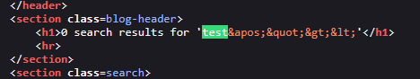
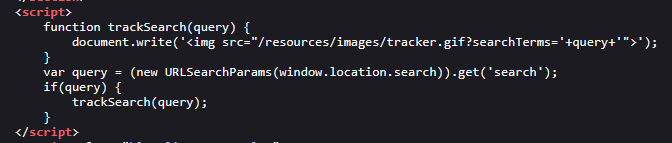
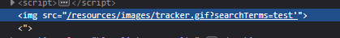
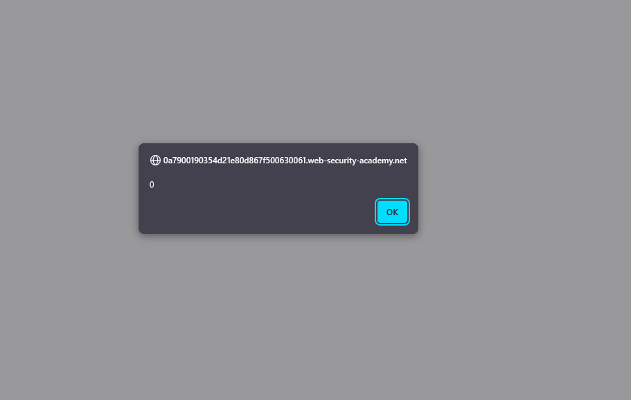
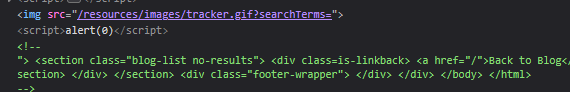
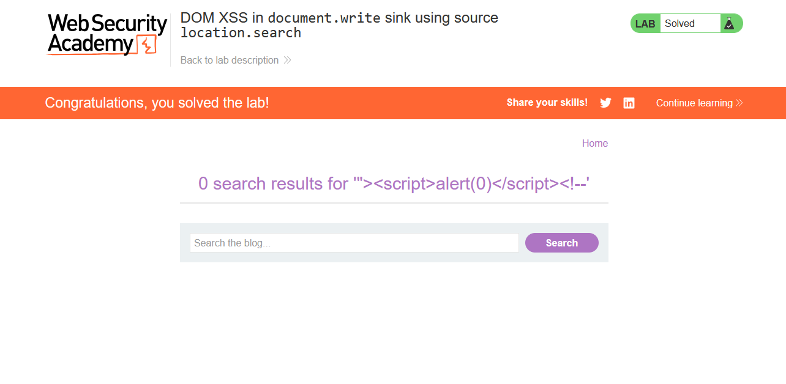

# Lab: DOM XSS in document.write sink using source location.search

> Lab Objective: perform a cross-site scripting attack that calls the alert function.

- Firstly, Enter simple input like this `test'"><` in search query tracking functionality, then search for the input in the Source Code.

  > In order to know which character from those `'"><` are either HTML-Encoded, Stripped, etc.

- When you search for the input in the source code, you'll see that these characters `'"><` are HTML-Encoded.
  

- But you'll find JS code that manipulates User Input using DOM.
  

- The Code gets the value associated with the parameter **_search_**, then appends it in an image tag, using `document.write` without proper validation/sanitization for user input.
  

- I'll use the fact that `document.write` function accepts script elements, and include this payload `"><!--`

  > this payload will close the `img` tag created by `document.write` function, then append the `script` and comments trailing characters

- When entering the previous payload in search query tracking functionality, `alert` function is executed successfully.
  

- Code after payload being executed.
  

- Therefore, the Lab is solved Successfully.
  

---
