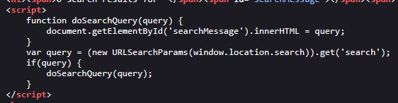
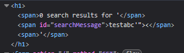
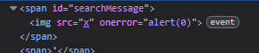

# Lab: DOM XSS in `innerHTML` sink using source `location.search`

> Lab Objective: perform a cross-site scripting attack that calls the alert function.

- Firstly, Enter simple input like this `test'"><` in search blog functionality, then search for the input in the Source Code.

  > In order to know which character from those `'"><` are either HTML-Encoded, Stripped, etc.

- You won't find the input you've entered earlier, But there is a JS Code that manipulates and displays User input using DOM.
  

- But the JS code passes user input from `window.location.search` (source) to `innerHTML` (sink) without proper validation/sanitization.

- Therefore, I'll use the fact that `innerHTML` accepts HTML Elements like `img` combined with event handlers such as `onerror`, to craft an XSS payload that will execute the `alert` function.

- The context my input is displayed within.
  

- The crafted payload:

  ```html
  
  ```

- When submitting this payload, `alert` function is executed successfully.
  
  

- Therefore Lab is solve successfully.
  

---

## Fixing the Vulnerable Code

- The Vulnerable JS Code Snippet:

  ```html
  <span id="searchMessage"></span>
  <script>
      function doSearchQuery(query) {
          document.getElementById('searchMessage').innerHTML = query;
      }
      var query = (new URLSearchParams(window.location.search)).get('search');
      if(query) {
          doSearchQuery(query);
      }
  </script>
  ```

- The Fixed JS Code Snippet:

  > `textContent` method will display/append text inside `span` tag with `id="searchMessage"` as raw text, with no interpreting for HTML tags or JS Code

  ```html
  <span id="searchMessage"></span>
  <script>
      function doSearchQuery(query) {
          document.getElementById('searchMessage').textContent = query;
      }
      var query = (new URLSearchParams(window.location.search)).get('search');
      if(query) {
          doSearchQuery(query);
      }
  </script>
  ```

---
