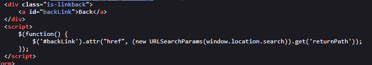

# Lab: DOM XSS in jQuery anchor href attribute sink using location.search source

> Lab Objective: make the "back" link alert document.cookie

- When You Submit a Feedback, You'll see a parameter in the URL which is `?returnPath=/`

- The JS Code snippet for this Parameter is:
  > Note: The value for `returnPath` parameter is set as a value for `href` attribute in an anchor tag.

```html
<div class="is-linkback">
  <a id="backLink">Back</a>
</div>
<script>
  $(function () {
    $("#backLink").attr(
      "href",
      new URLSearchParams(window.location.search).get("returnPath")
    );
  });
</script>
```

- The Screenshot for it:
  

- Therefore, I could use Javascript Protocol `javascript:alert(0)`, as a value for `returnPath` Parameter in the URL.

- It'll be something like this: `?returnPath=javascript:alert(0)`
  

- When You view the Code, You'll see that the anchor tag with Javascript Protocol is interpreted successfully (with no encoding, sanitization, etc.).
  

- When Clicking `Back` Button, `alert(0)` function is executed successfully.
  

- Therefore, The lab is solved successfully.
  

---
