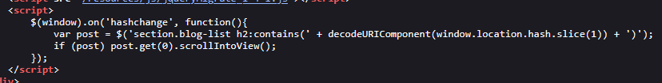
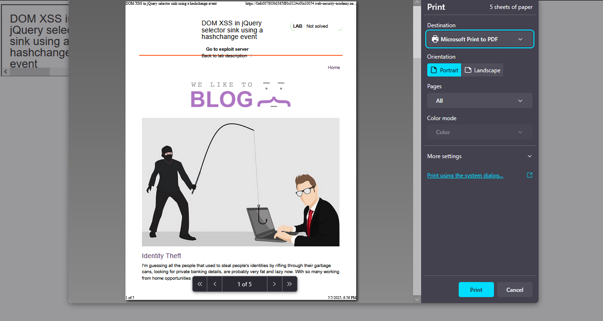
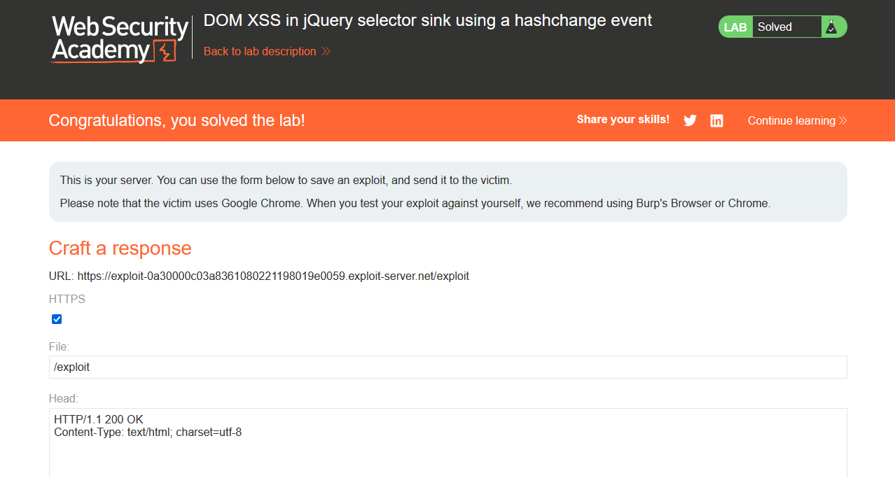
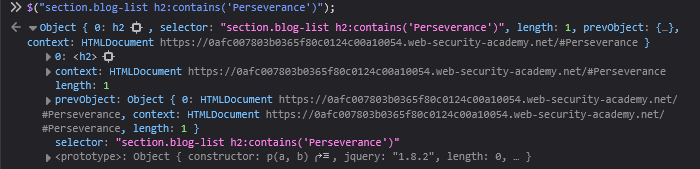
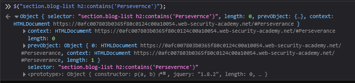
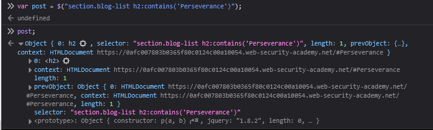
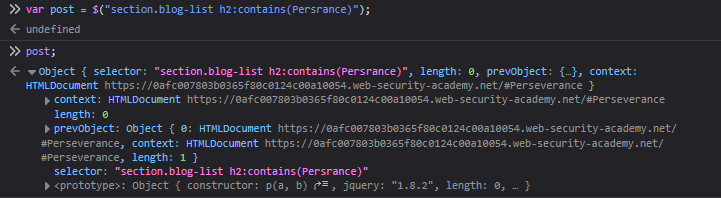
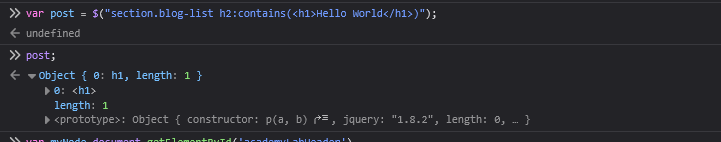
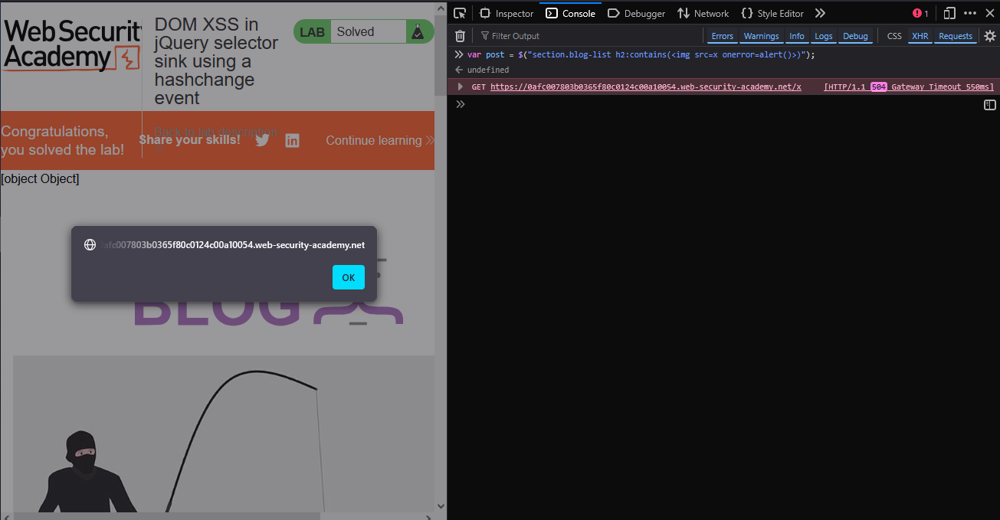

# Lab: DOM XSS in jQuery selector sink using a hashchange event

> Lab Objective: deliver an exploit to the victim that calls the `print()` function in their browser.

- When viewing the source code of the home page, you'll find this code snippet:

```html
<script>
  $(window).on("hashchange", function () {
    var post = $(
      "section.blog-list h2:contains(" +
        decodeURIComponent(window.location.hash.slice(1)) +
        ")"
    );
    if (post) post.get(0).scrollIntoView();
  });
</script>
```



- Which scroll to a specific post based on the post title you write after the hash character in the URL, like this: `#It's All Just A Click Away`, this will scroll you to the post with that title.

- To exploit a code snippet like this you can use a payload like this:
  > View [Jump to Explanation](#Explanation)

```html
<iframe
  src="https://0a4d00200453b7fe80553f3800290064.web-security-academy.net/#"
  onload="this.src+=''"
></iframe>
```

- Add the payload to the exploit server, then "View Exploit", the `print()` function is executed successfully.
  

- Then "Deliver exploit to victim", and the lab is solved successfully.
  

---

## Explanation

- This is the code snippet:

```html
<script>
  $(window).on("hashchange", function () {
    var post = $(
      "section.blog-list h2:contains(" +
        decodeURIComponent(window.location.hash.slice(1)) +
        ")"
    );
    if (post) post.get(0).scrollIntoView();
  });
</script>
```

- Let's break it line by line.

1. `$(window).on("hashchange": function () {`

   - The `hashchange` event is triggered whenever the value after the hash `#` character in the url has changed
   - For instance, `https://website/#Perseverance`.
   - Note: you can't trigger the `hashchange` event with the same value after the `#` twice, it's only triggered with the first try.

2. `$("section.blog-list h2:contains('Perseverance')");`

   - `decodeURIComponent(window.location.hash.slice(1))` thats the part that gets the value after the hash character.

     - For instance, `#Perseverance`, this function will get `Perseverance`

   - According to example, `section.blog-list h2:contains('Perseverance')` it has two cases:

     - There is an h2 object that contains our keyword "Perseverance", if exist it will get it.
       

     - If that object doesn't exist, the length will be zero, and nothing is returned.

       > Note: I've removed a character from the keyword so that the object doesn't exist.

       

3. `var post = $("section.blog-list h2:contains('Perseverance')");`

   - In case the h2 tag that contains the keyword (e.g., `Perseverance`) exists:
     

   - In case it doesn't exist:

     - But it still returns an object although there is no h2 tag found and returned.

       

4. Here is a good notice if `h2:contains()` function doesn't find the h2 tag with specified keyword but you entered the keyword another tag like this: `<h1>Hello World</h1>`, it will create that tag and return it with the object returned.
   

   - Therefore, I'll be able to append it in the page or deal with as a normal h1 tag.

5. Using the previous note, when using this keyword ``, like that `var post = $("section.blog-list h2:contains()");`, although I didn't append to the DOM Hierarchy or anything, it's still interpreted and the `alert()` function is executed, using the fact that any tag with a `src` attribute will initiate a HTTP Request to the value given to it.
   

6. In this step I need a tag that will automate this script, So I'll use an `iframe` tag, The Final payload will be something like this:
   - which will the load the web page firstly, then the JS event handler will add the `img` tag => ``

```html
<iframe
  src="https://0a4d00200453b7fe80553f3800290064.web-security-academy.net/#"
  onload="this.src+=''"
></iframe>
```

---
