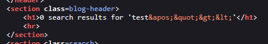
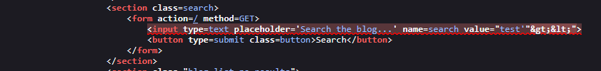
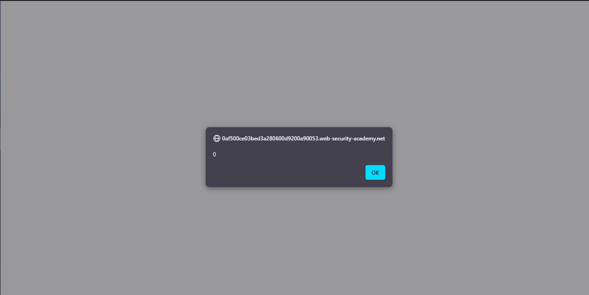
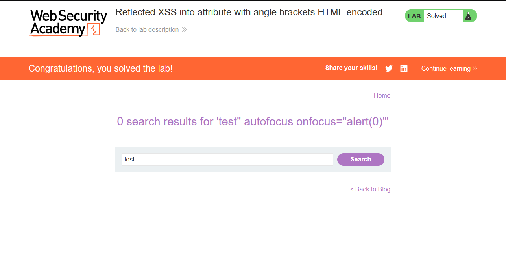

# Lab: Reflected XSS into attribute with angle brackets HTML-encoded

> Lab Objective: perform a cross-site scripting attack that injects an attribute and calls the `alert` function.

- Firstly, Enter simple input like this `test'"><` in search blog functionality, then search for the input in the Source Code.

  > In order to know which character from those `'"><` are either HTML-Encoded, Stripped, etc.

- The input value appeared in two places, The first place is in a `h1` tag where these characters `'"><` are html-encoded.
  

- The second place is in an `input` tag in the as the value for `value` attribute with `<>` html-encoded and `'"` displayed and interpreted normally, I'll try to inject according to this.
  

- I'll use this payload, to close the current attribute value then make that input field autofocus so when the page reload it'll be focused on, then adding `onfocus` attribute with `value` equals to `alert(0)`, The Payload: `test" autofocus onfocus="alert(0)"`

- Therefore, the `alert` function is executed successfully, and the lab is solved successfully.
  
  

---
