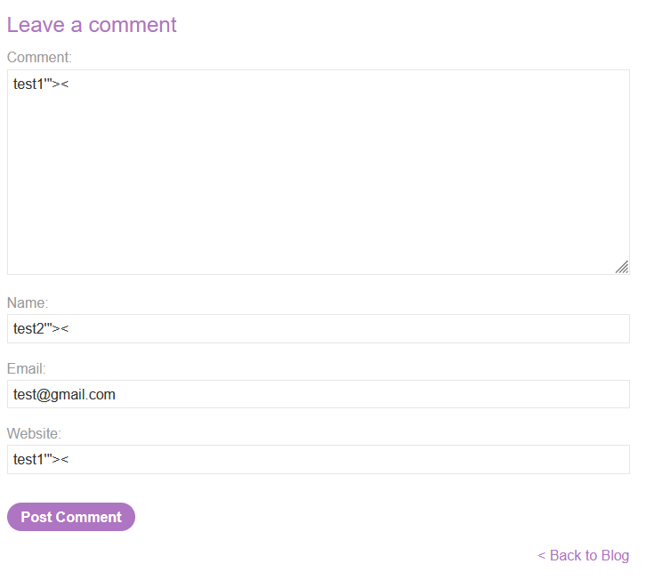
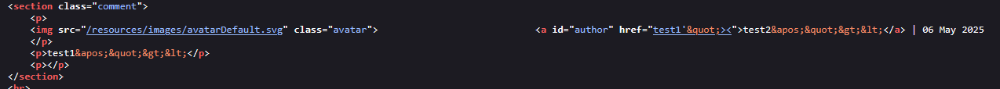
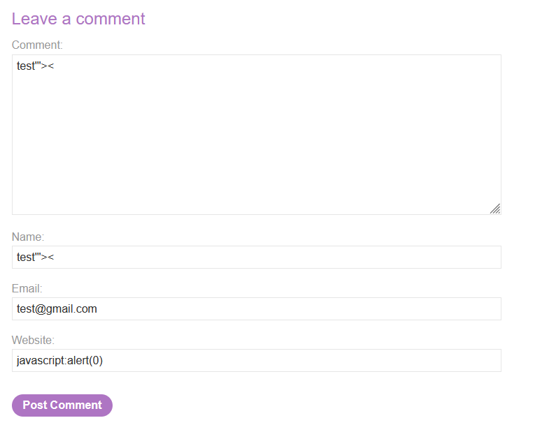
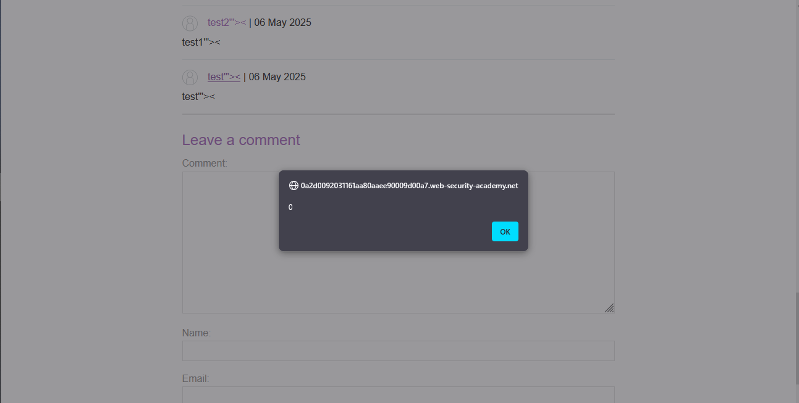

# Lab: Stored XSS into anchor href attribute with double quotes HTML-encoded

> Lab Objective: submit a comment that calls the alert function when the comment author name is clicked.

- Firstly, Enter simple input like this `test'"><` in submitting a comment fields, then search for the input in the Source Code.

  > In order to know which character from those `'"><` are either HTML-Encoded, Stripped, etc.

  

- In comment and name fields these characters `'"><` are HTML-Encoded, but in website field only `"` is html-encoded.
  

- Try using `javascript:alert(0)` in the website field when submitting a new comment.
  

- When submitting this comment and clicking on the author name, `alert(0)` function is executed successfully.
  

- Therefore, the lab is solved successfully.
  

---
