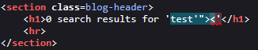
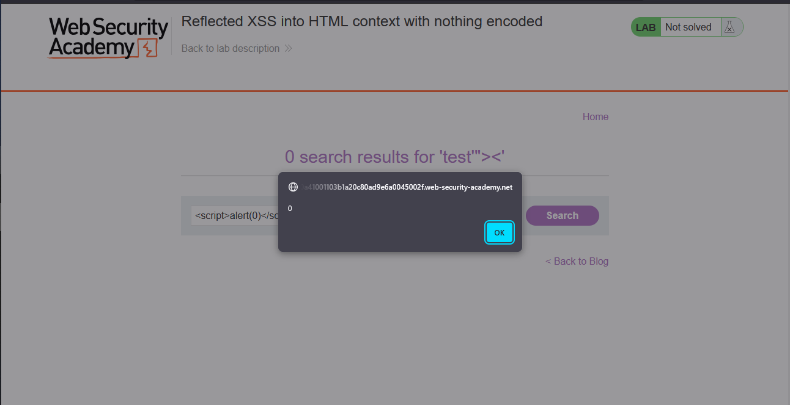
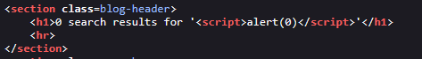
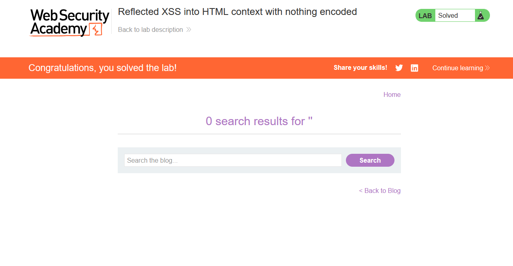

# Lab: Reflected XSS into HTML context with nothing encoded

> Lab Objective: perform a cross-site scripting attack that calls the `alert` function.

- Firstly, Enter simple input like this `test'"><`, then search for the input in the Source Code.

  > In order to know which character from those `'"><` are either HTML-Encoded, Stripped, etd.

- You'll see that these characters `'"><` are displayed and interpreted by the browser normally.
  

- Therefore, Try payload like this ``

- The `alert` function is executed normally, and the lab is solved successfully.
  
  
  

---
