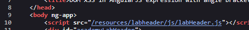

# Lab: DOM XSS in AngularJS expression with angle brackets and double quotes HTML-encoded

> Lab Objective: perform a cross-site scripting attack that executes an AngularJS expression and calls the alert function.

- Firstly, Enter simple input like this `test'"><` in search functionality, then search for the input in the Source Code.

  > In order to know which character from those `'"><` are either HTML-Encoded, Stripped, etc.

- You'll see that it's reflected within an `h1` tag with `'<>` html-encoded and `"` displayed & interpreted successfully.
  

- Therefore, there is nothing much I can do in this case.

- But If You look at the tags in the `head` tag at the top of the code, you'll find that the application utilizes `AngularJS v1.7.7`, in addition to AngularJS Directive `ng-app` attribute in the `body` tag.
  
  

- Therefore, I'm able to JavaScript expressions within double curly braces. (which is useful when angle brackets are being encoded)

- So I'll search for payloads for that specific version of AngularJS, The Payload: `{{constructor.constructor('alert(1)')()}}`

- The `alert` function is executed successfully, and the lab is solved.
  
  

---
