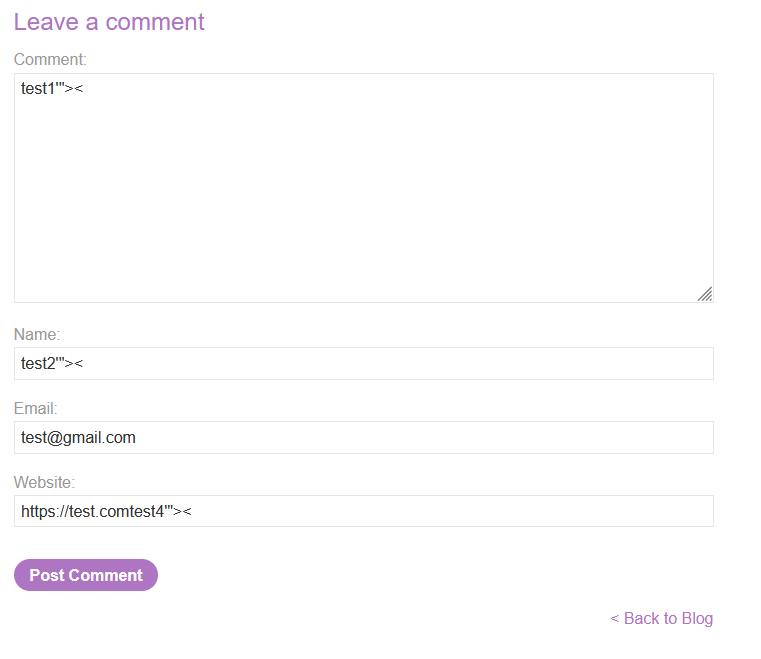
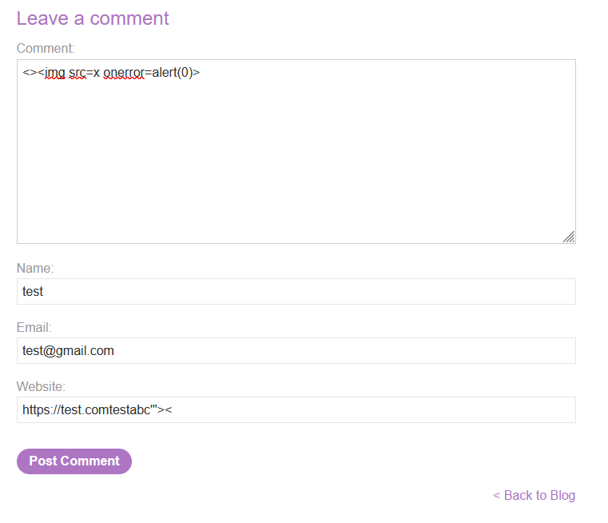

# Lab: Stored DOM XSS

> Lab Objective: exploit this vulnerability to call the `alert()` function.

- Firstly, Enter simple input like this `test'"><` in blog comment functionality, then search for the input in the Source Code.

  > In order to know which character from those `'"><` are either HTML-Encoded, Stripped, etc.

  

- When viewing page source code, there is a JS file that loads the comments.

```html
<script src="/resources/js/loadCommentsWithVulnerableEscapeHtml.js"></script>
<script>
  loadComments("/post/comment");
</script>
```

- In that file, He fetches user comments then displays them, but this time he uses `JSON.parse()` function instead of `eval()` function, therefore I couldn't exploit this part.

```js
let xhr = new XMLHttpRequest();
xhr.onreadystatechange = function () {
  if (this.readyState == 4 && this.status == 200) {
    let comments = JSON.parse(this.responseText);
    displayComments(comments);
  }
};
xhr.open("GET", postCommentPath + window.location.search);
xhr.send();
```

- But I noticed that when he displays the Comment Body he uses `innerHTML` sink (It accepts elements which I can exploit XSS using them).

```js
if (comment.body) {
  let commentBodyPElement = document.createElement("p");
  commentBodyPElement.innerHTML = escapeHTML(comment.body);
  commentSection.appendChild(commentBodyPElement);
}
```

- In addition that he passes the comment body to `escapeHTML()` function which HTML-Encode only the first appearance of `<`, then do the same with `>`, therefore It's exploitable.

```js
function escapeHTML(html) {
  return html.replace("<", "&lt;").replace(">", "&gt;");
}
```

- So combining the previous two points together to craft a suitable payload, The payload will be something like this: `<>`
  

- When submitting the comment, then going back to blog, the `alert()` function is executed successfully.
  

- Therefore, the lab is solved.
  

---
