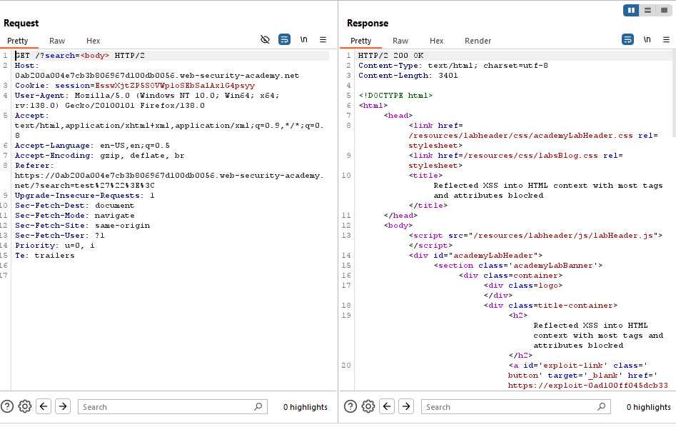

# Lab: Reflected XSS into HTML context with most tags and attributes blocked

> Lab Objective: perform a cross-site scripting attack that bypasses the WAF and calls the `print()` function.

- Firstly, Enter simple input like this `test'"><` in blog search functionality, then search for the input in the Source Code.

  > In order to know which character from those `'"><` are either HTML-Encoded, Stripped, etc.

- When Searching for the input in page source code, these characters `'"><` are displayed & interpreted successfully.
  

- Therefore, inject this payload: `<script>print()</script>`, but that tag is not allowed.
  

- So run a python script (or Burp Suite Intruder) with all html tags to figure out which tag is allowed.

- I've used Burp Suite Intruder with a list html tags, the only allowed tag is the `body` tag.
  
  

- When using a payload like this: `<body onload=print()>`, the response indicates that the attribute is not allowed.
  
  

- So I'm going to do the same thing I did with the tags (use Burp intruder to figure out which attributes are allowed), `onresize` attribute is allowed.

- Therefore the crafted payload is:

```html
<iframe
  src="https://You-Lab-ID/?search=<body onresize=print()>"
  onload="this.style.width='100px'"
></iframe>
```

- When Storing the payload and Deliver exploit to the server, the `print()` function will get executed.
  

- The Lab is solved successfully.
  

---
