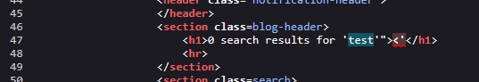
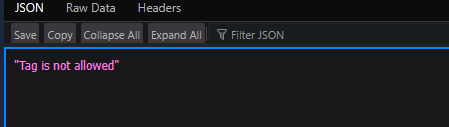
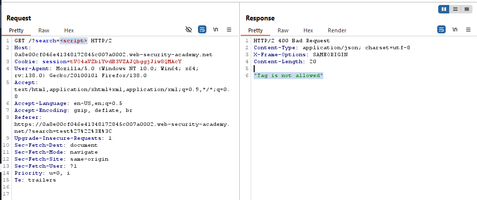
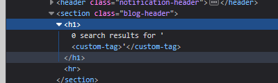
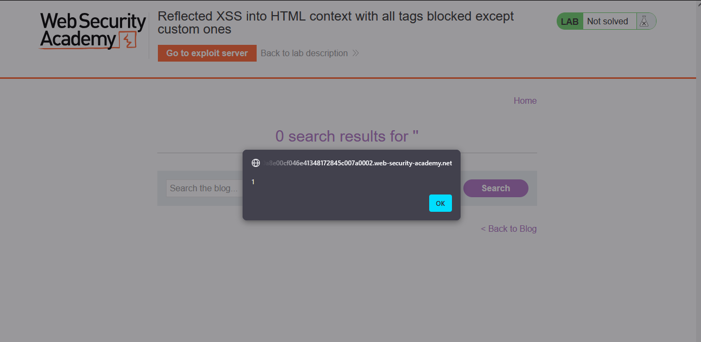
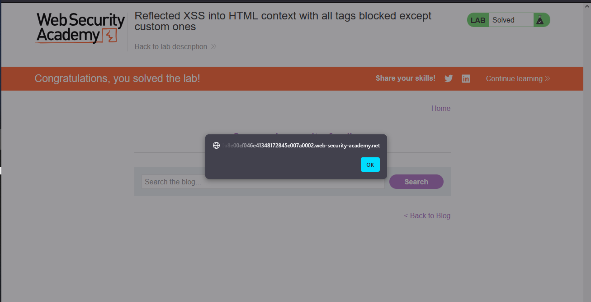
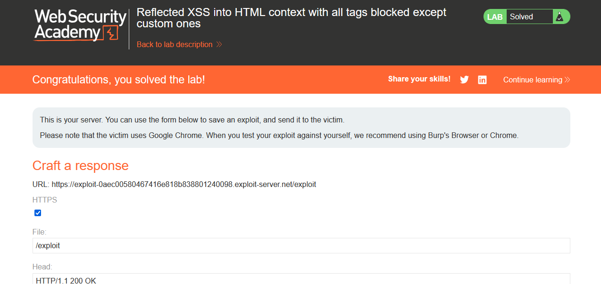

# Lab: Reflected XSS into HTML context with all tags blocked except custom ones

> Lab Objective: perform a cross-site scripting attack that injects a custom tag and automatically alerts `document.cookie`

- Firstly, Enter simple input like this `test'"><` in search functionality, then search for the input in the Source Code.

  > In order to know which character from those `'"><` are either HTML-Encoded, Stripped, etc.

- When Searching for the input in page source code, these characters `'"><` are displayed & interpreted successfully.
  

- When trying to inject `test<script>alert(document.cookie)</script>`, You'll see that `script` tag isn't allowed.
  
  

- Therefore, use Burp Suite Intruder (or run a python script) to find out which tags are allowed to use.

- I've noticed that only custom tags are allowed (e.g., `<custom-tag>`)
  

- When injecting `<custom-tag onmouseover=alert(1)>`, `alert` function is executed based on JS event handler, But we need XSS to be automated.
  

- Therefore, craft something like this: `<custom-tag onfocus=alert(document.cookie) id=x tabindex=0>`, then adding `#x` allows for focusing on `custom-tag` therefore executing `alert` function.
  

- Then add this JS coe snippet to exploit server, and Deliver exploit to server.

```html
<script>
  location =
    "https://0a8e00cf046e41348172845c007a0002.web-security-academy.net/?search=%3Ccustom-tag+onfocus%3Dalert(document.cookie)+id%3Dx+tabindex%3D0%3E#x";
</script>
```

- Finally, the lab is solved.
  

---

## Code Explanation

- Code Snippet:

```html
<custom-tag onfocus="alert(document.cookie)" id="x" tabindex="0"> </custom-tag>
```

- Explanation:
  - `<custom-tag>`:
    - This is a non-standard HTML tag. Browsers will treat it as a custom element (or unknown tag), but it will still be rendered in the DOM.
    - It's used in XSS payloads to bypass filters that block standard html tags.
  - `onfocus="alert(document.cookie)"`:
    - When triggering that event `alert(document.cookie)` will get executed.
    - Which I'm trying to execute it automatically.
  - `id=x`:
    - Assigns ID to the custom tag in order to allow the element to be referenced afterwards.
  - `tabindex="0"`:
    - It makes the element focusable, meaning it can receive focus via:
      - keyboard navigation.
      - adding `#x` at the end of the url, which will reference the element based on it's `id` attribute.
    - The `=0` part indicates that the element is placed in tab index order, and it's the first element to be focused on.
  - `#x` at the end of the URL:
    - The #x in the URL is a **fragment identifier** that instructs the browser to navigate to and focus on the element with the id="x" in the page.

---
