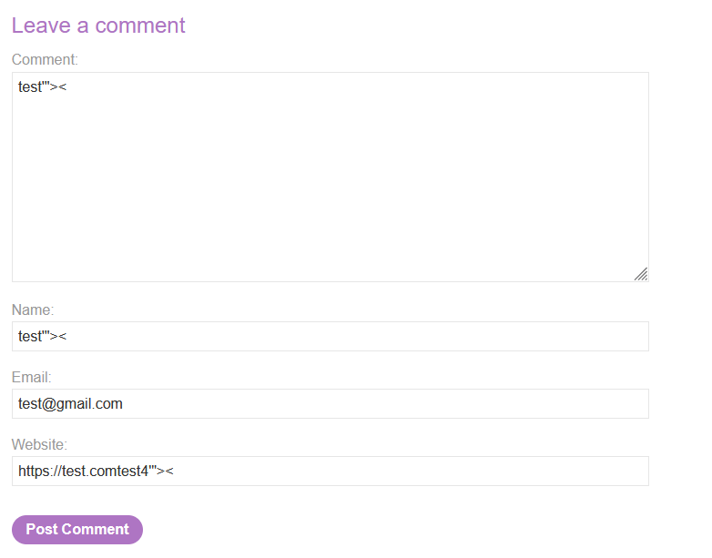
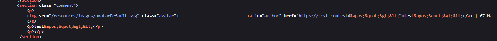
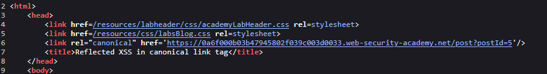
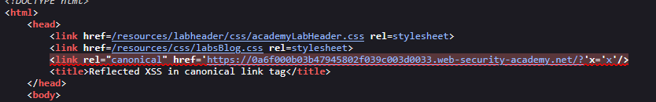

# Lab: Reflected XSS in canonical link tag

> Lab Objective: perform a cross-site scripting attack on the home page that injects an attribute that calls the alert function.

- Firstly, Enter simple input like this `test'"><` to submit a comment, then search for the input in the Source Code.
  

  > In order to know which character from those `'"><` are either HTML-Encoded, Stripped, etc.

- When viewing source code, You'll see that `'"><` are html encoded, therefore there is nothing much I can do.
  

- But at the first of the source code, You'll find a canonical link tag that holds the URL as value for href attribute.
  

- Try adding `?'x='x` to the end of the url, you'll see that it has been added & interpreted in the href value.
  

- so the payload: `?'accesskey='x'onclick='alert(1)`, when pressing `ALT+SHIFT+X` the alert function will get executed.
  

---
