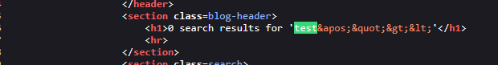
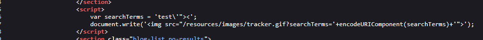
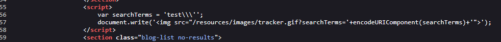
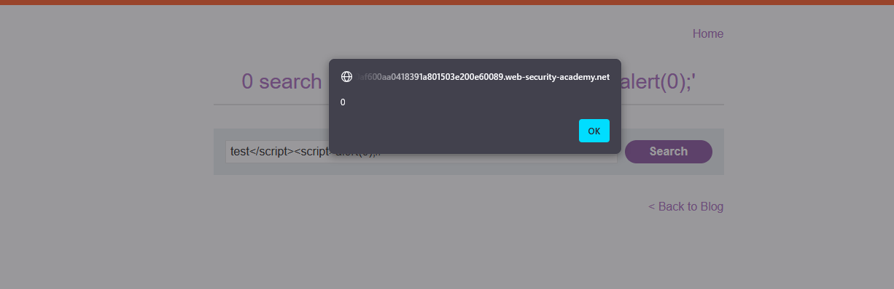
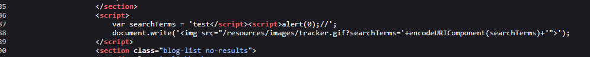
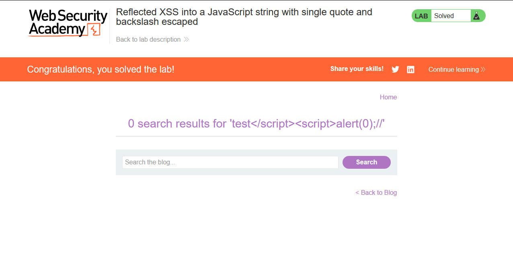

# Lab: Reflected XSS into a JavaScript string with single quote and backslash escaped

> perform a cross-site scripting attack that breaks out of the JavaScript string and calls the `alert` function.

- Firstly, Enter simple input like this `test'"><` in the search query tracking functionality, then search for the input in the Source Code.

  > In order to know which character from those `'"><` are either HTML-Encoded, Stripped, etc.

- When Viewing the source code, The Input has appeared twice:

  - The First time in `h1` tag with `'"><` html-encoded.
    
  - The second time is within a `script` tag with `'` esacped.
    

- Regarding the second time, I'll use `test\'` in order to see if I succeeded in getting out of the JS string and the `'` escaping.

- But `'` & `\` are both escaped.
  

- But When closing the `script` tag then open a new one then add `alert` function, it will execute successfully.

- The Payload `test</script><script>alert(0);//`

  - `alert()` function is executed successfully.
    
  - The source code after submitting the input.
    

- The Lab is solved successfully.
  

---
