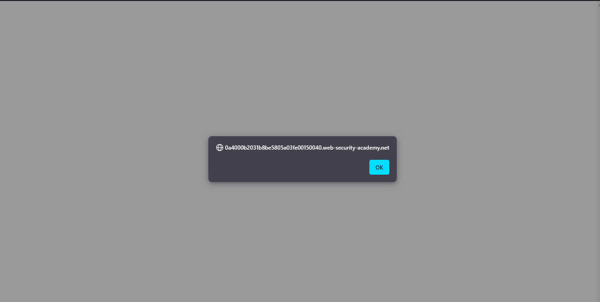

# Lab: Reflected XSS into a JavaScript string with angle brackets and double quotes HTML-encoded and single quotes escaped

> Lab Objective: perform a cross-site scripting attack that breaks out of the JavaScript string and calls the alert function.

- Firstly, Enter simple input like this `test'"><` in the search query tracking functionality, then search for the input in the Source Code.

  > In order to know which character from those `'"><` are either HTML-Encoded, Stripped, etc.

- when viewing the page source code The Input appeared twice.

  - The First time within a `h1` tag with `'"><` html encoded.
    
  - The second time within a JS string with `'` escaped and `"><` html encoded.
    

- I'll inject within the second time with `test\'` to see if it can break out the string, `\` has deon it's job.
  

- So inject this payload `test\';alert(0);//`, and the `alert` function is executed successfully.
  

- Therefore the Lab is solved successfully.
  

---
