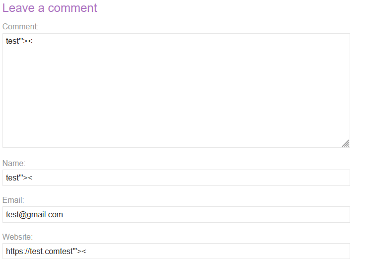
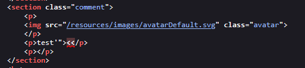
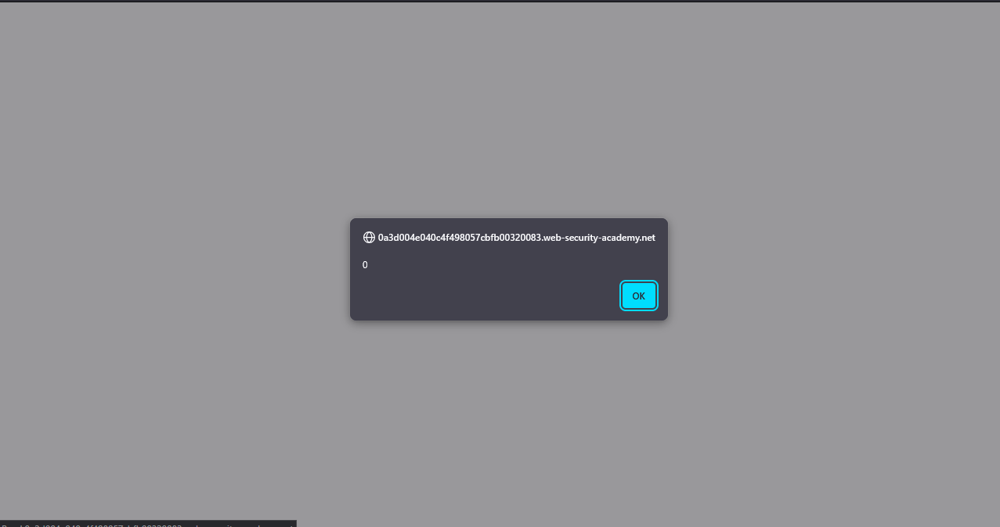
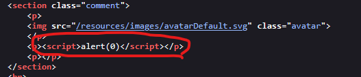

# Lab: Stored XSS into HTML context with nothing encoded

> Lab Objective: submit a comment that calls the `alert` function when the blog post is viewed.

- Firstly, Enter input like this `test'"><` for comment input fields, then search for the input in the Source Code.

  > In order to know which character from those `'"><` are either HTML-Encoded, Stripped, etd.

  

- You'll see that the displayed content `test'"><` is displayed and interpreted normally.
  

- Therefore, try this payload `` in the comment input field.

- When clicking on 'back to blog' button, `alert` function will be executed.
  
  

- The lab is solved successfully
  

---
