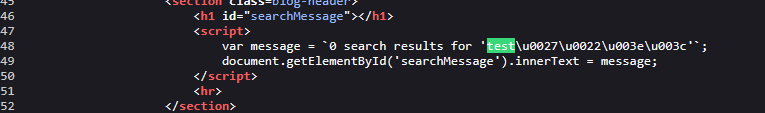
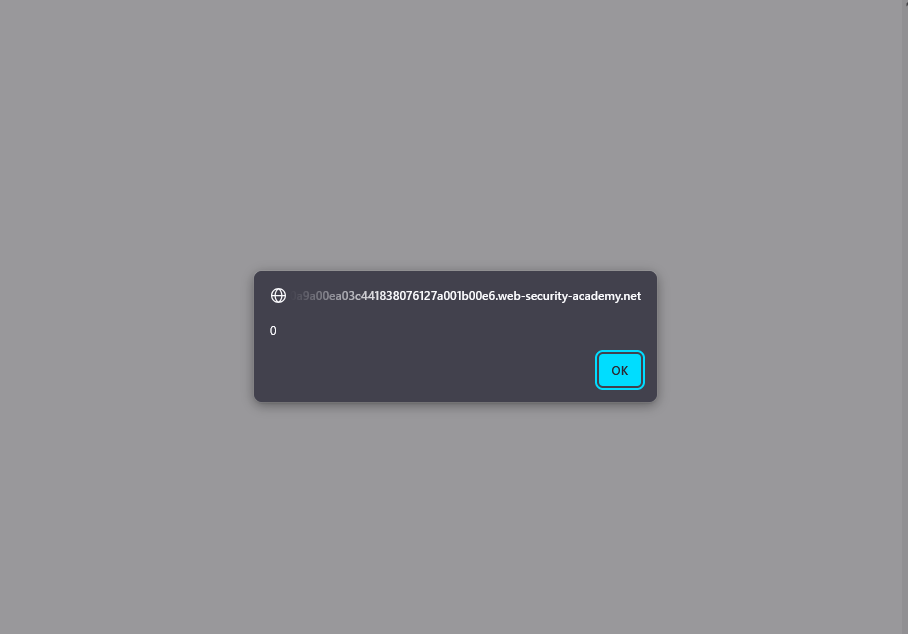
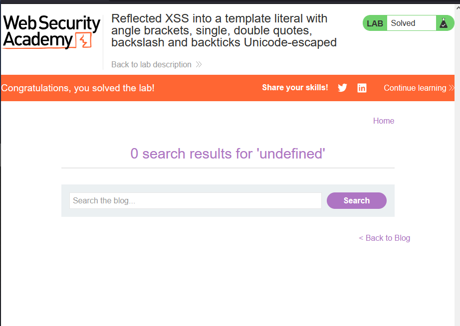

# Lab: Reflected XSS into a template literal with angle brackets, single, double quotes, backslash and backticks Unicode-escaped

> Lab Objective: perform a cross-site scripting attack that calls the alert function inside the template string.

- Firstly, Enter simple input like this `test'"><` in the search blog functionality, then search for the input in the Source Code.

  > In order to know which character from those `'"><` are either HTML-Encoded, Stripped, etc.

- The input appeared inside a JS template literals, with `'"><` characters unicode encoded.
  

- In order to execute JS Expressions within JS Template Literals we use `${}`.

- Therefore, in order to execute `alert()`, use this payload as input `${alert(0)}`.

- `alert()` function is executed successfully.
  

- Therefore, The lab is solved.
  

---

## Explanation

- Code Snippet:

```html
<h1 id="searchMessage"></h1>
<script>
  var message = `0 search results for '${alert(0)}'`;
  document.getElementById("searchMessage").innerText = message;
</script>
```

- Note: the `alert()` function in the previous context is executed in the line of assignment, not after appending it to the html element with `id="searchMessage"`, because he uses `innerText` which will deal with my input a literal string.

---
