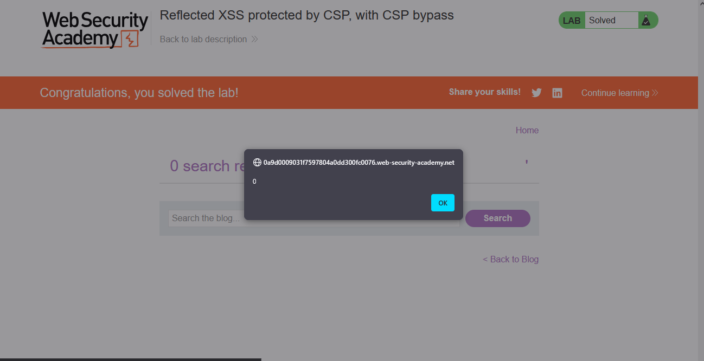

# Lab: Reflected XSS protected by CSP, with CSP bypass

> Lab Objective: perform a cross-site scripting attack that bypasses the CSP and calls the `alert` function.

- Firstly, Enter simple input like this `test'"><` in search functionality, then search for the input in the Source Code.

  > In order to know which character from those `'"><` are either HTML-Encoded, Stripped, etc.

- When viewing the response via Burp Suite, I've noticed that the Application uses CSP.
  

- CSP Directives:
  `Content-Security-Policy: default-src 'self'; object-src 'none';script-src 'self'; style-src 'self'; report-uri /csp-report?token=`

- When adding `/csp-report?token=15` (for instance) to the end of the URL, the value (which is 15) is appended in the CSP Policy returned in the Response Headers.
  

- In order to bypass this CSP Policy, I'll try escape the `report-uri` directive, then overwrite the `script-src 'self';` directive with `script-src-attr 'unsafe-inline'` which allows event handlers within HTML tags.

- Therefore, the payload will be `/?search=test&token=15';script-src-attr 'unsafe-inline'`

- The `alert` function is executed and the lab is solved.
  

---
