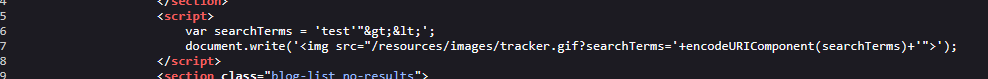
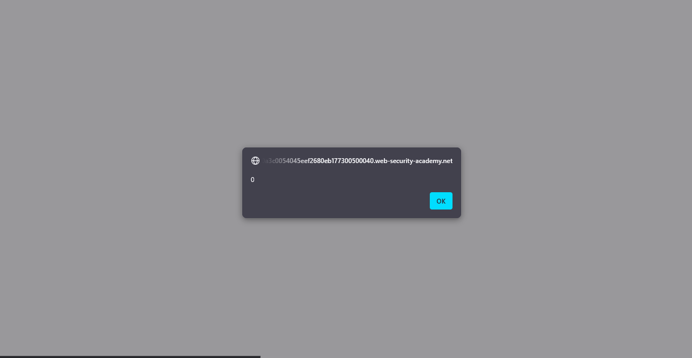
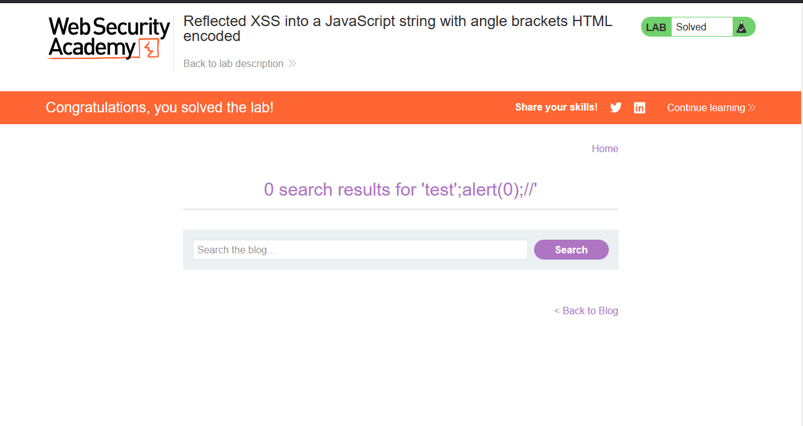

# Lab: Reflected XSS into a JavaScript string with angle brackets HTML encoded

> Lab Objective: perform a cross-site scripting attack that breaks out of the JavaScript string and calls the `alert` function.

- Firstly, Enter simple input like this `test'"><` in search query tracking functionality, then search for the input in the Source Code.

  > In order to know which character from those `'"><` are either HTML-Encoded, Stripped, etc.

- The Input has appeared in two places, the first place is in an `h1` tag where these characters `'"><` are html-encoded, there is nothing much I can do here.
  

- But the second place is in a `script` tag, and the input is stored in a variable `searchTerms` with `<>` html-encoded, while `'"` are displayed and interpreted normally.
  

- I'll craft a payload to inject in this line of code:

```js
var searchTerms = 'test'"&gt;&lt;';
```

- The Payload: `test';alert(0);//`.

  - Which will close the opening single quote for searchTerms variable

  - Then since we are in a `script` tag already there is no need for adding one, just call the `alert(0)` function.

  - Then comment the following line to avoid syntax error.

  - The resulting line will be:

  ```js
  var searchTerms = "test";
  alert(0); //';
  ```

- When using the payload in search query tracking functionality, the `alert(0)` is executed successfully.
  

- Therefore, the lab is solved successfully.
  

---
