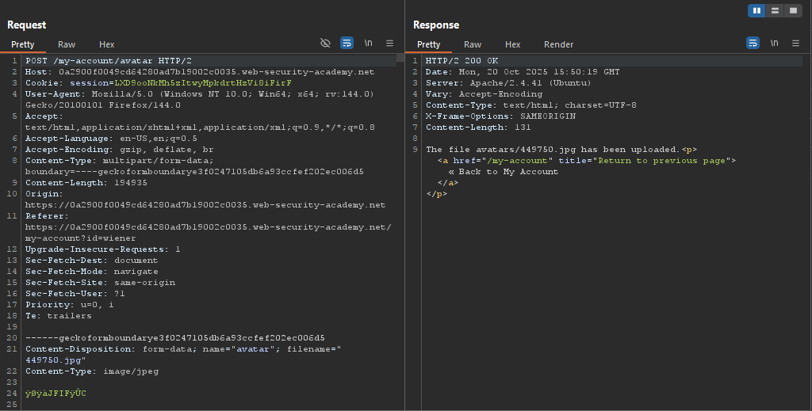
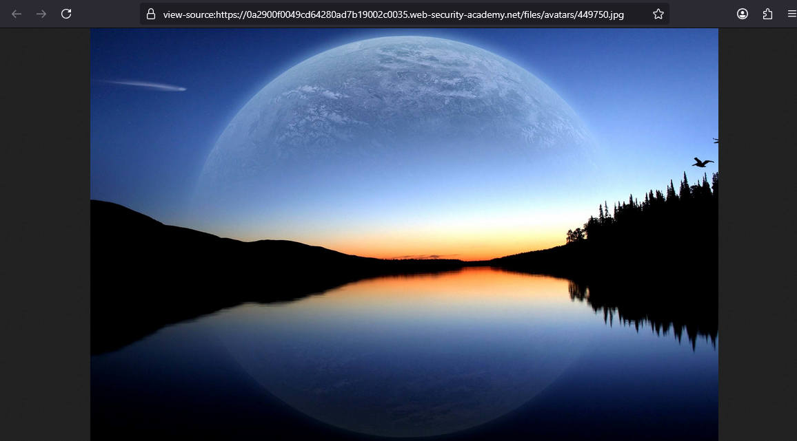
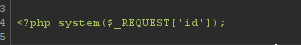
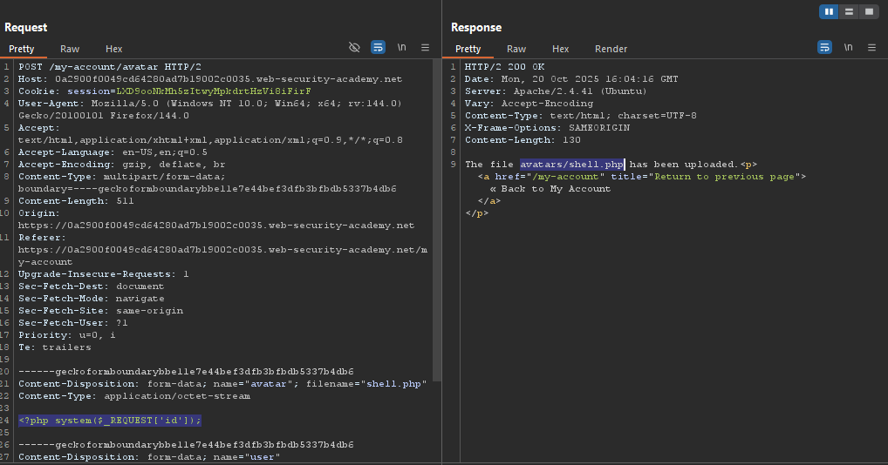
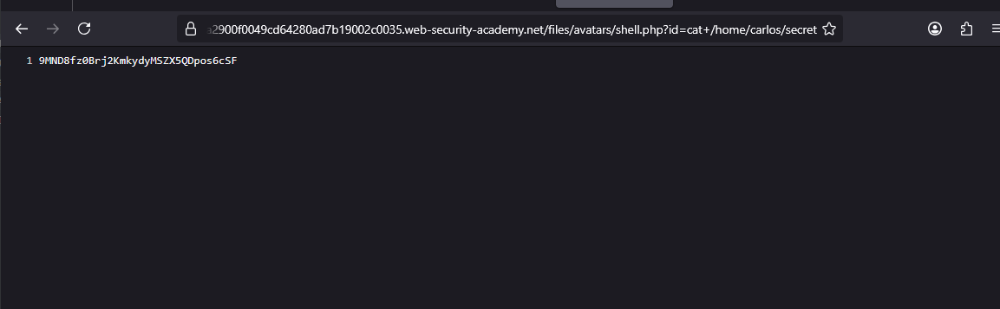
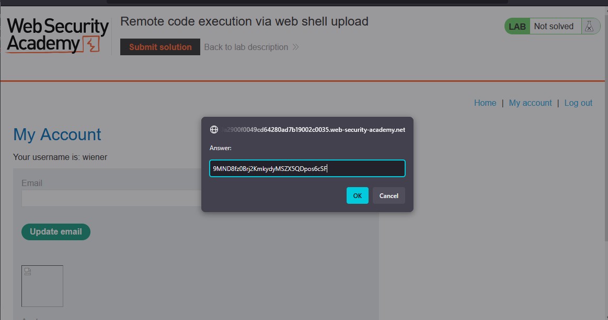
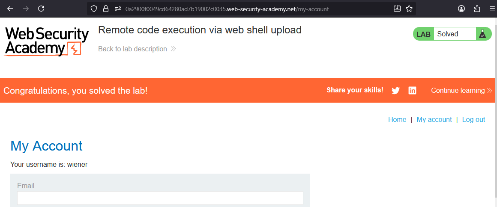

# Lab: Remote code execution via web shell upload

> Lab Objective: upload a basic PHP web shell and use it to exfiltrate the contents of the file `/home/carlos/secret`. Submit this secret using the button provided in the lab banner.

- Login using provided credentials `wiener:peter`, then inspect the file upload functionality.

- The file upload functionality, you just browse to and select the wanted picture to upload, and a POST request is sent.
  

- And the uploaded file is accessed via this endpoint `/files/avatars/449750.jpg`.

```url
view-source:https://0a2900f0049cd64280ad7b19002c0035.web-security-academy.net/files/avatars/449750.jpg
```



- Create a php file including this payload:
  

- Upload that shell, and you'll notice that it's uploaded without any problem.
  

- Visit this endpoint `/avatars/shell.php?id=cat+/home/carlos/secret`.
  

- Copy and submit carlos' secret value.
  

- And te lab is solved successfully.
  

---
