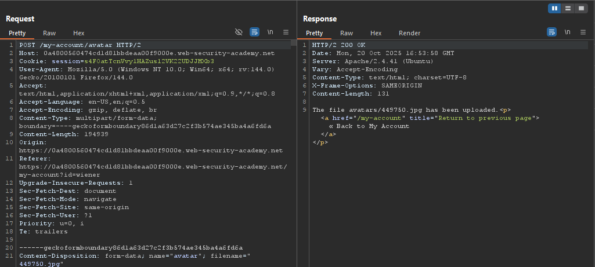
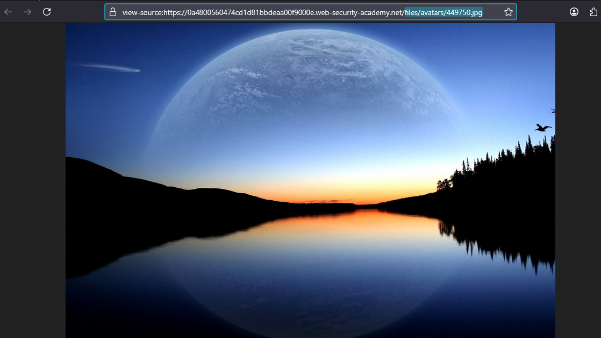
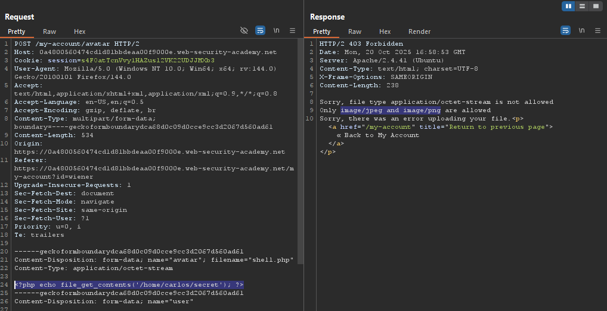
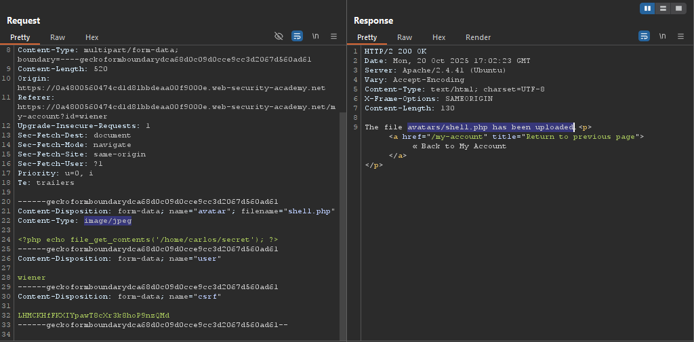
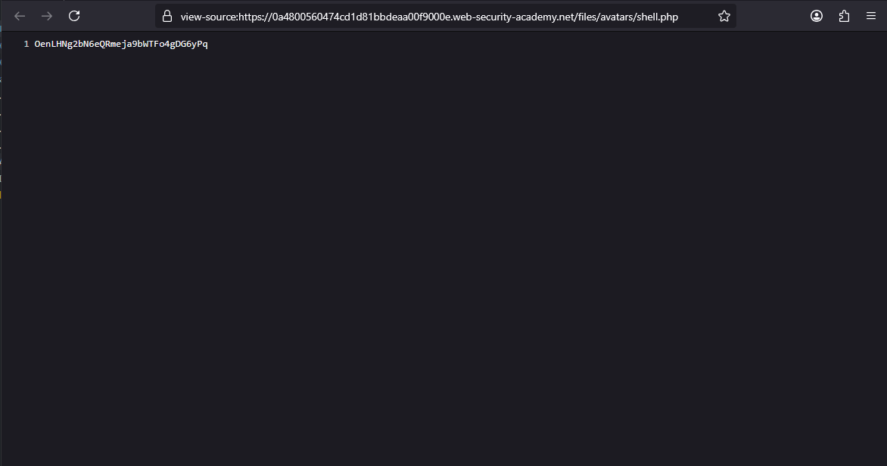
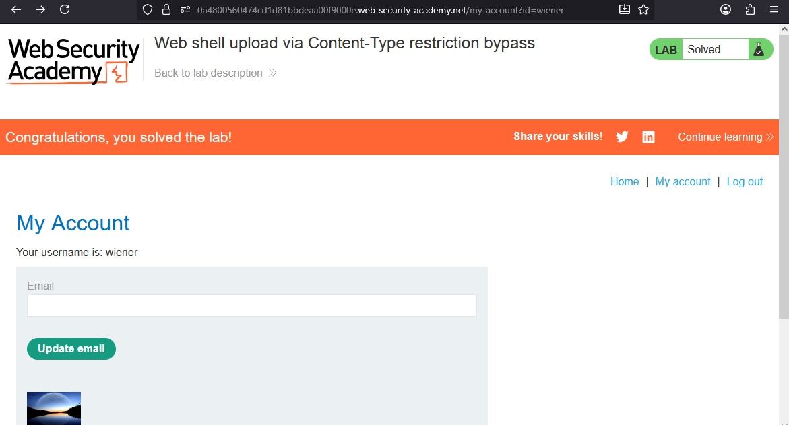

# Lab: Web shell upload via Content-Type restriction bypass

> Lab Objective: upload a basic PHP web shell and use it to exfiltrate the contents of the file `/home/carlos/secret`. Submit this secret using the button provided in the lab banner.

- Login using provided credentials `wiener:peter`, then inspect the upload functionality.

- The request to upload a file.
  

- And you can access the uploaded file through accessing this endpoint `files/avatars/449750.jpg`:
  

- Create a shell php file, with the following payload:

```php
<?php echo file_get_contents('/home/carlos/secret'); ?>
```

- When you try to upload the shell file you'll notice that:

  - `application/octet-stream` (which is the shell file type) is not allowed.
  - Only `image/jpeg` & `image/png` file types are allowed.

  

- Notice that when you change the `Content-Type` from `application/octet-stream` to `image/jpeg` that the shell file is uploaded successfully.
  

- Access the uploaded file through accessing this endpoint `/files/avatars/shell.php`, and you'll be able to retrieve carlos' secrete key
  
- Submit the secret key, and the lab is solved.
  

---
