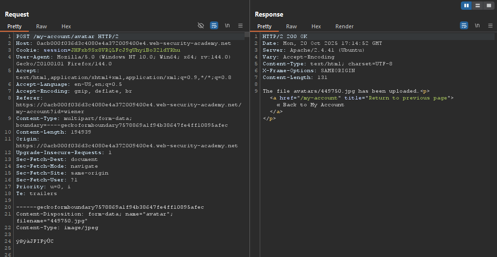
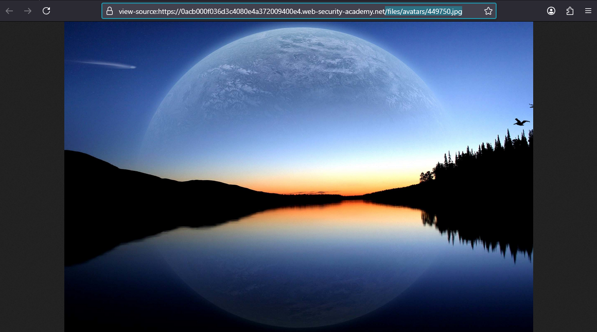
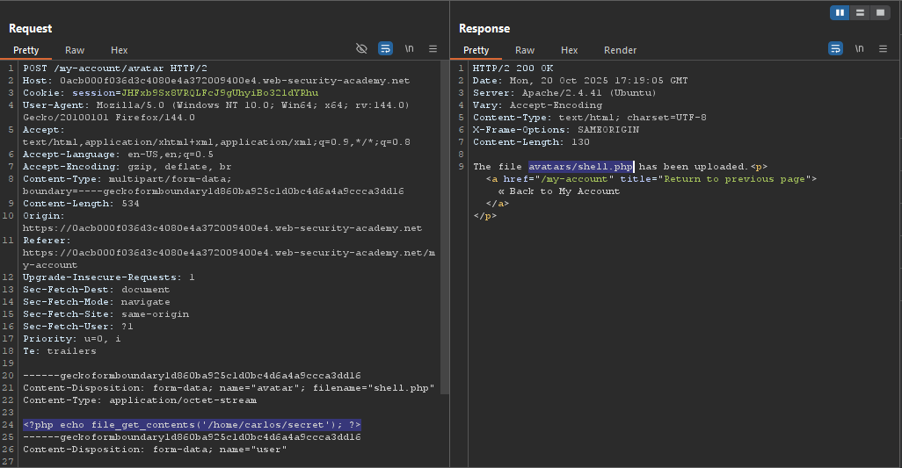
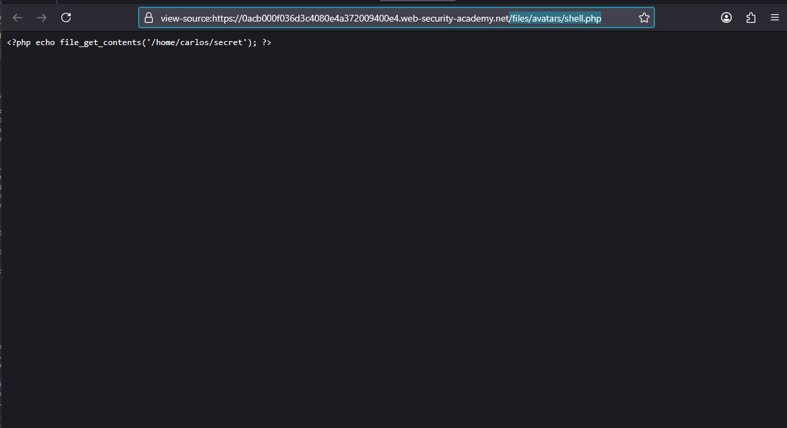
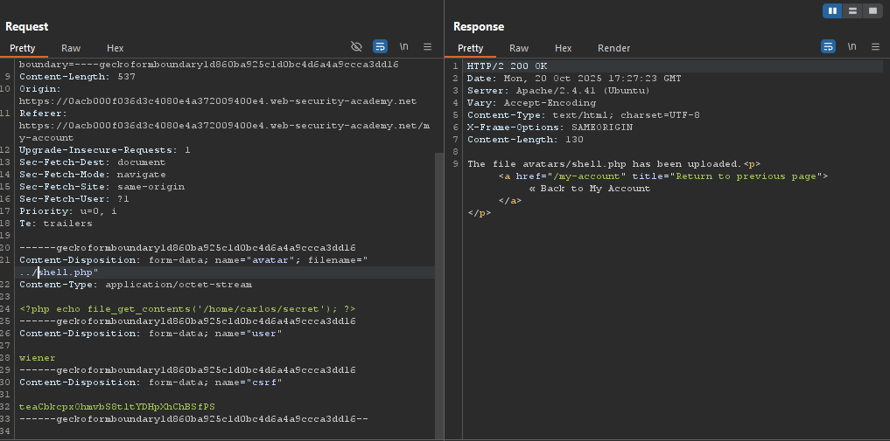
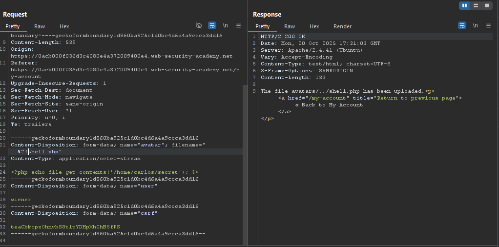
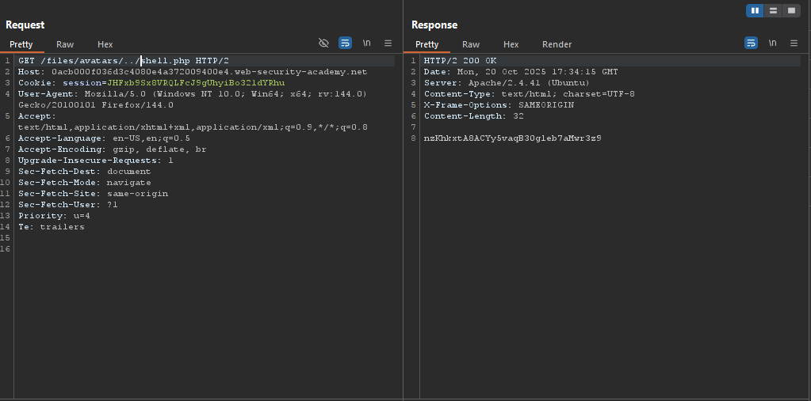
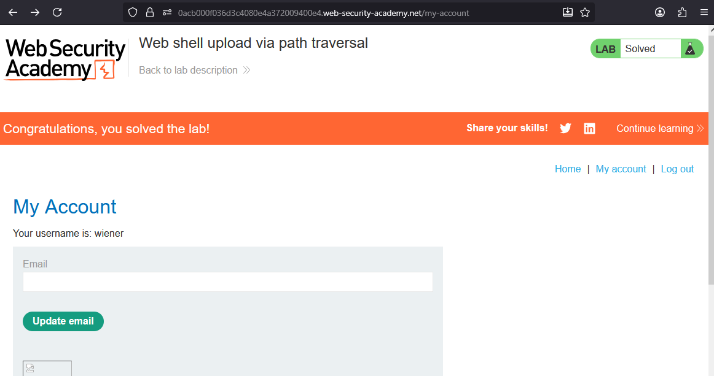

# Lab: Web shell upload via path traversal

> Lab Objective: upload a basic PHP web shell and use it to exfiltrate the contents of the file `/home/carlos/secret`. Submit this secret using the button provided in the lab banner.

- Login using provided credentials `wiener:peter`, then inspect the upload functionality.

- The request made to upload a file.
  

- And can be accessed through this endpoint `/files/avatars/449750.jpg`.
  

- Create a shell php file with the following payload:

```php
<?php echo file_get_contents('/home/carlos/secret'); ?>
```

- Then upload the shell file, and you'll notice that it's uploaded normally.
  

- But when accessing the shell file via this `/files/avatars/shell.php` endpoint, you'll notice that the php code is represented as text not executed as code.
  

- Send the upload request to the repeater, and change the `filename` parameter to `../shell.php`.
  

- You'll notice that the shell file is uploaded to the same place `avatars/shell.php` and the path traversal hasn't worked as intended.

- URL encode the slash `/` and you'll notice that the path traversal has worked.
  

- Access the file through this endpoint using the burp repeater `/files/avatars/../shell.php`.
  

- And you'll be able to retrieve carlos's secret key, submit it and the lab is solved.
  

---
