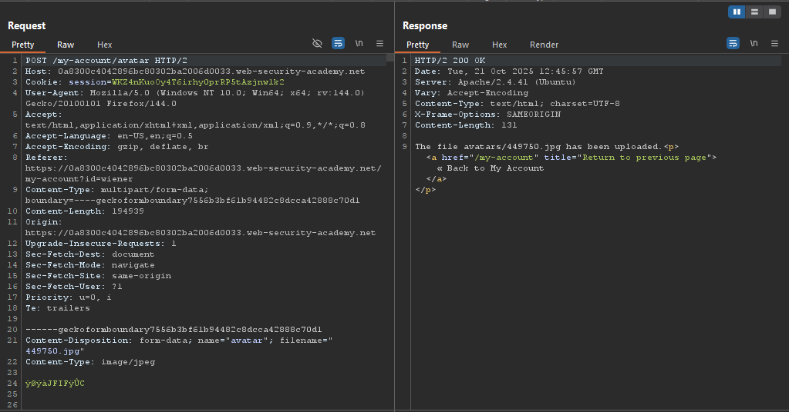
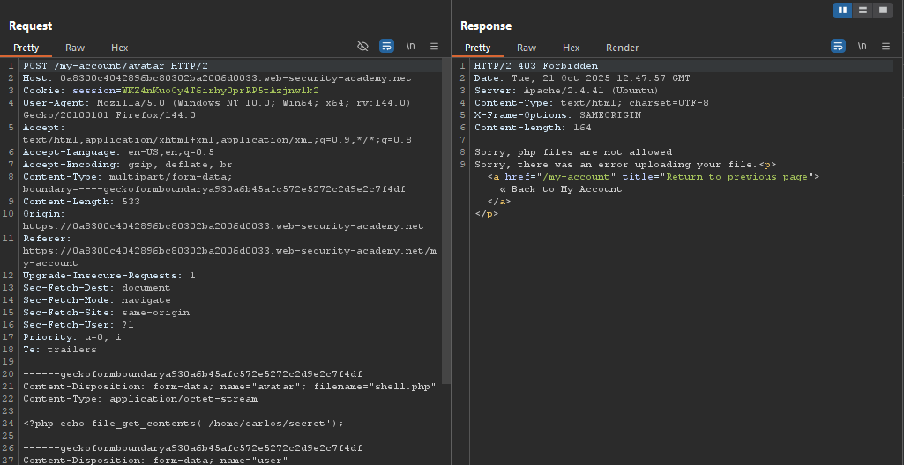
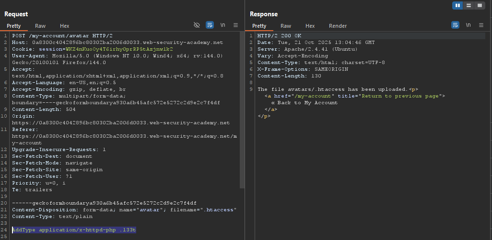
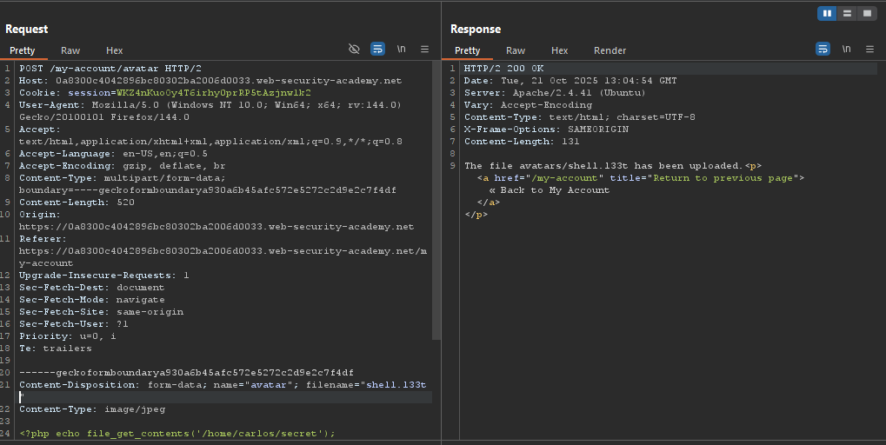
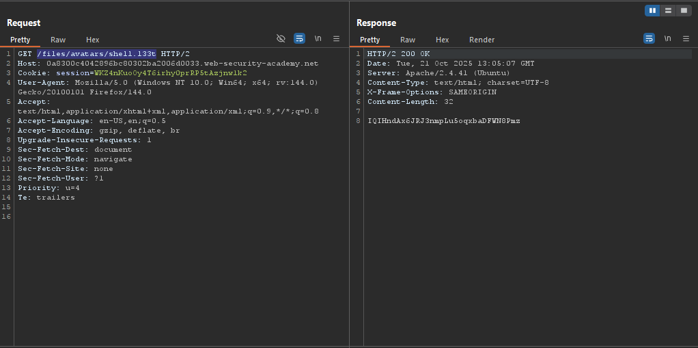
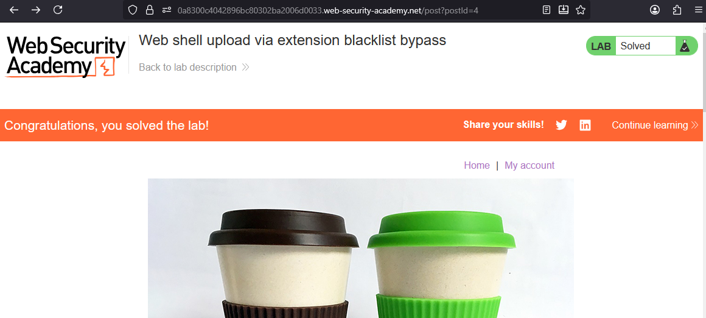

# Lab: Web shell upload via extension blacklist bypass

> Lab Objective: upload a basic PHP web shell, then use it to exfiltrate the contents of the file `/home/carlos/secret`. Submit this secret using the button provided in the lab banner.

- Login using provided credentials `wiener:peter`, then inspect the upload functionality.

- The request made to upload a file:
  

- Try to upload a php shell including the following payload:

```php
<?php echo file_get_contents('/home/carlos/secret'); ?>
```

- You'll notice that you're blocked from uploading the php shell.
  

- Instead you can modify the content of `.htaccess` file by sending the following request which will deal with files ending with `.l33t` extensions as php files.
  

- You'll notice that the file has been uploaded successfully.

- Go back to the request where you upload your php shell file, but instead replace the `.php` extension with `.l33t`, and you'll notice that the shell has been uploaded successfully.
  

- View your uploaded shell via this endpoint `/files/avatars/shell.l33t`, and you'll be able to retrieve carlos's secret key.
  

- Submit the key and the lab is solved.
  

---
