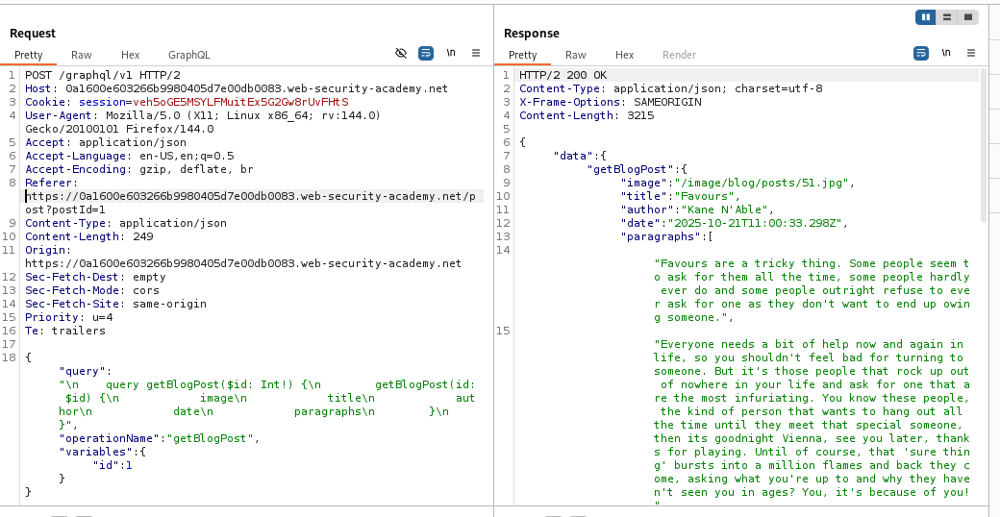
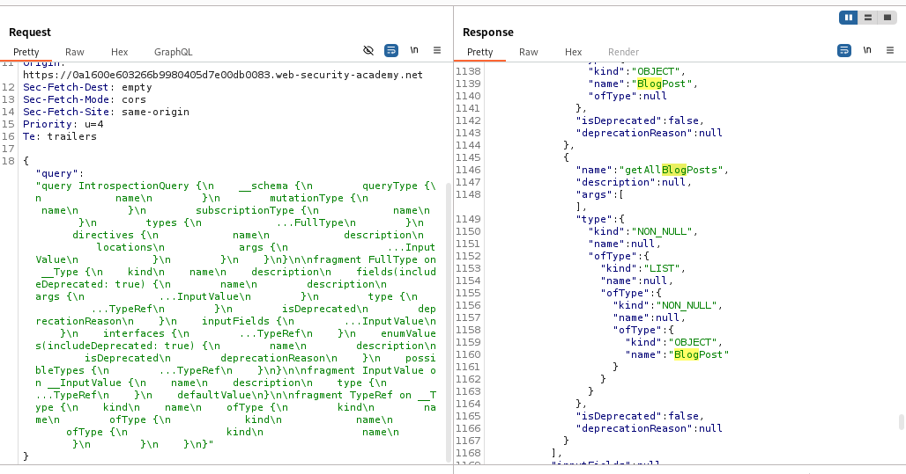
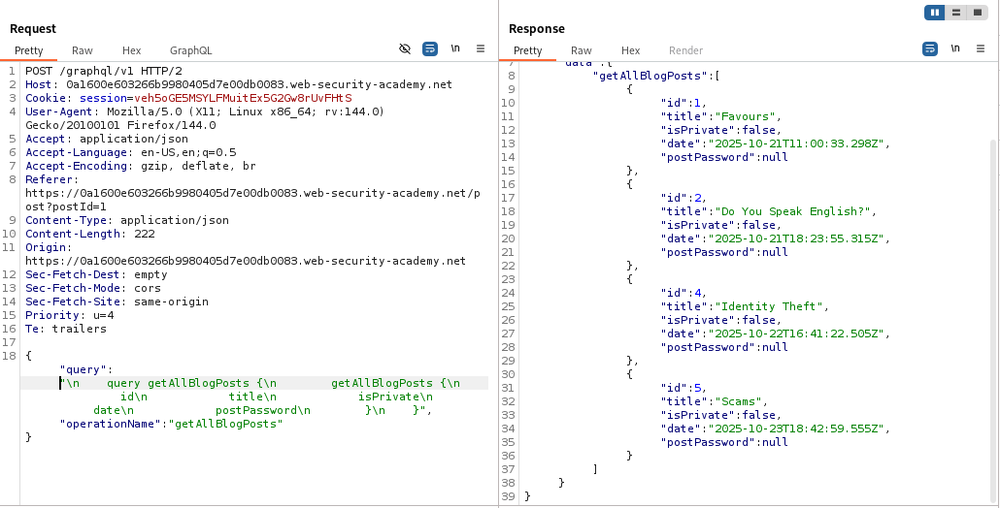
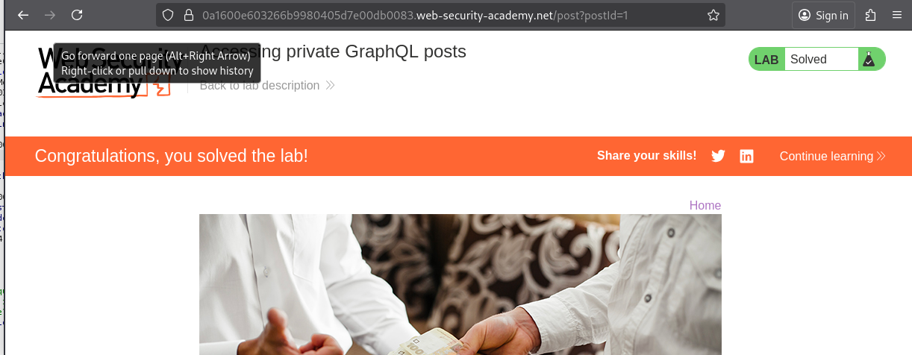

# Lab: Accessing private GraphQL posts

> Lab Objective: find the hidden blog post and enter the password.

- Access any product, and intercept the request.
  

- Right click on the request > Graphql > Set introspection query, then send the request.

- You'll have access to the mutations for `/graphql/v1` endpoint, including `getAllBlogPost` mutation.
  

- Use `getAllBlogPost` mutation to retrieve all existing blogs/
  

- You'll notice that Blog Post with id = 3 is missing, indicating that it's private.

- Therefore, use `getBlogPost` mutation with `id:3` as an argument to retrieve the private blog post.
  

- Retrieve the postPassword value then submit it, and the lab is solved.
  

---
