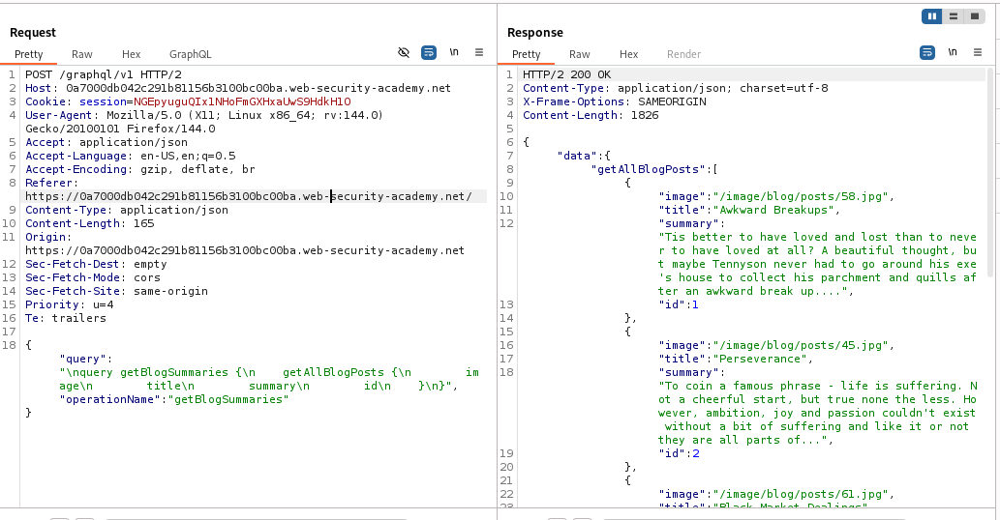
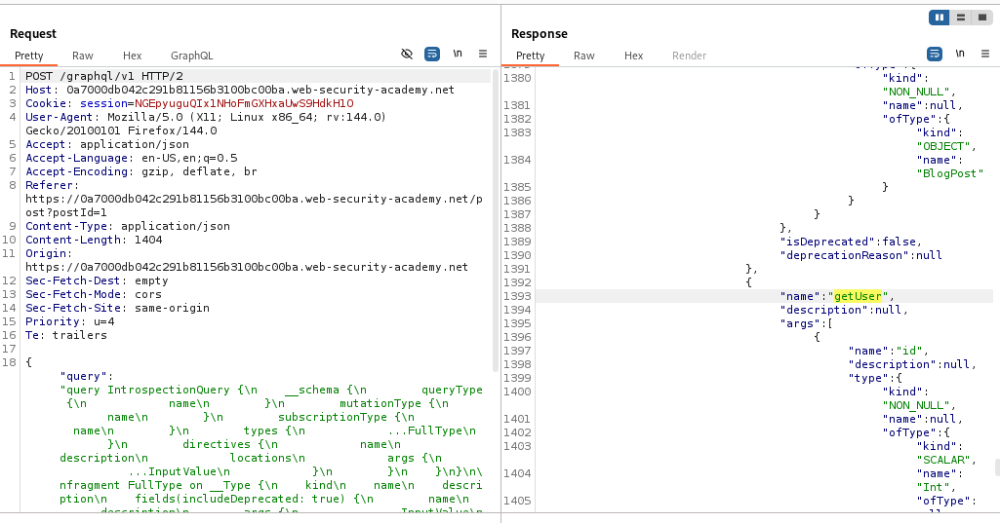
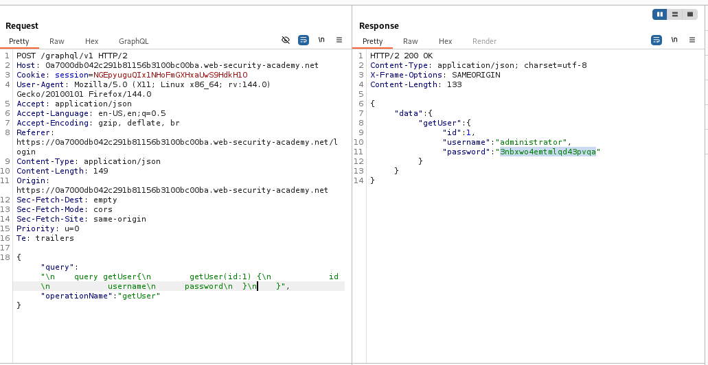
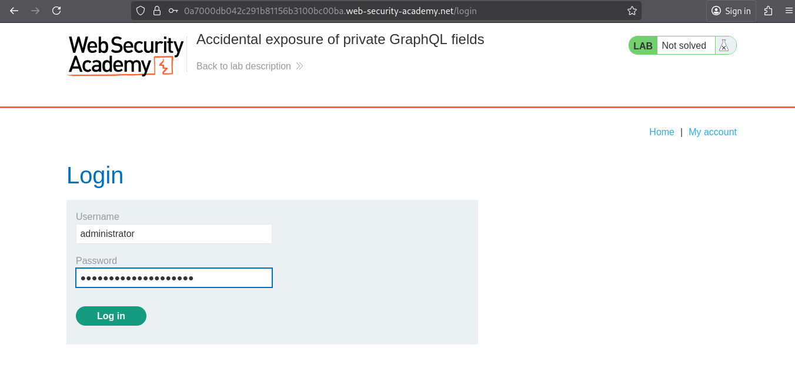
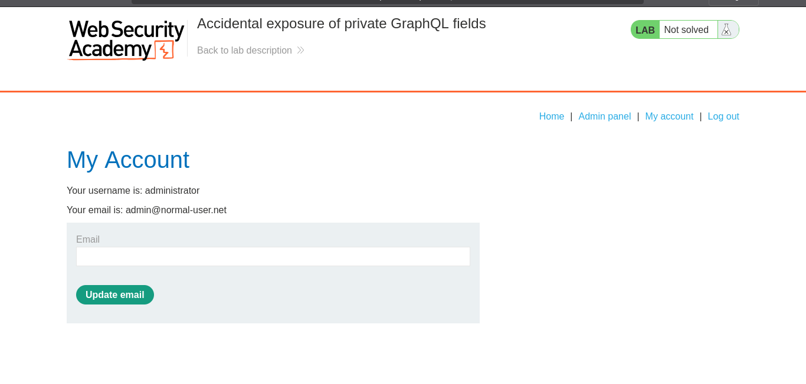
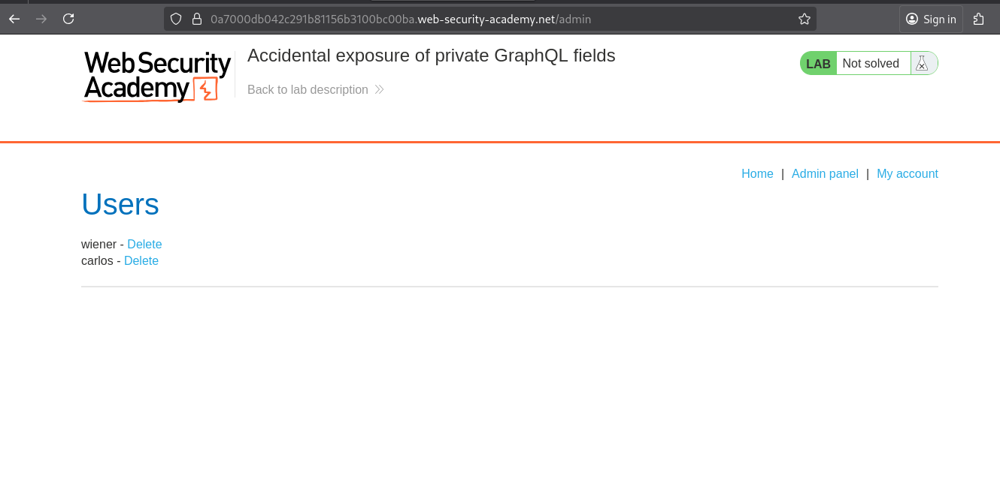
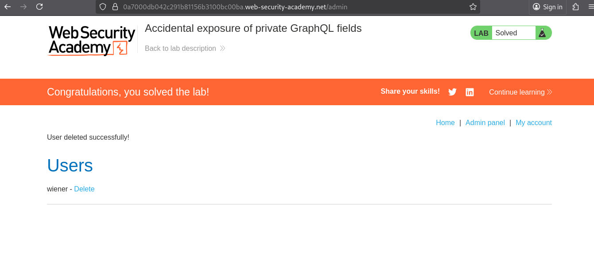

# Lab: Accidental exposure of private GraphQL fields

> Lab Objective: sign in as the administrator and delete the username carlos.

- Visit ay Product page, then inspect the request.

- You'll notice that it's a GraphQL Endpoint.
  

- Right CLick > GraphQL > Set Introspection Request, then traverse available mutations, and you'll find `getUser` mutation, with `id` as an argument.
  

- Therefore, use the `getUser` mutation to retrieve the user with `id:1`, which is revealed to be the user.
  

- Obtain the username & password, and login using those credentials
  

- And you're logged in as an administrator.
  

- Access the admin panel.
  

- Then delete the user carlos, and the lab is solved.
  

---
