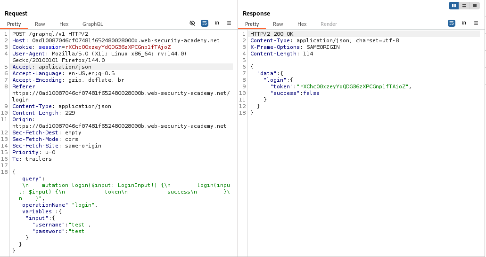
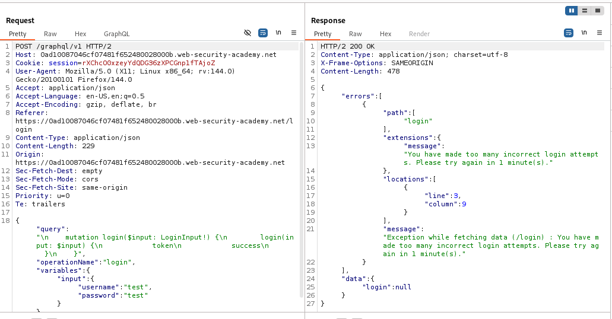
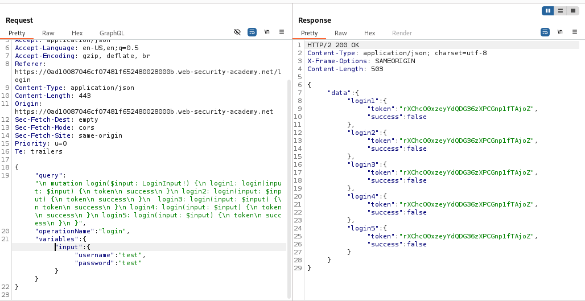
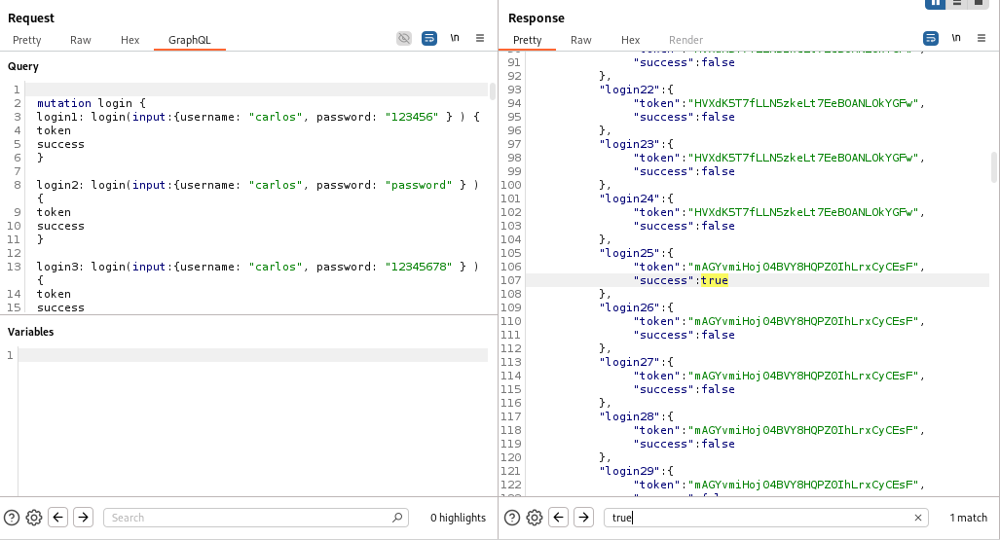
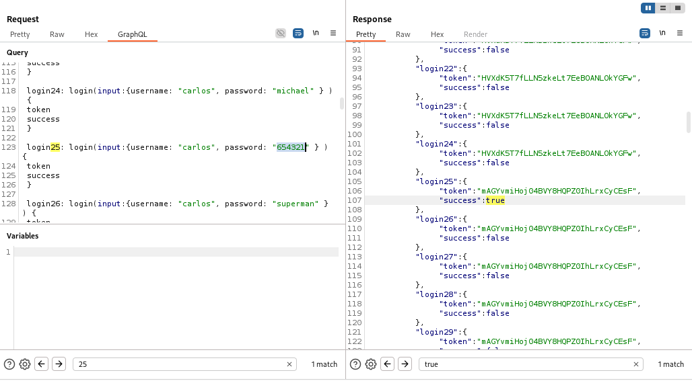
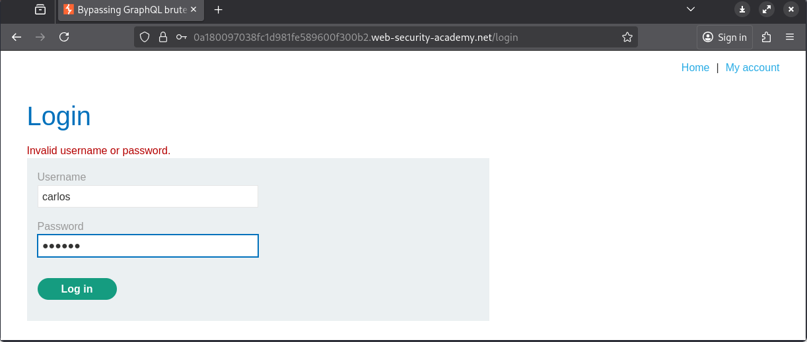
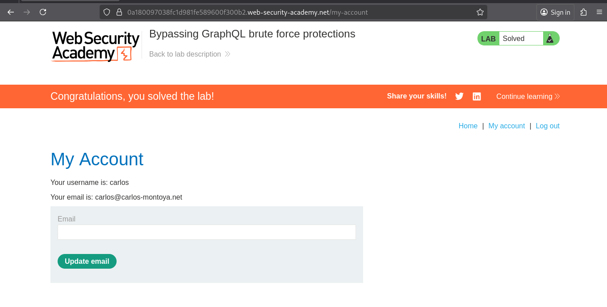

# Lab: Bypassing GraphQL brute force protections

> Lab Objective: brute force the login mechanism to sign in as carlos.

- Try to login using test credentials `test:test`, then inspect the GraphQL Request.
  

- Send this request to repeater, and after repeating the failed request multiple times, you'll notice that you've gotten blocked.
  

- But when you request multiple login attempts in the same GraphQL Endpoint using aliases, the request is accepted and you're not blocked.

- The GraphQL:

```json
{
  "query": "\n mutation login($input: LoginInput!) {\n login1: login(input: $input) {\n token\n success\n }\n login2: login(input: $input) {\n token\n success\n }\n  login3: login(input: $input) {\n token\n success\n }\n login4: login(input: $input) {\n token\n success\n }\n login5: login(input: $input) {\n token\n success\n }\n }",
  "operationName": "login",
  "variables": { "input": { "username": "test", "password": "test" } }
}
```

- The Request & Response:
  

- Use the attached python script with the list of passwords to automate the process of aliasing properties.

- After this process send the request, and search for `success:true`, and you'll notice that the 25th request is the right password.
  
  

- Take the retrieved credentials `carlos:654321`, and login with them.
  

- And you've access to Carlos's Account and the lab is solved.
  

---
