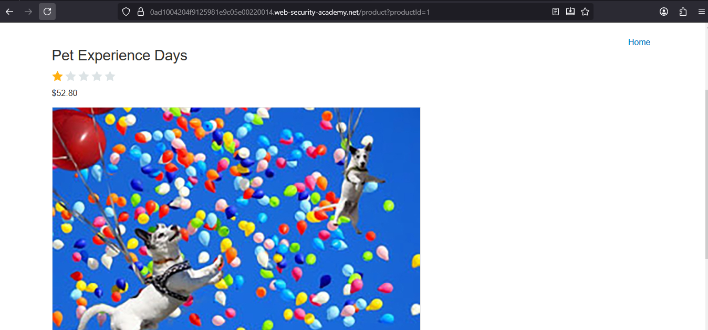
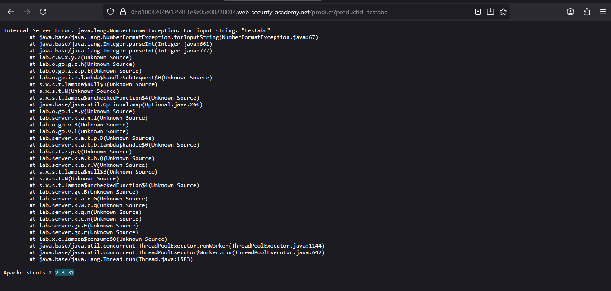
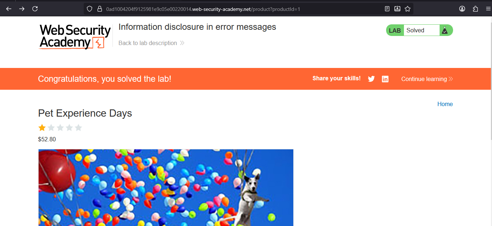

# Lab: Information disclosure in error messages

> Lab Objective: obtain and submit the version number of this framework.

- View Details for any product, and you'll notice that the request sent was to this endpoint `/product?productId=1`.
  

- Modify the value of the `productId` parameter to `testabc`, and you'll notice that you've received and error message including the Framework version, which is `2.3.31`.
  

- Submit this value and the lab is solved.
  

---
