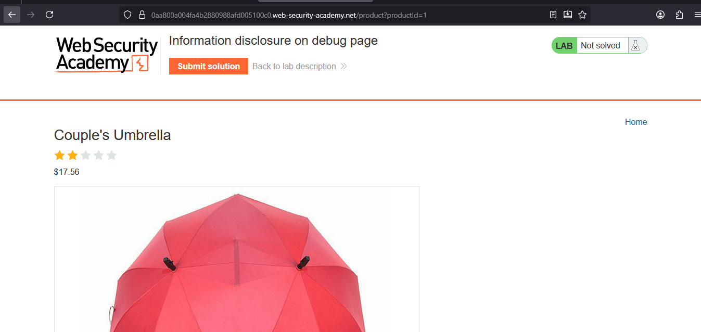
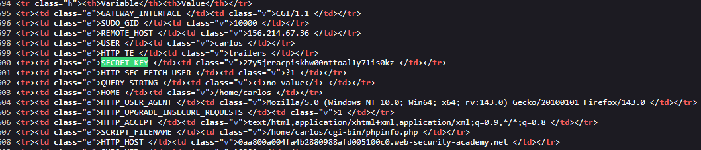

# Lab: Information disclosure on debug page

> Lab Objective: obtain and submit the SECRET_KEY environment variable.

- View Details for any product, and inspect the endpoint `/product?productId=1`.
  

- Change the value of `productId` parameter to `testabc`, and you'll notice that there's no error messages disclosing any information.
  

- But when viewing the source code for a normal product page for instance, `/product?productId=1`.

- You'll notice the path for debug page.

```html
<!-- <a href=/cgi-bin/phpinfo.php>Debug</a> -->
```


- Access this endpoint through it's path `/cgi-bin/phpinfo.php`, and search for `SECRET_KEY`.
  

- Take it's value and submit it, and the lab is solved.
  

---
