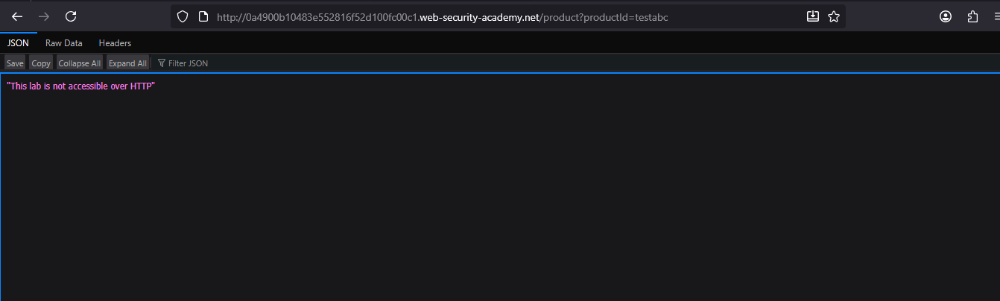

# Lab: Source code disclosure via backup files

> Lab Objective: identify and submit the database password, which is hard-coded in the leaked source code.

- View Details for any product, then inspect the endpoint, which is `/product?productId=1`.
  

- Change the value of productId `parameter` to `testabc`, you'll notice that there's no error messages appeared.
  

- Try to view source code for this normal endpoint `/product?productId=1`, and you'll notice that there's no useful comments or paths exist.
  

- Try to access `/robots.txt` file, and you'll find a backup directory located at `/backup`.
  

- Access this folder using the provided path `/backup`.
  

- You'll find a source code file with the name of `ProductTemplate.java.bak`.

- Access this source code file, and you'll find a function that initiates a connection with the Database.
  

- Submit this `by30soymieol9fbos6r8pj19gh7tdojm` as the database password, and the lab is solved.
  

---
