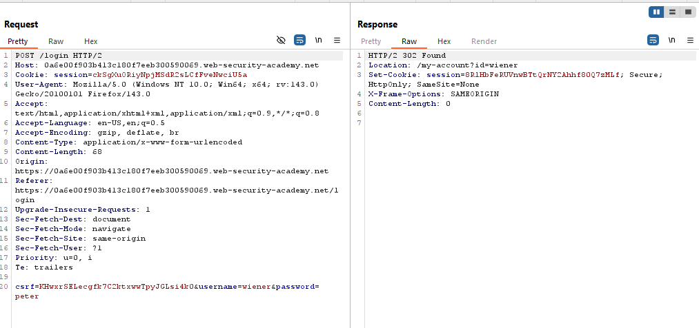
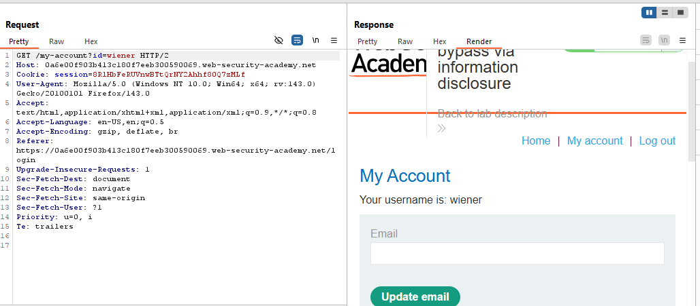
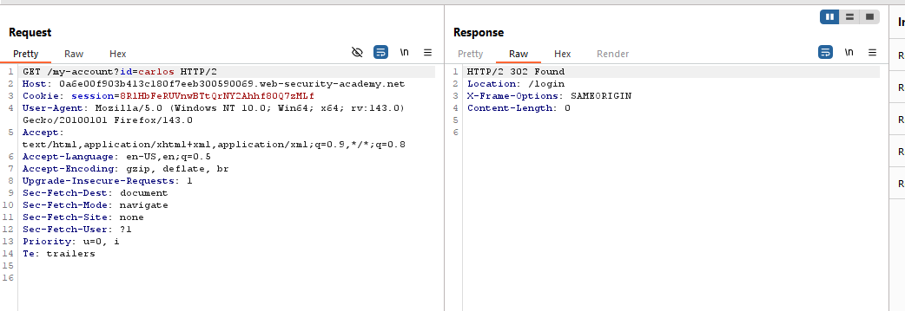
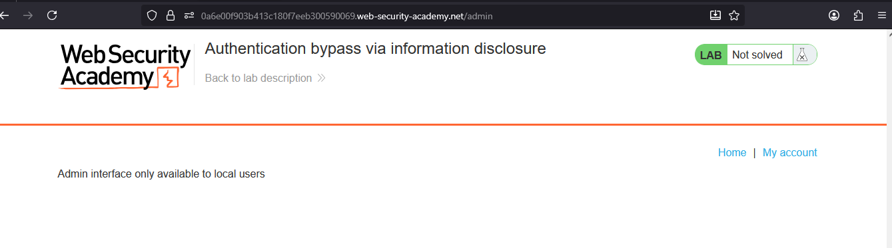
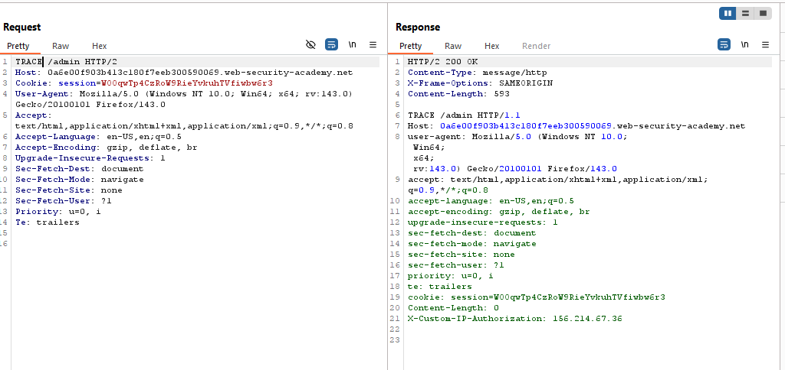
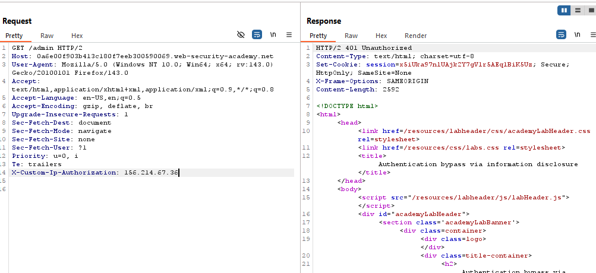
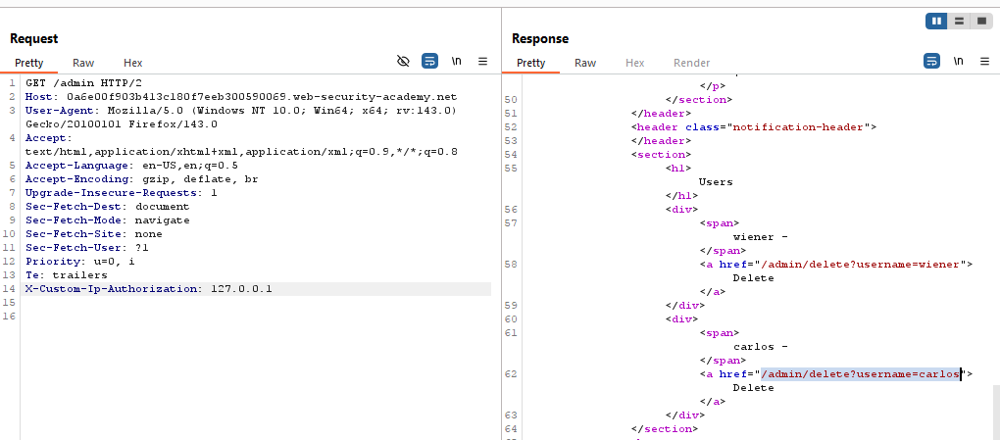
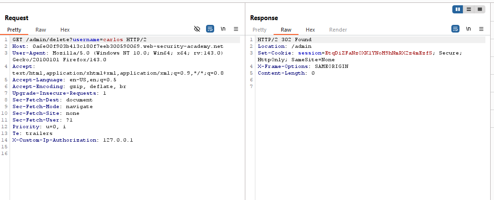
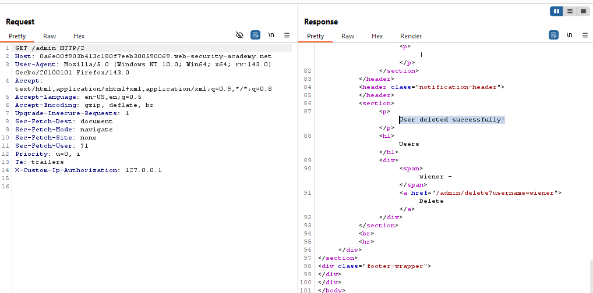
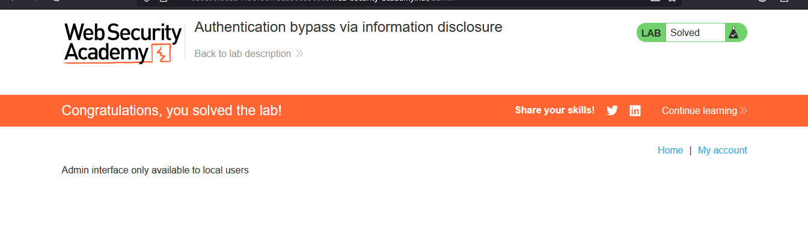

# Lab: Authentication bypass via information disclosure

> Lab Objective: obtain the header name then use it to bypass the lab's authentication. Access the admin interface and delete the user carlos.

- login using provided credentials `wiener:peter`, then inspect the login process requests.

- The Login process:

  - You login using username & password.
    
  - If valid, you're redirected to your account page.
    

- Even if you changed username from wiener to carlos after a successful login, you'll be redirected to the login page.
  

- Try to access `/admin` endpoint, and you'll notice that it's only enabled to local users.
  

- Inspect this request using Burp, then change the HTTP request method to `TRACE`.
  

- There's an interesting header which is `X-Custom-IP-Authorization: 156.214.67.36`, try to include it within your GET Request to `/admin` endpoint, you'll notice that you're not authorized.
  

- Since that `/admin` interface is enabled to local users, try changing the ip in the `X-Custom-IP-Authorization:` to `127.0.0.1`

- You'll notice that you've accessed the admin panel, and retrieved the endpoint to delete the user carlos through this endpoint `/admin/delete?username=carlos`.
  

- Change the path to `/admin/delete?username=carlos` while keeping the custom header `X-Custom-IP-Authorization: 127.0.0.1` and send the request.
  

- The user carlos was deleted and the lab is solved.
  
  

---
