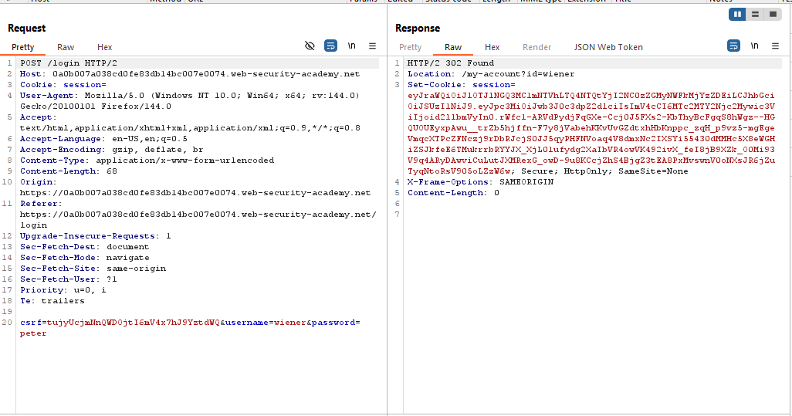
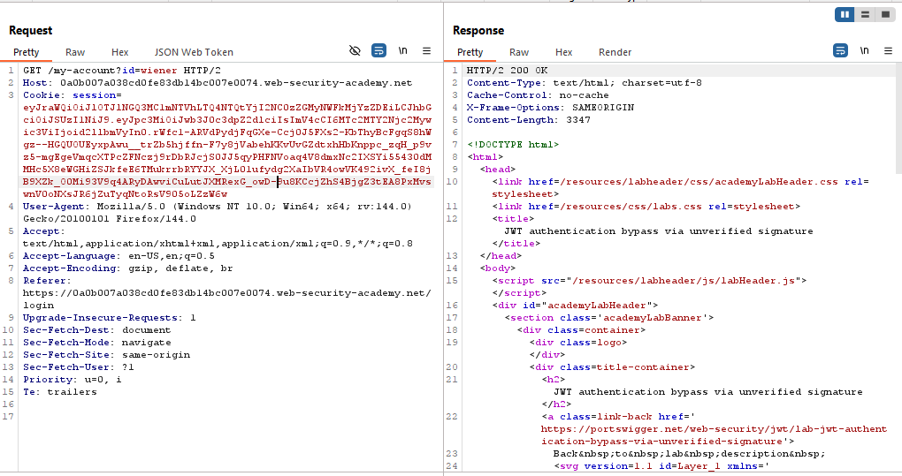
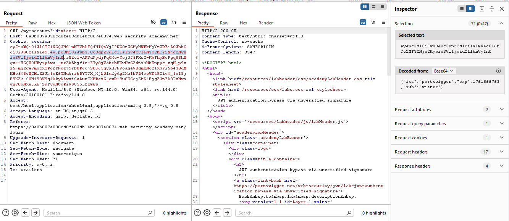
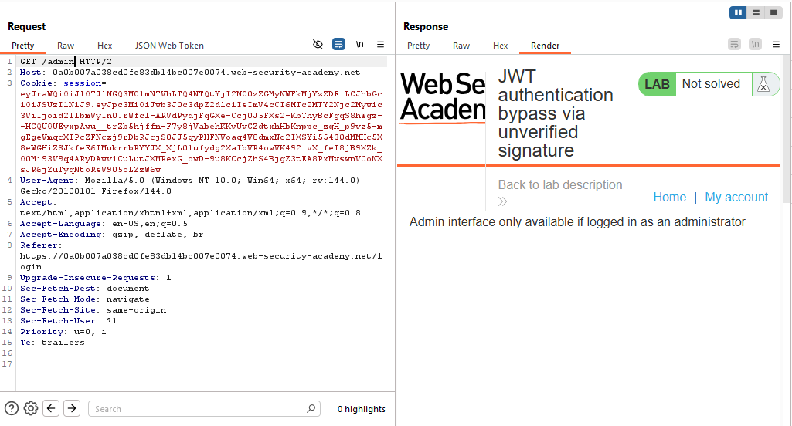
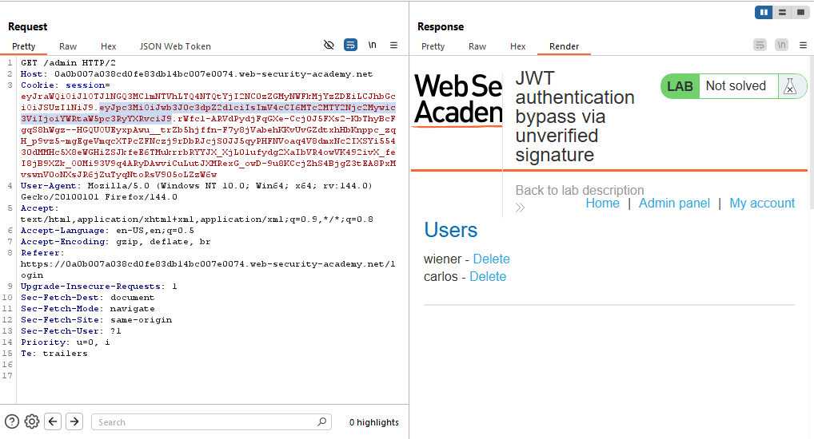
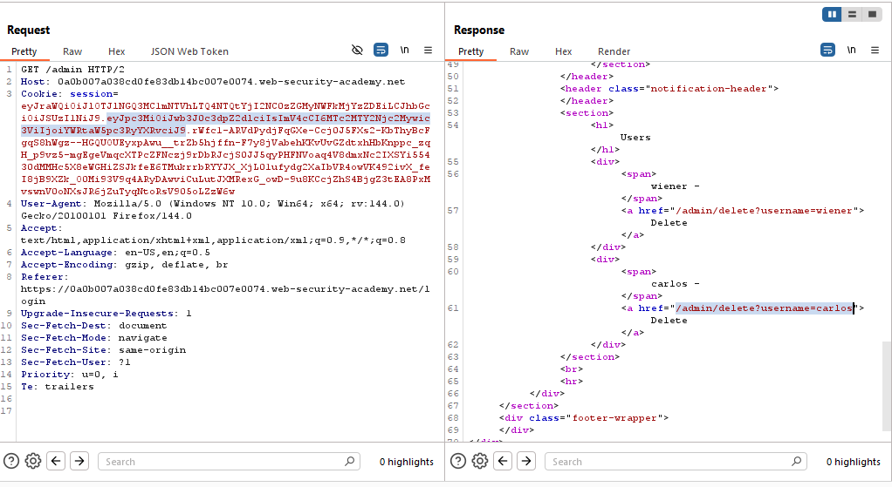
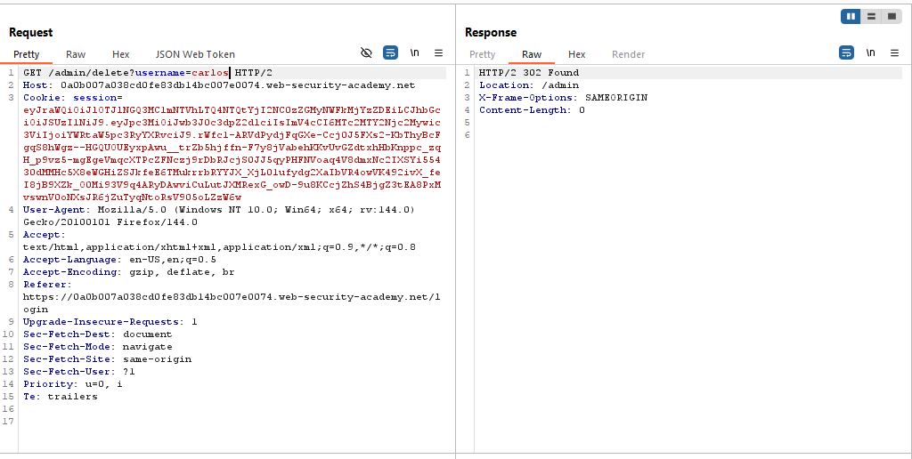
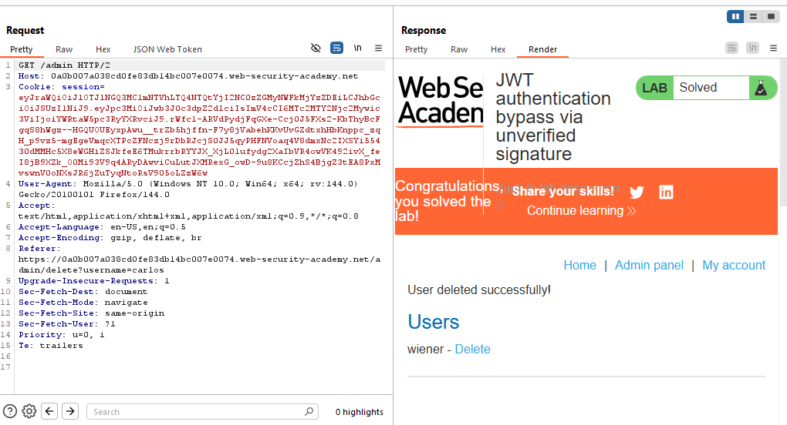
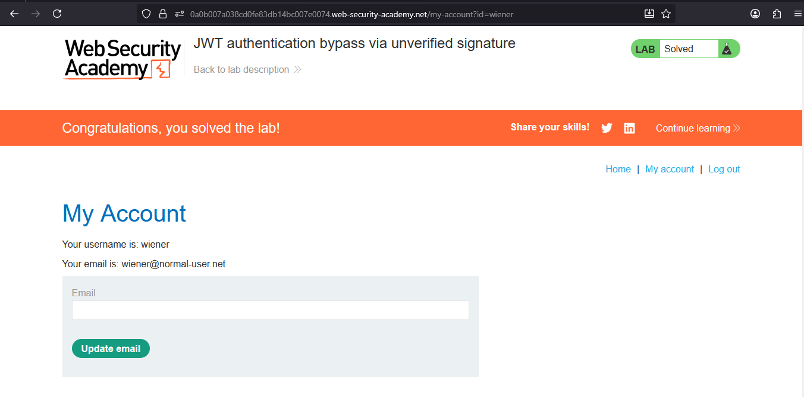

# Lab: JWT authentication bypass via unverified signature

> Lab Objective: modify your session token to gain access to the admin panel at `/admin`, then delete the user carlos.

- Login using provided credentials, then inspect the login requests.

- POST request sent to `/login`.
  

- A GET request is sent to `/my-account?id=wiener` endpoint to retrieve wiener account page.
  

- Select the payload part from the JWT token in the `session` parameter.
  

- You'll notice that you username is set as the value for `sub` parameter.

- Send a request to `/admin` endpoint and inspect the response.

- You'll notice that you're blocked because you're not logged in as an administrator.
  

- Therefore, change the value of the `sub` parameter from `wiener` to `administrator` then apply changes, and change the endpoint to `/admin`, and send the request.

- You'll notice that you've access to the admin panel.
  

- Delete the user carlos via this endpoint `/admin/delete?username=carlos`.
  

- You'll notice that the user carlos is deleted.
  
  

- And the lab is solved.
  

---
