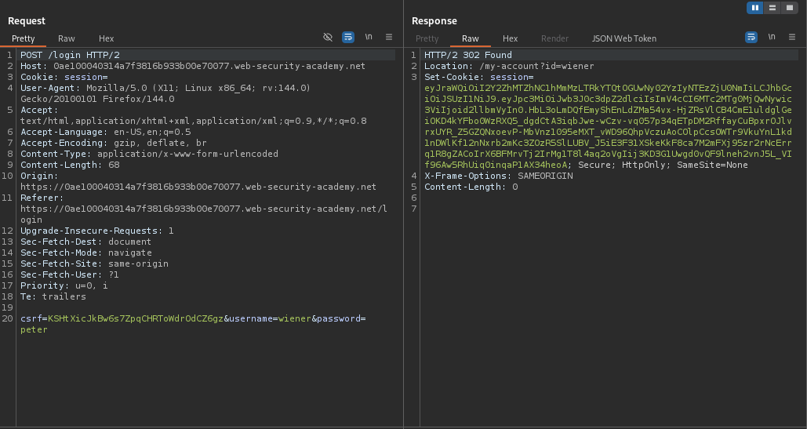
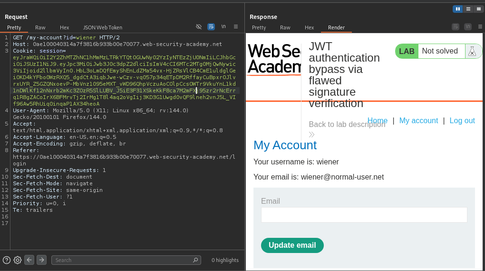
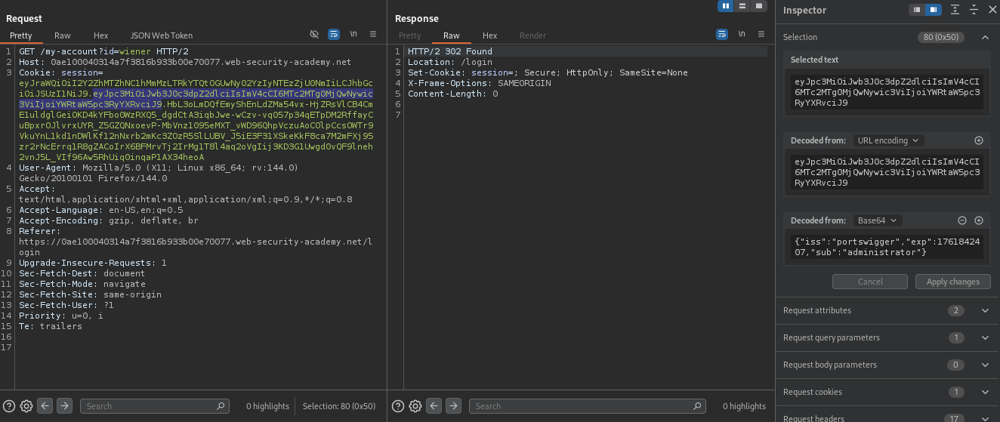
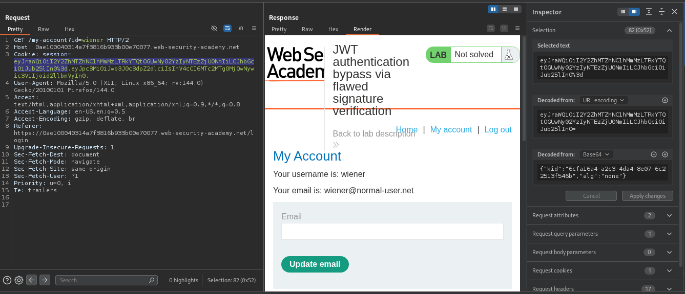
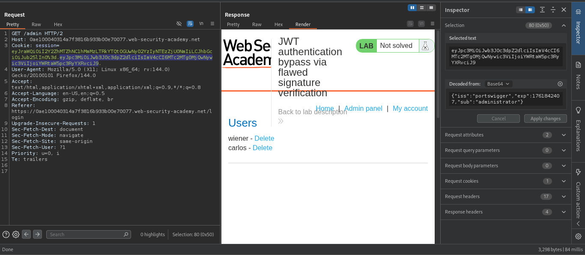
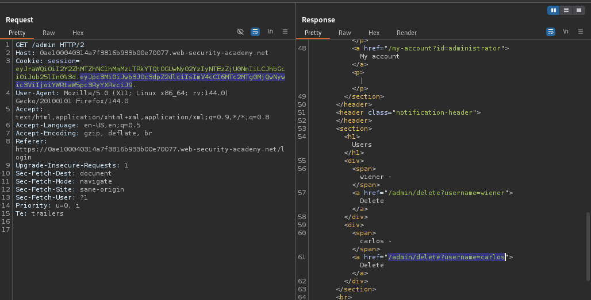
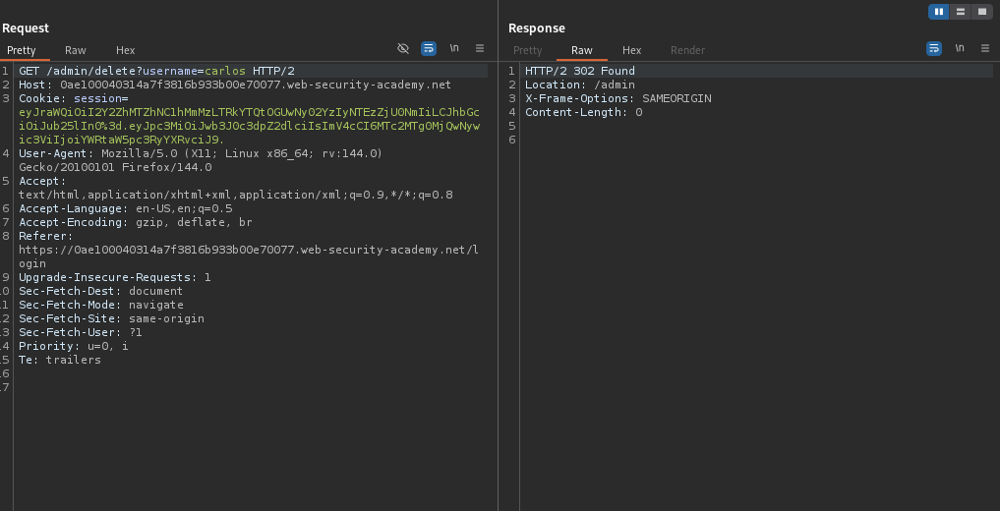
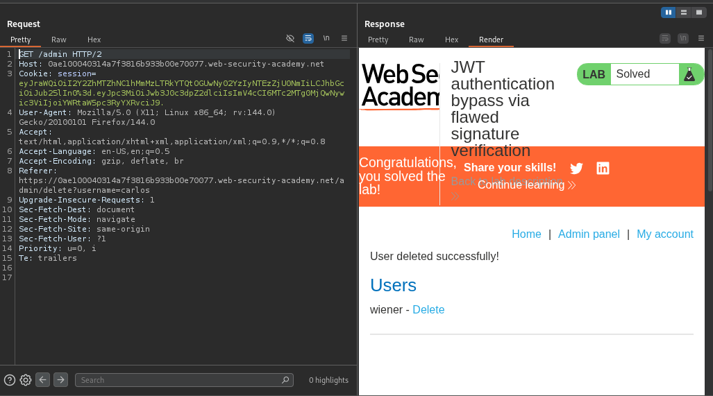

# Lab: JWT authentication bypass via flawed signature verification

> Lab Objective: modify your session token to gain access to the admin panel at `/admin`, then delete the user carlos.

- Login using provided credentials `wiener:peter`, then inspect the login requests.

- Login POST request.
  

- Login to `/my-account?id=wiener` to retrieve wiener's account page.
  

- Notice that if you changed the username from `wiener` to `administrator` in the payload part, you'll be redirected to `/login` endpoint, indicating that the server validates the user sending the request.
  

- But in the header part of the JWT, if you changed the value of `alg` parameter to `none` and removed the signature part (while keeping the trailing `.`), you'll notice that the request to wiener's account page is accepted.
  

- Therefore, in addition to the changes that you've made:

  - Replace the accessed endpoint to `/admin`.
  - The `sub` value from `wiener` to `administrator`.

- You'll notice that the request is accepted and you've accessed the admin panel.
  

- Delete the user carlos via this endpoint `/admin/delete?username=carlos`.
  

- Send that request, and follow redirection to `/admin` endpoint.
  

- You'll notice that the user carlos is deleted and the lab is solved successfully.
  

---
