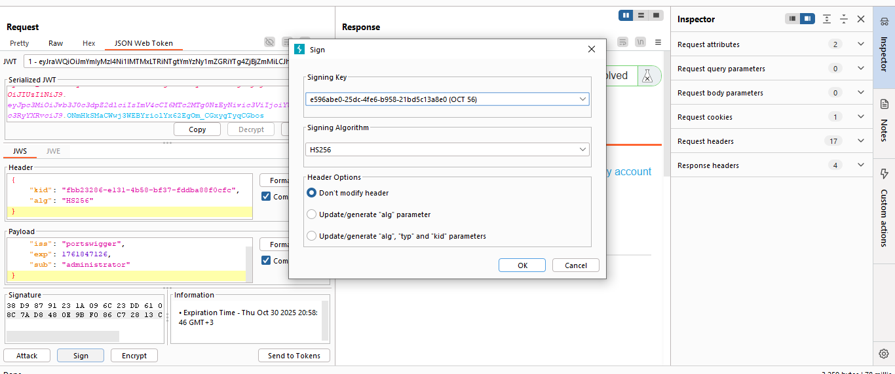

# Lab: JWT authentication bypass via weak signing key

> Lab Objective: first brute-force the website's secret key. Once you've obtained this, use it to sign a modified session token that gives you access to the admin panel at `/admin`, then delete the user carlos.

- Login using provided credentials `wiener:peter`, then inspect the login requests.

- Login POST Request.
  

- Wiener's account page.
  

- If you changed the `alg` in the header part to `none`, and removed the signature, you'll notice that you're redirected to `/login` endpoint, indicating that this method is not working.
  

- The same happened when changing the username to `administrator`.
  

- Therefore, I'll try to brute force the secret key used for signing the JWT (the JWT signature).

- Obtain a valid JWT token from accessing Wiener's Account page `/my-account?id=wiener`, and a wordlist of well-known secrets, and run the following command:

```
hashcat -a 0 -m 16500 <jwt> <wordlist>
```

- Retrieve the secret from hashcat output.
  

- Base64 decode it, then generate a new key from JWT Editor Key tab, and replace the value of `k` parameter with the encoded secret.
  

- In Repeater Json Web Token Tab, replace `sub` value to `administrator`, then `sign` and select the previously created key.
  

- Then change the endpoint to `/admin`, and send the request.

- You'll notice that the request is accepted and you have access to the admin panel.
  

- Delete the user carlos via this endpoint `/admin/delete?username=carlos`.
  

- Send the request, then follow the redirection to `/admin`.
  

- You'll notice that the user is deleted successfully, and the lab is solved.
  
  

---
