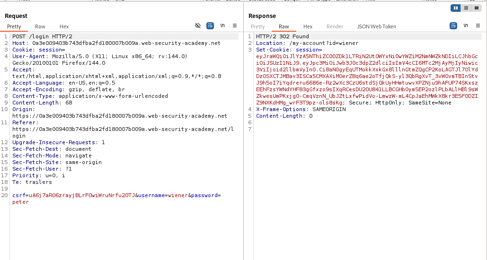
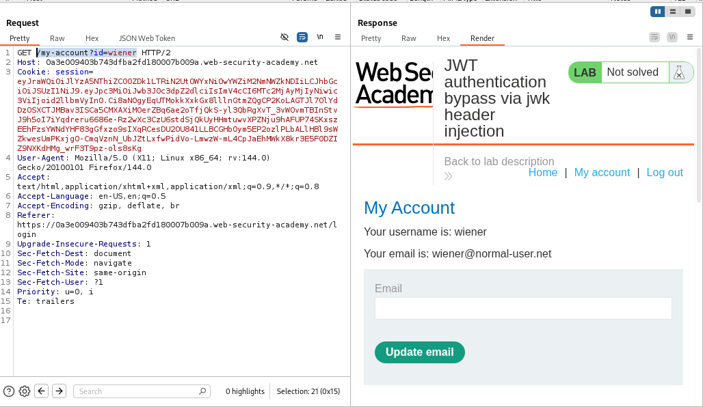
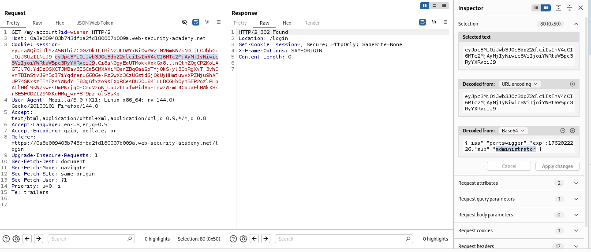
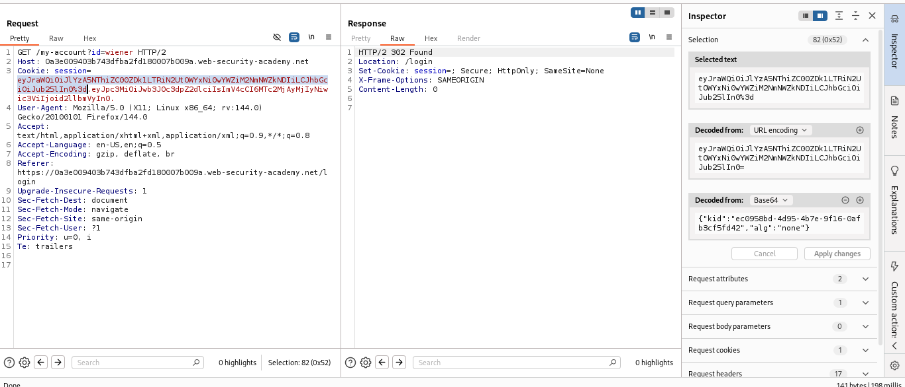
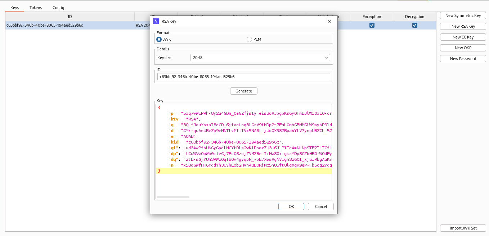
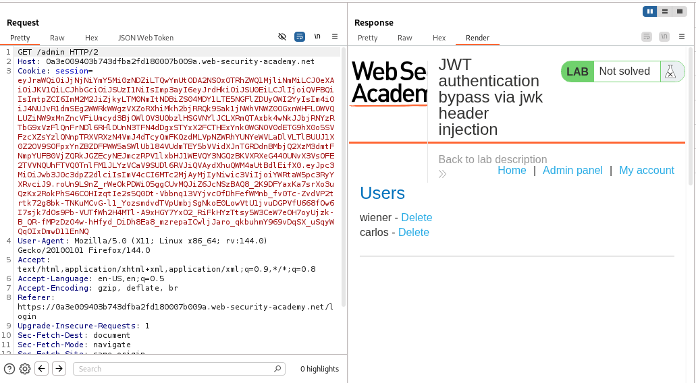
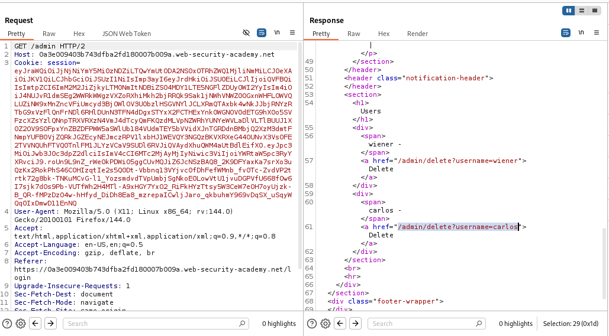
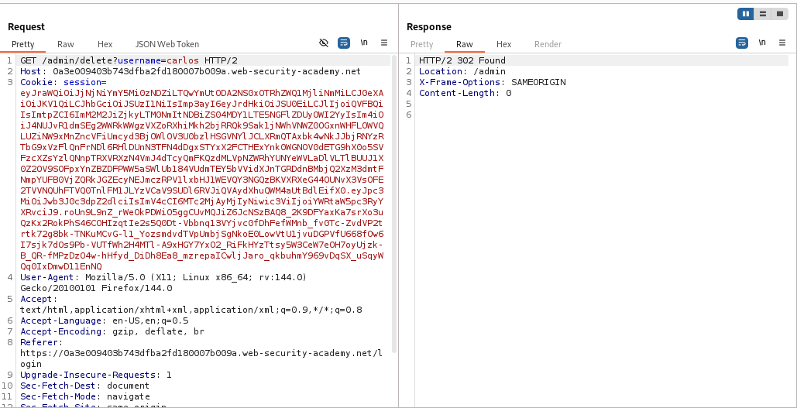
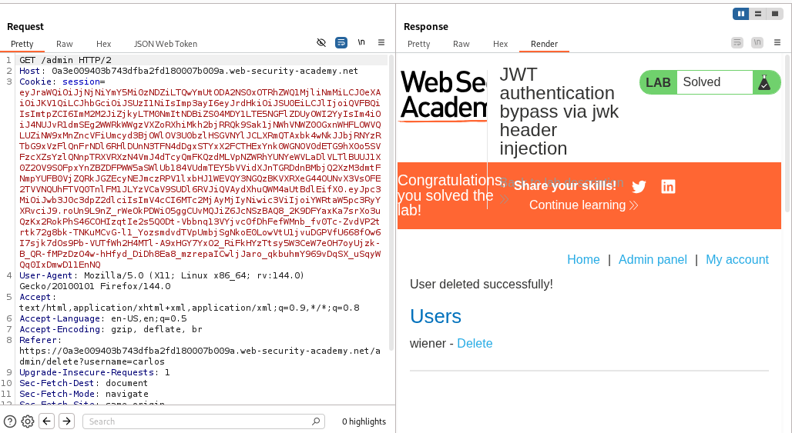
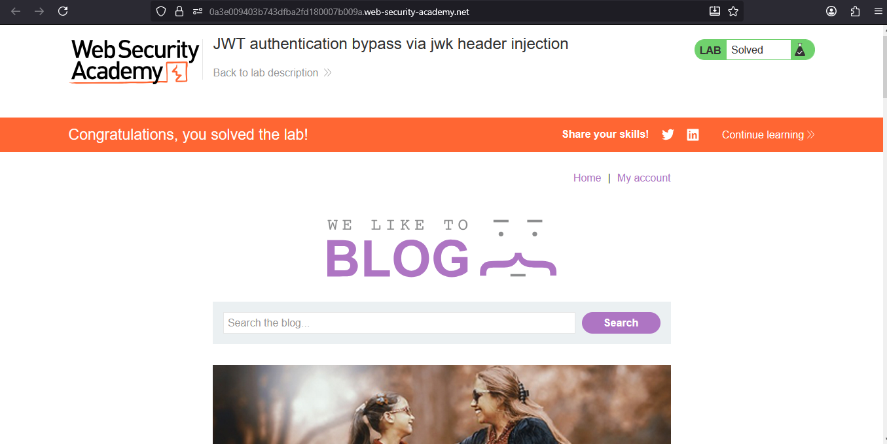

# Lab: JWT authentication bypass via jwk header injection

> Lab Objective: modify and sign a JWT that gives you access to the admin panel at `/admin`, then delete the user carlos.

- Login using provided credentials `wiener:peter`, then inspect the login requests.

- Login Request:
  

- Redirection to wiener's account page `/my-account?id=wiener`.
  

- Replacing your username with `administrator` within the `sub` parameter in the payload part, results in redirection to `/login`, indicating a failed attempt.
  

- Making the value of `alg` in header part `none` and removing the signature part, also results in redirection to `/login`, indicating a failed attempt.
  

- Create a new RSA key using JWT Editor extension in Burp.
  

- Modify the payload part in the JWT token as desired, then use the created RSA key to sign it, and send the request.

- Replace your usernames with `administrator`, and the endpoint with `/admin`, and you'll notice that the server has accepted the RSA key, and you've accessed the Admin Panel.
  

- Delete the user carlos via this endpoint `/admin/delete?username=carlos`.
  

- The request of deleting the user carlos is accepted.
  

- Follow the redirection to the `/admin` endpoint.
  

- You'll notice that the user carlos is deleted and the lab is solved.
  

---
