# Lab: JWT authentication bypass via jku header injection

> Lab Objective: forge a JWT that gives you access to the admin panel at `/admin`, then delete the user carlos.

- Login using provided credentials `wiener:peter`, then inspect the login requests.

- The Login request.
  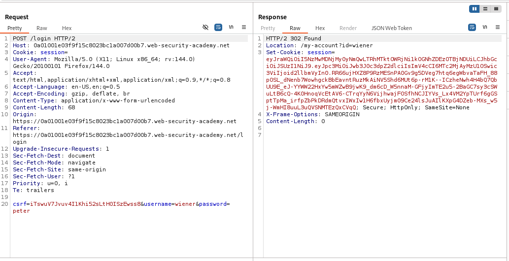

- Accessing wiener's account page via `/my-account?id=wiener` endpoint.
  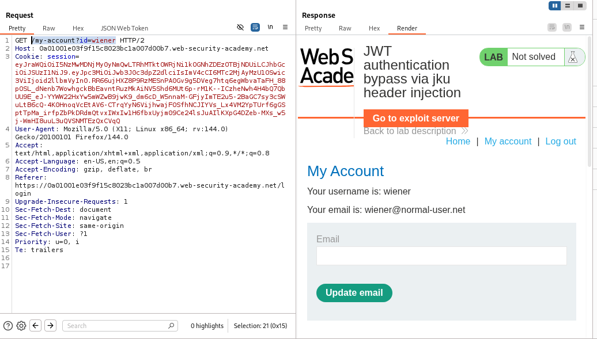

- Either setting the `alg` parameter to `none` and removing the signature part, or replacing the `sub` parameter in the payload part to `administrator` and the endpoint to `/admin`, both of them will result in a failed attempt.
  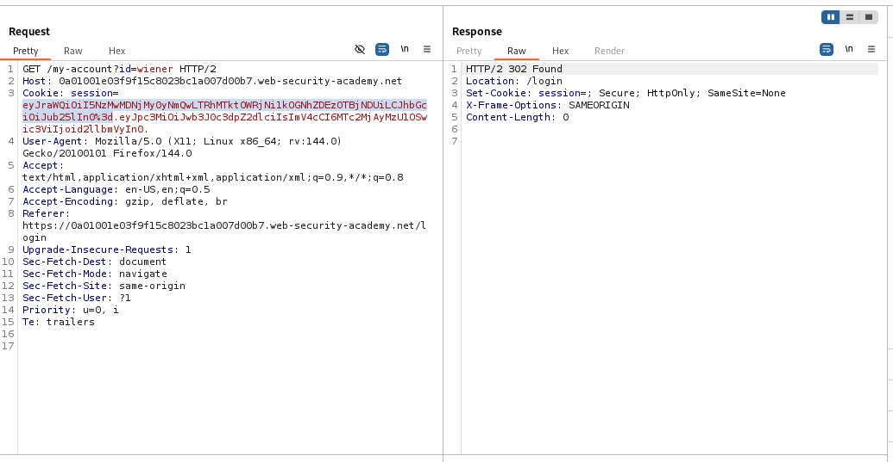
  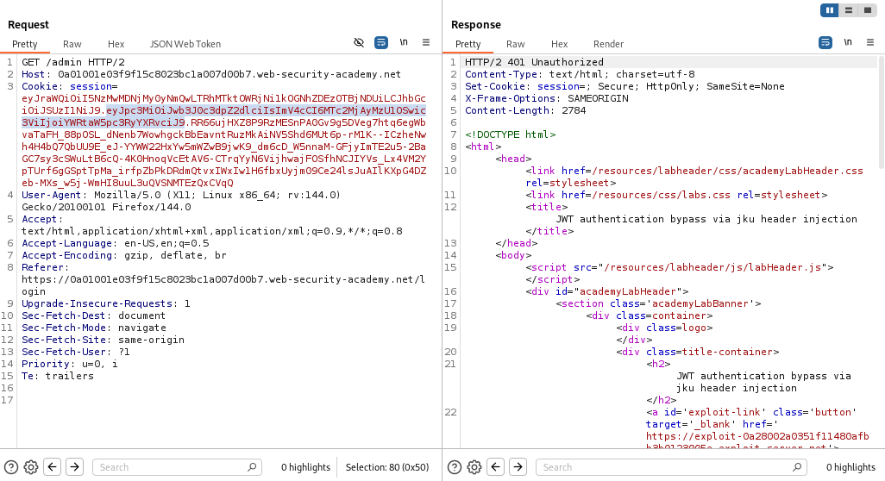

- Generate a new RSA Key.
  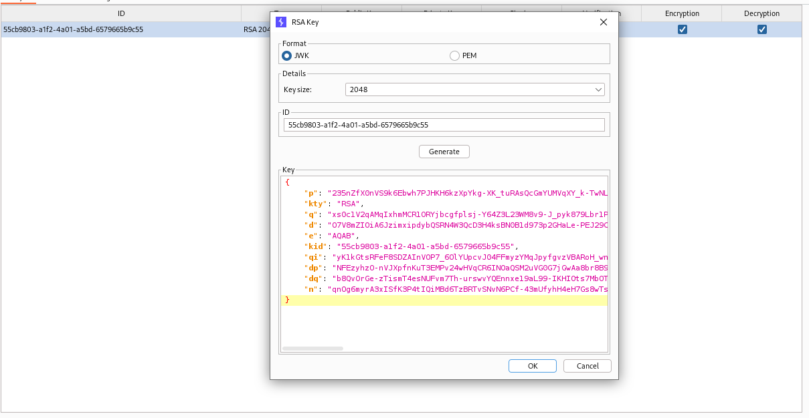

- In exploit server set a set of JWT keys that only contains the public key of the created RSA key (copy public key as JWK option), then store it.
  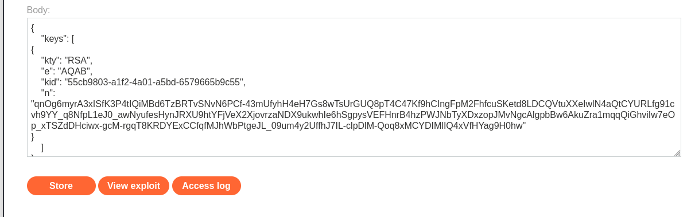

- In JSON Web token tab in the repeater:

  - Replace the current `kid` with the `kid` stored in the exploit server.
  - Add `jku` parameter containing the Exploit server URL, pointing to your stored public key.
  - Replace the value of the `sub` parameter in the payload header from your username to `administrator`.
  - Sign the JWT with the created RSA Key.
    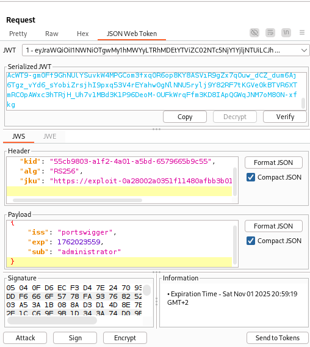

- Send the request and notice that the request is accepted and you've access to the admin panel.
  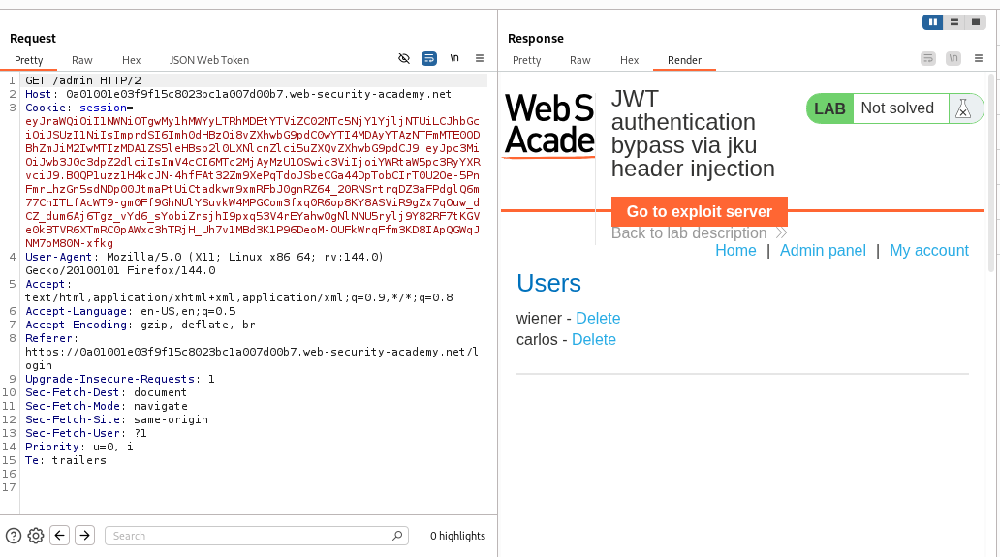
  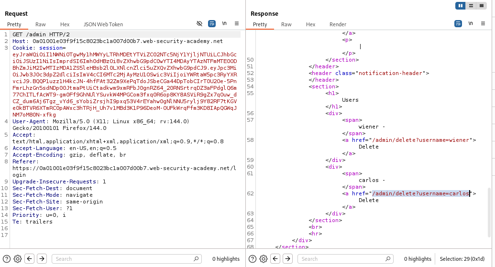

- Delete the user carlos via `/admin/delete?username=carlos` endpoint.
  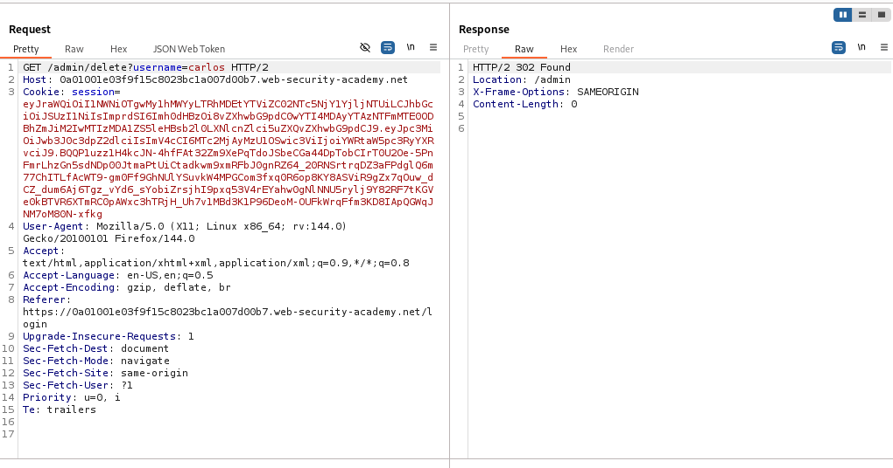

- Follow the redirection to `/admin` endpoint, and you'll notice that the user carlos is deleted successfully, and the lab is solved.
  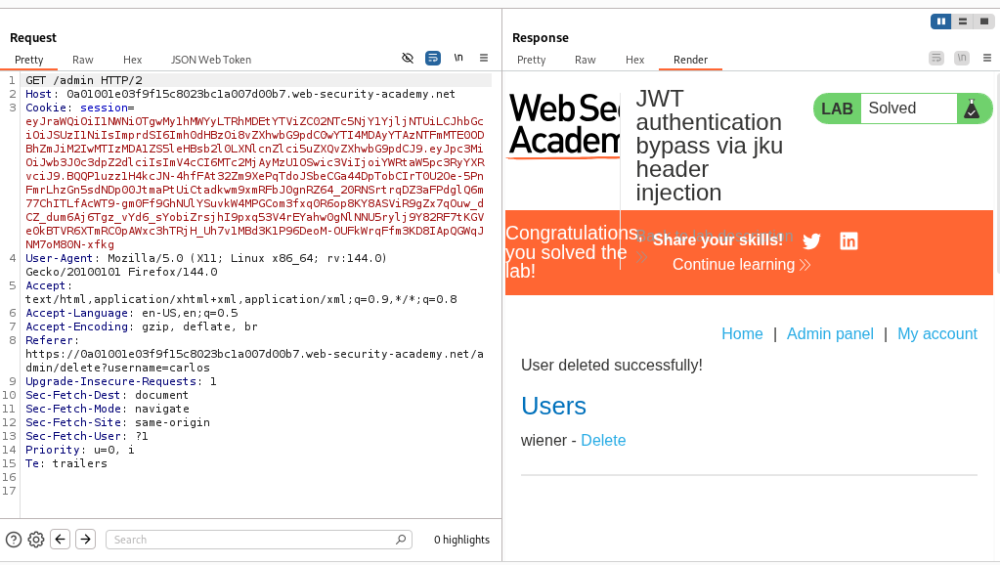
  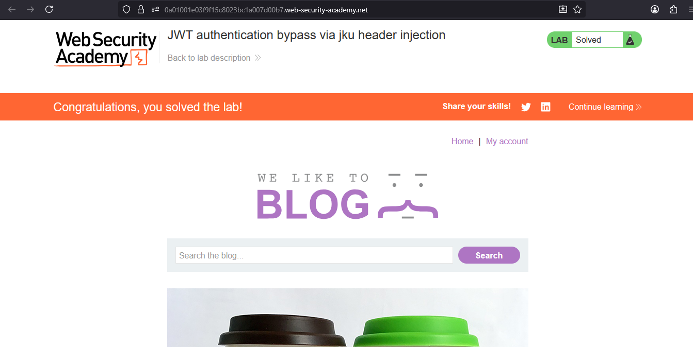

---
