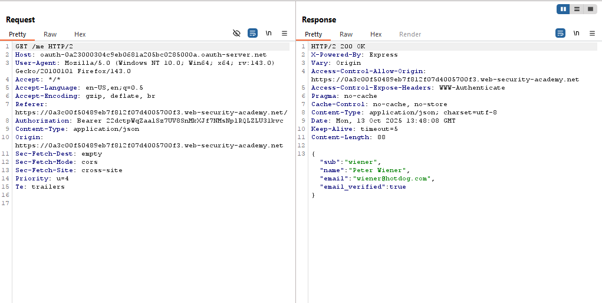

# Lab: Authentication bypass via OAuth implicit flow

> Lab Objective: exploit the flawed validation by the client application, then log in to Carlos's account

- Login using provided credentials `wiener:peter`, then inspect the login process.

- The Login Process:

  - You access `/my-account` endpoint, then You're redirected to `/social-login`
    
  - A GET request is sent to `/social-login`, indicating that you'll be redirected to login using your social media account.
    
  - Then the Authorization Request for Implicit Grant Type is sent.
    
  - Then You're prompted to enter your login credentials `wiener:peter`.
    
  - You send a POST request with your login credentials.
    
  - Then you're prompted again but for your consent on provisioning access for your profile and email.
    
  - If you agree, a confirm request will be sent.
    
  - Then you're redirected to the callback specified in the Authorization request, and the access token is sent to the Client Application.
    
    
  - Then an API call is made to retrieve your data via a GET request to `/me` endpoint.
    
  - Then a POST request sent to `/authenticate`, with your data retrieved from the previous request.
    
  - Then you're redirected to `/`, and you're authenticated successfully.
    

- In the `/authenticate` POST request, replace your email with `carlos@carlos-montoya.net` and your username with `carlos`, then send the request.
  

- Right Click on the request, "Request in Browser" > "In Original Session", then copy the URL and paste it in your Browser, then access my Account, and you're logged in as carlos and the lab is solved.
  

- Or after sending the `/authenticate` request, copy the issued cookie paste it in your burp request, then send a request to `/`, then `/my-account?id=carlos`, and you'll achieve the same result.
  
  

---
