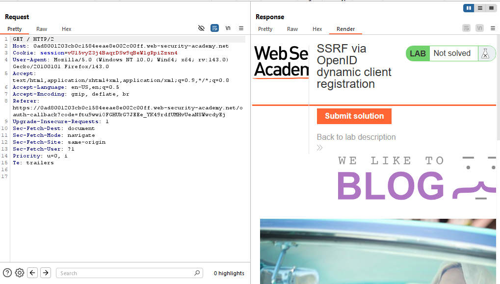
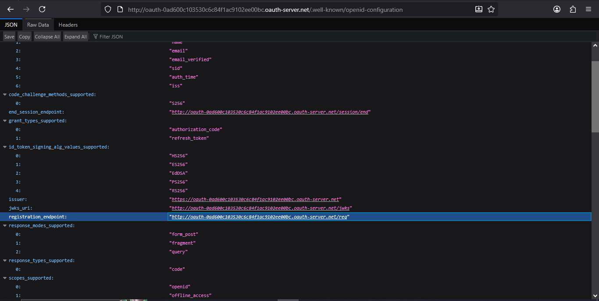
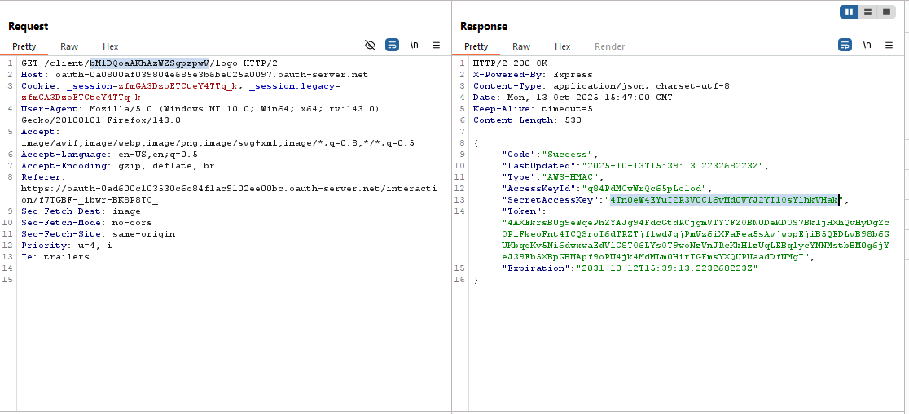

# Lab: SSRF via OpenID dynamic client registration

> Lab Objective: craft an SSRF attack to access `http://169.254.169.254/latest/meta-data/iam/security-credentials/admin/` and steal the secret access key for the OAuth provider's cloud environment.

- Login using provided credentials `wiener:peter`, then inspect the login process.

- The Login Process:

  - You send a GET request to `/my-account`.
    
  - Then you're redirected to `/social-login`, that indicates that you'll be redirected to login with your social media account.
    
  - then the Authorization Request is sent including `response_type=code` indicating that Authorization Code grant type is used.
    
  - Then you're prompted to enter your credentials `wiener:peter`.
    
  - Then a POST request is sent with your submitted credentials.
    
  - Then you're prompted to provide your consent that your Profile and email data will be used by the client application (which is WeLikeToBlog).
    
  - If you agree, a confirmation request will be sent.
    
  - You'll be redirected to the callback URL specified in the authorization request and the authorization code is granted.
    
  - A GET Request is sent with the authorization code indicating a successful login.
    
  - Click continue and you'll be redirected to the root `/` page.
    
    

- Inspect the request where you retrieve the logo.
  

- Extract the OAuth server from the Host header and add `/.well-known/openid-configuration` to the url to access the configuration file.
  

- Access the `registration_endpoint` to register your client application.
  

- But firstly you need to customize a suitable POST request.
  

- And you'll notice that you've registered a Client Application without any kind of authentication.

- Therefore, you can use `logo_uri` with Burp Collaborator URL.
  

- Send the request where you retrieve the logo to Burp Repeater then replace the client ID with your client ID and send the request.
  

- Visit Burp Collaborator Tab, and you'll notice that there's an HTTP request sent to your Burp Collaborator
  

- Therefore, a Second-Order SSRF Vulnerability Exist.

- Therefore, instead of placing Burp Collaborator URL in `logo_uri`, place the internal admin panel `http://169.254.169.254/latest/meta-data/iam/security-credentials/admin/`, and repeat this process again.
  
  

- Obtain the Secret Access Key, and submit it.
  

- And the lab is solved.
  

---
